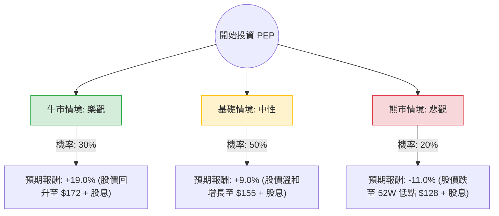

這份分析報告結合了您提供的基本面數據，以及針對 **PepsiCo (PEP)** 的最新市場動態（包含 2024 年第三季財報表現、GLP-1 藥物影響、以及宏觀經濟環境）進行的綜合評估。

---

### 一、 核心假設與市場背景分析

在構建決策樹之前，我們基於最新資訊設定以下核心假設：

1.  **定價權與銷量挑戰**：百事公司近期面臨「銷量下滑」但「利潤增加」的局面。消費者對漲價開始產生抵制（尤其是北美零食業務 Frito-Lay），這限制了未來的增長空間。
2.  **GLP-1 減肥藥衝擊**：市場擔憂減肥藥（如 Ozempic）會長期改變零食消費習慣。雖然目前影響尚不明顯，但這壓低了 PEP 的估值倍數。
3.  **宏觀環境**：隨著聯準會進入降息週期，像 PEP 這種提供 **3.75% 高殖利率** 的防禦性價值股，對尋求穩定收益的資金更具吸引力。
4.  **財務健康度**：ROE 高達 43.9%，顯示極強的資本利用效率；但 Debt/Eq 2.47 偏高，需關注利息支出。

---

### 二、 決策樹分析 (Decision Tree)

以下為未來 12 個月的投資情境預測：

#### 節點詳細說明：

1.  **牛市情境 (Bull Case) - 30% 機率**：
    *   **條件**：國際市場（拉美、亞太）增長強勁，抵消北美疲軟；成本控制優於預期；GLP-1 擔憂被證明過度。
    *   **預期報酬計算**：目標價 $171.95 (約 +15.2%) + 股息 3.75% ≈ **+19.0%**。

2.  **基礎情境 (Base Case) - 50% 機率**：
    *   **條件**：銷量維持平穩，公司透過裁員與自動化維持利潤率；降息帶動防禦性板塊估值修復。
    *   **預期報酬計算**：股價回升至 SMA200 附近約 $155 (約 +5.2%) + 股息 3.75% ≈ **+9.0%**。

3.  **熊市情境 (Bear Case) - 20% 機率**：
    *   **條件**：北美消費者持續縮減開支導致銷量大幅萎縮；原材料成本再度上漲；高債務壓力在經濟放緩時顯現。
    *   **預期報酬計算**：股價回測 52 週低點 $127.6 (約 -14.5%) + 股息 3.75% ≈ **-11.0%**。

---

### 三、 期望值分析 (Expected Value Analysis)

根據上述情境，我們計算投資 PEP 的總體期望報酬率：

**計算公式：**
$EV = (P_{Bull} \times R_{Bull}) + (P_{Base} \times R_{Base}) + (P_{Bear} \times R_{Bear})$

**計算過程：**
1.  牛市貢獻：$0.30 \times 19.0\% = 5.7\%$
2.  基礎貢獻：$0.50 \times 9.0\% = 4.5\%$
3.  熊市貢獻：$0.20 \times (-11.0\%) = -2.2\%$

**總期望報酬率 (Total EV)：**
$5.7\% + 4.5\% - 2.2\% = \mathbf{8.0\%}$

---

### 四、 最終結論與投資建議

#### **結論：適合投資 (建議：分批買入 / 持有)**

**判斷理由：**

1.  **正向期望值**：8.0% 的預期報酬率雖然不算驚人，但在當前高波動的市場中，作為防禦性配置具有吸引力。
2.  **股息安全邊際**：3.75% 的股息率處於歷史較高水平，且 PEP 是著名的「股息王」（連續 50 年以上增加股息），這為股價提供了強大的下行支撐。
3.  **估值合理化**：Forward P/E 降至 16.61，遠低於過去幾年的平均水平，顯示市場已部分消化了銷量下滑的利空。
4.  **技術面機會**：目前股價 ($149.27) 低於 SMA20 與 SMA50，但高於 52 週低點，且接近 Target Price ($171.95) 提供的 15% 潛在上漲空間。

**風險提示：**
*   **債務壓力**：Debt/Eq 2.47 偏高，若利率下降速度慢於預期，利息負擔將壓抑淨利。
*   **消費者行為改變**：需密切關注 Frito-Lay 北美區的銷量數據，若銷量持續兩季以上萎縮，需重新評估基礎情境的機率。

**操作建議：**
目前 PEP 處於相對低位，適合追求**穩定現金流**與**低波動**的投資者。建議在 $145 - $150 區間分批建倉，長期持有以獲取股息與估值修復的雙重收益。