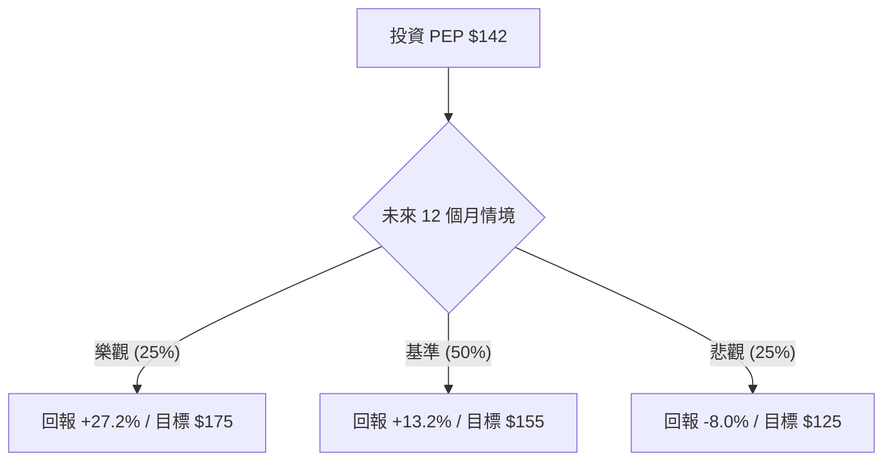

# PEP (PepsiCo) 投資價值量化分析報告

作為量化投資分析師，我將透過機率思維與期望值模型，對 PepsiCo (PEP) 進行深度拆解。目前 PEP 股價處於相對低位（接近 52 週低點），技術面呈現超賣，但基本面仍具備強大的護城河。

---

### 1. 核心驅動因素與風險 (Drivers & Risks)

#### **關鍵催化劑 (Catalysts)**
1.  **估值修復與均值回歸**：目前 Forward P/E 僅 15.49x，遠低於其 5 年平均值（約 22x）。若市場情緒從科技股轉向防禦性價值股，PEP 具備強大的估值彈性。
2.  **成本結構優化與利潤率擴張**：PEP 持續推動生產力計畫，預計透過自動化與供應鏈優化提升營業利益率（Oper. Margin 目前為 15.63%）。
3.  **國際市場增長**：儘管北美市場飽和，但拉美與亞太地區的有機營收增長仍維持高個位數，是支撐 EPS 增長的核心引擎。

#### **主要風險點 (Risks)**
1.  **GLP-1 藥物長期威脅**：減肥藥普及可能導致零食與含糖飲料的長期消費量萎縮，這對 Frito-Lay 業務構成結構性挑戰。
2.  **北美銷量疲軟**：近期財報顯示北美零食與飲料銷量出現下滑，消費者因通膨壓力轉向平價自有品牌。
3.  **匯率風險**：PEP 約 40% 營收來自海外，強勢美元將侵蝕其海外利潤折算。

---

### 2. 情境設定與機率賦予 (Scenario Modeling)

基於未來 12 個月的展望，設定以下三種互斥且窮盡的情境：

*   **樂觀情境 (Bull Case) - 估值與銷量雙重回升**
    *   **發生條件**：北美銷量止跌回升，GLP-1 恐慌消退，且聯準會降息帶動防禦性高股息股重新定價。
    *   **預估機率**：25%
    *   **目標價格與預期回報**：給予 20x Forward P/E，目標價 **$175**。預期回報率：**+23.2%** (含 4% 股息)。

*   **基準情境 (Base Case) - 穩健增長與利潤保護**
    *   **發生條件**：有機營收增長維持在 4% 左右，利潤率因成本控制微幅改善，銷量持平。
    *   **預估機率**：50%
    *   **目標價格與預期回報**：給予 17.5x Forward P/E，目標價 **$155**。預期回報率：**+9.2%** (含 4% 股息)。

*   **悲觀情境 (Bear Case) - 結構性衰退與消費降級**
    *   **發生條件**：GLP-1 影響超預期，北美銷量持續萎縮，且通膨導致原物料成本再度飆升。
    *   **預估機率**：25%
    *   **目標價格與預期回報**：回測 52 週低點支撐，給予 14x Forward P/E，目標價 **$125**。預期回報率：**-12.0%** (含 4% 股息)。

---

### 3. 期望值計算與決策樹 (EV Calculation & Decision Tree)

#### **決策樹結構**

*(註：回報率已計入約 4% 的股息收益)*

#### **總期望值計算**
`EV = (0.25 * 27.2%) + (0.50 * 13.2%) + (0.25 * -8.0%)`
`EV = 6.8% + 6.6% - 2.0% = 11.4%`

#### **風險回報比分析**
*   **上行空間 (Upside)**：$175 - $142 = $33
*   **下行空間 (Downside)**：$142 - $125 = $17
*   **風險回報比 (Risk/Reward Ratio)**：**1 : 1.94**。這顯示每承擔 1 元風險，預期可獲得 1.94 元回報，具備不對稱的投資吸引力。

---

### 4. 決策總結 (Decision Summary)

| 情境 | 發生機率 (%) | 預期報酬率 (%) | 關鍵驅動/觸發因素 |
| :--- | :--- | :--- | :--- |
| **樂觀 (Bull)** | 25% | +27.2% | 銷量恢復增長，P/E 回歸 20x 歷史均值 |
| **基準 (Base)** | 50% | +13.2% | 成本控制抵銷銷量疲軟，維持穩定派息 |
| **悲觀 (Bear)** | 25% | -8.0% | GLP-1 衝擊加劇，北美消費降級嚴重 |
| **整體期望值** | **100%** | **+11.4%** | **具備防禦性的正期望值投資** |

**最終結論：**
1.  **投資建議**：**買入 (Buy)**
2.  **核心邏輯**：PEP 目前處於估值窪地（Forward P/E 15.5x），4% 的股息率提供了強大的安全邊際。期望值 11.4% 優於多數防禦性標的，且風險回報比接近 1:2，顯示目前股價已過度反應負面預期（如 GLP-1 恐慌）。
3.  **風控建議**：若股價跌破 **$125**（52 週低點且悲觀情境觸發點），或連續兩季有機營收增長低於 2%，應重新評估長期增長邏輯並考慮減碼。

【結束指令】