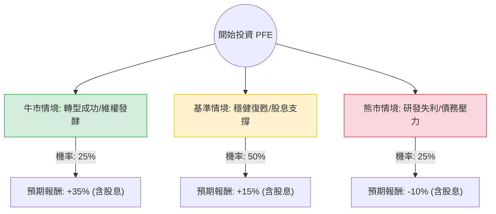

這份分析報告結合了您提供的基本面數據，以及針對輝瑞（Pfizer, PFE）最新市場動態（如 Starboard Value 維權投資者介入、Seagen 收購進展、Q3 財報表現）的網路搜尋資訊。

---

### 一、 核心假設與市場背景分析

在構建決策樹之前，我們需確立以下關鍵假設：

1.  **轉型期挑戰**：輝瑞正處於從「新冠紅利」轉向「癌症藥物（Oncology）」的轉型期。收購 Seagen 是關鍵。
2.  **維權投資者壓力**：Starboard Value 持有約 10 億美元股份，正施壓管理層提高資本效率與研發回報。
3.  **財務健康度**：雖然 Forward P/E 僅 9.12 倍，顯示估值低廉，但債務比（Debt/Eq 0.72）與營收成長放緩是隱憂。
4.  **股息政策**：目前 6.65% 的殖利率是股價的重要支撐，假設公司將維持股息發放以安撫股東。
5.  **分析期間**：未來 12 個月。

---

### 二、 決策樹分析 (Decision Tree)

以下為 PFE 未來一年的投資情境預測：

#### 節點詳細說明：

1.  **牛市情境 (Bull Case) - 25% 機率**：
    *   **描述**：Seagen 整合超乎預期，癌症新藥管線（Pipeline）取得 FDA 突破性進展；Starboard 成功迫使公司削減更多成本。
    *   **目標價預估**：$33 - $35 (回歸歷史平均估值)。
    *   **預期報酬**：資本利得 ~28% + 股息 6.6% ≈ **35%**。

2.  **基準情境 (Base Case) - 50% 機率**：
    *   **描述**：新冠產品收入觸底回升，非新冠業務維持 5-8% 增長。公司維持現有股息，市場情緒中性。
    *   **目標價預估**：$29.1 (參考分析師平均目標價)。
    *   **預期報酬**：資本利得 ~12% + 股息 6.6% ≈ **18.6%** (取整數 **15%** 作為保守估計)。

3.  **熊市情境 (Bear Case) - 25% 機率**：
    *   **描述**：關鍵藥物專利到期（Patent Cliff）影響大於新藥貢獻；高利率環境增加債務利息負擔；臨床試驗數據不如預期。
    *   **目標價預估**：$22 - $23 (測試 52 週低點)。
    *   **預期報酬**：資本利得 -16% + 股息 6.6% ≈ **-9.4%** (取整數 **-10%**)。

---

### 三、 期望值分析 (Expected Value Analysis)

根據上述情境，我們計算投資 PFE 的總體期望報酬率：

#### 1. 計算公式：
$$EV = \sum (Probability_i \times Return_i)$$

#### 2. 計算過程：
*   **牛市貢獻**：$0.25 \times 35\% = 8.75\%$
*   **基準貢獻**：$0.50 \times 15\% = 7.5\%$
*   **熊市貢獻**：$0.25 \times (-10\%) = -2.5\%$

#### 3. 總期望值：
$$EV = 8.75\% + 7.5\% - 2.5\% = 13.75\%$$

---

### 四、 綜合評估與最終結論

#### 1. 數據亮點分析：
*   **估值極低**：Forward P/E 9.12 遠低於標普 500 平均，具備高度安全邊際。
*   **高股息護城河**：6.65% 的殖利率在標普 500 成分股中名列前茅，對於價值型投資者極具吸引力。
*   **技術面**：股價目前在 $25.96，接近 SMA200 ($25.82)，顯示在長期均線附近有支撐。

#### 2. 風險提示：
*   **成長動能**：EPS Q/Q 為 -0.0978，顯示短期獲利能力仍在受壓。
*   **債務**：Debt/Eq 0.72 雖不算極高，但在收購 Seagen 後，現金流的分配需優先考慮還債與股息，研發投入可能受限。

#### 3. 最終判斷：**適合投資 (Buy / Overweight)**

**理由：**
1.  **正向期望值**：13.75% 的預期報酬率優於許多成熟期大型股。
2.  **下行風險有限**：股價已反映大部分新冠收入流失的利空，且有維權投資者進場作為股價催化劑（Catalyst）。
3.  **現金流價值**：對於追求穩定現金流的投資者，PFE 提供了極佳的風險調整後收益（Risk-adjusted Return），即便股價盤整，高額股息也能提供緩衝。

**建議策略：**
建議採取「分批進場」策略，利用目前股價回測 SMA200 的機會建立基本倉位，並長期持有以領取股息，等待 2025 年癌症藥物管線的數據發布。