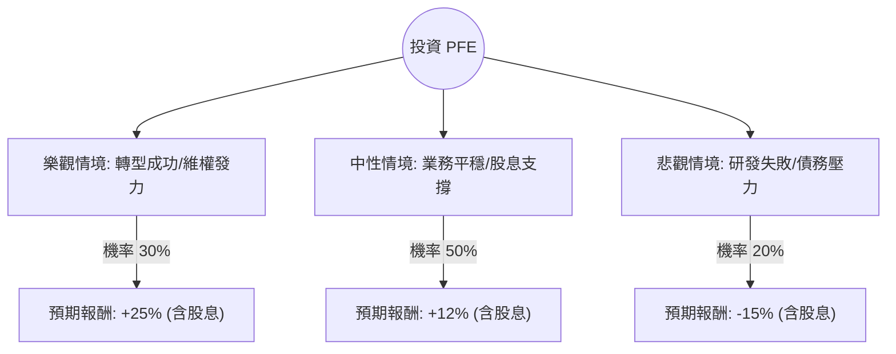

針對美股公司 **輝瑞（Pfizer, PFE）**，我結合了您提供的基本面數據以及最新的市場動態（包括 2024 年 Q2/Q3 財報趨勢、Starboard Value 維權投資者介入、以及 Seagen 收購後的整合進度）進行了深度分析。

以下是基於**決策樹（Decision Tree）**與**期望值（Expected Value）**的投資評估報告。

---

### 一、 核心背景與市場動態分析

在進入計算前，我們先釐清影響 PFE 股價的三大關鍵變數：
1.  **後疫情轉型：** COVID-19 產品（Paxlovid, Comirnaty）營收大幅萎縮後，市場正觀察其非 COVID 業務的增長（目前約 10% 增長）。
2.  **收購與管線：** 斥資 430 億美元收購 Seagen 後，輝瑞正全力轉向腫瘤藥物（Oncology）。
3.  **維權投資者介入：** 近期維權對沖基金 **Starboard Value** 買入約 10 億美元股份，施壓管理層提高資本效率與研發回報，這通常是股價的催化劑。
4.  **財務健康：** 股息率高達 **6.45%**，且 Forward P/E 僅 **9.41**，顯示估值處於歷史低位。

---

### 二、 決策樹分析 (Decision Tree)

我們將未來一年的投資情境分為三種：**樂觀（成功轉型）**、**中性（穩健恢復）**、**悲觀（研發受挫）**。

#### 節點詳細說明：

1.  **樂觀情境 (Bull Case) - 30% 機率**
    *   **條件：** Seagen 整合超預期，癌症新藥數據亮眼；Starboard Value 成功推動成本削減；聯準會降息帶動高股息股估值修復。
    *   **目標價：** $32 - $34
    *   **預期報酬：** 約 25% (價差 18.5% + 股息 6.5%)。

2.  **中性情境 (Base Case) - 50% 機率**
    *   **條件：** 非 COVID 業務維持中個位數增長；股息維持發放；股價回歸分析師平均目標價 ($28.5)。
    *   **目標價：** $28.5
    *   **預期報酬：** 約 12% (價差 5.5% + 股息 6.5%)。

3.  **悲觀情境 (Bear Case) - 20% 機率**
    *   **條件：** 關鍵臨床實驗失敗；專利到期（Patent Cliff）壓力提前反應；收購產生的債務利息負擔過重導致信用評等下調。
    *   **目標價：** $22 - $23
    *   **預期報酬：** 約 -15% (價差 -21.5% + 股息 6.5%)。

---

### 三、 期望值分析 (Expected Value Analysis)

#### 1. 計算過程
期望值 (EV) = $\sum (機率 \times 預期報酬)$

*   **樂觀貢獻：** $0.30 \times 25\% = 7.5\%$
*   **中性貢獻：** $0.50 \times 12\% = 6.0\%$
*   **悲觀貢獻：** $0.20 \times (-15\%) = -3.0\%$

**總體期望值 (Total EV) = 7.5% + 6.0% - 3.0% = 10.5%**

#### 2. 核心假設
*   **市場假設：** 假設未來 12 個月無全球性經濟衰退，且利率環境趨於寬鬆（有利於 PFE 這種高負債收購型公司）。
*   **財務假設：** 輝瑞能維持其 $1.68 的年度股息（目前現金流尚能支撐，但壓力存在）。
*   **產業趨勢：** 減肥藥（GLP-1）口服藥研發進度雖落後，但只要有正面數據即是加分項。

---

### 四、 最終結論

**評估結果：適合投資 (Buy / Overweight)**

#### 理由如下：

1.  **正向期望值：** 10.5% 的預期報酬率優於許多保守型資產，且考慮到其 6.45% 的股息收益率，提供了極強的下行保護（Downside Protection）。
2.  **估值極具吸引力：** Forward P/E 9.41 倍遠低於標普 500 平均水平及醫療保健板塊平均水平。
3.  **催化劑明確：** 維權投資者 Starboard Value 的介入通常會迫使公司進行資產剝離或更激進的成本控制，這對股價是短期利多。
4.  **技術面支撐：** 數據顯示股價已站上 SMA50 (2.74%) 與 SMA200 (7.03%)，顯示中期趨勢已由空轉多，底部築底完成。

**建議策略：**
*   **適合對象：** 追求穩定現金流（股息）與價值修復的長期投資者。
*   **風險提示：** 需密切關注其債務股本比 (Debt/Eq: 0.66) 以及未來兩季的自由現金流 (FCF) 是否足以覆蓋股息支出。若 FCF 持續惡化，則需重新評估悲觀情境的機率。

---
*免責聲明：本分析僅供參考，不構成具體投資建議。投資股票有風險，入市需謹慎。*