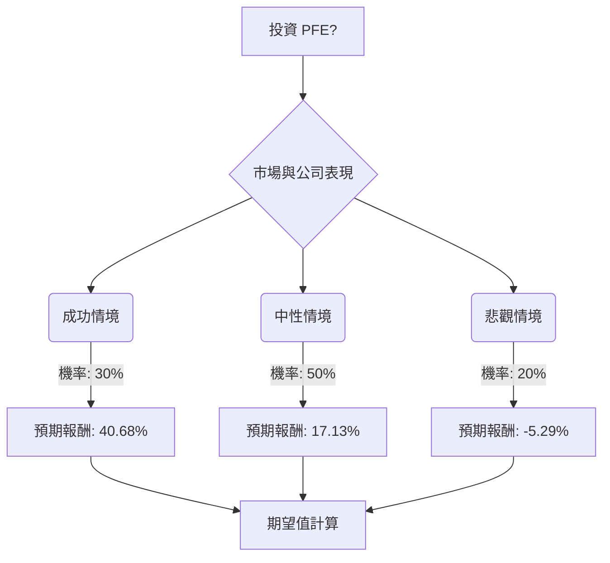

好的，我們將根據「決策樹分析」與「期望值分析」來評估美股公司 PFE (輝瑞) 目前是否適合投資。

### **核心假設 (Core Assumptions)**

1.  **投資期限 (Investment Horizon)**：一年。此分析將評估 PFE 在未來一年內的潛在表現。
2.  **當前股價 (Current Stock Price)**：$26.10 (來自提供的基本面數據)。
3.  **年度股息 (Annual Dividend)**：根據 2025 年第四季度的股息 $0.43/股，預計年度股息為 $0.43 \* 4 = $1.72。
4.  **股息收益率 (Dividend Yield)**：$1.72 / $26.10 = 6.59% (與提供的基本面數據 0.066 相符)。
5.  **市場情緒與公司基本面 (Market Sentiment & Company Fundamentals)**：
    *   **挑戰**：2026 年營收和調整後每股盈餘 (EPS) 預期下降，主要受 COVID-19 產品收入減少和專利懸崖影響。
    *   **優勢與潛力**：核心業務預計在 2026 年實現 4% 的營運增長。在腫瘤學領域擁有強大地位，並透過收購 Seagen 強化了其抗體藥物複合體 (ADC) 管線。肥胖症藥物管線 (如 MET-097i) 若第三期數據積極，可能成為重要催化劑。公司預計將實現 72 億美元的成本節約。目前估值較低，P/E (非 GAAP) 為 7.9，被一些分析師視為「划算」。
    *   **轉折點**：2028 年被視為公司擺脫專利到期影響、穩定基礎、實現成本節約並推出新產品（肥胖症、腫瘤學）以大幅增加收入的轉折點。
6.  **分析師預期 (Analyst Expectations)**：
    *   綜合評級為「買入」。
    *   12 個月目標價範圍介於 $23.00 至 $37.54，平均目標價為 $28.85。

### **決策樹分析 (Decision Tree Analysis)**

我們將設定三個情境來評估 PFE 的投資潛力：

*   **成功情境 (Optimistic Scenario)**：公司在腫瘤學和肥胖症管線方面取得重大進展，核心業務增長超出預期，成本節約措施顯著，市場對其低估值進行重估。
*   **中性情境 (Moderate Scenario)**：公司表現符合 2026 年財測，管線產品有一定進展但同時面臨 COVID-19 產品收入下降和專利到期的持續壓力，股價向分析師平均目標價靠攏。
*   **悲觀情境 (Pessimistic Scenario)**：關鍵管線產品遭遇挫折，COVID-19 產品收入和專利到期影響超出預期，成本節約不達標，或整體醫藥市場環境惡化。

---

#### **決策樹 (Decision Tree)**

---

#### **計算過程 (Calculation Process)**

**1. 股息收益率計算 (Dividend Yield Calculation)**
*   年度股息 = $0.43/股 (每季度) * 4 = $1.72
*   當前股價 = $26.10
*   股息收益率 = $1.72 / $26.10 = 0.0659 = 6.59%

**2. 情境預期報酬計算 (Scenario Expected Return Calculation)**

*   **成功情境 (Optimistic Scenario)**
    *   **情境名稱**：強勁管線表現與市場重估
    *   **情境描述**：PFE 的新腫瘤藥物 (如 BRAFTOVI 擴展) 表現出色，肥胖症管線 (MET-097i) 取得積極的第三期數據，核心業務增長超預期，且 72 億美元的成本節約措施有效實施。市場對其目前較低的估值進行重估。
    *   **預期股價 (1年後)**：$35.00 (接近分析師最高目標價 $37.54 但更為保守)
    *   **資本利得率** = ($35.00 - $26.10) / $26.10 = 34.09%
    *   **總預期報酬** = 資本利得率 + 股息收益率 = 34.09% + 6.59% = **40.68%**
    *   **機率 (Probability)**：30%

*   **中性情境 (Moderate Scenario)**
    *   **情境名稱**：符合財測與穩定轉型
    *   **情境描述**：PFE 的 2026 年營收和 EPS 符合公司指引，COVID-19 產品收入下降和專利到期壓力持續存在，但新產品和成本節約措施部分抵消了負面影響。市場情緒保持中性，股價向分析師平均目標價靠攏。
    *   **預期股價 (1年後)**：$28.85 (分析師平均目標價)
    *   **資本利得率** = ($28.85 - $26.10) / $26.10 = 10.54%
    *   **總預期報酬** = 資本利得率 + 股息收益率 = 10.54% + 6.59% = **17.13%**
    *   **機率 (Probability)**：50%

*   **悲觀情境 (Pessimistic Scenario)**
    *   **情境名稱**：管線失敗與專利懸崖衝擊
    *   **情境描述**：PFE 的關鍵管線產品 (特別是肥胖症或腫瘤學) 臨床試驗失敗或數據不佳，COVID-19 產品收入下降速度快於預期，專利到期對營收造成更大衝擊，且成本節約未能有效執行。整體醫藥行業面臨更嚴峻的監管或定價壓力。
    *   **預期股價 (1年後)**：$23.00 (分析師最低目標價)
    *   **資本利得率** = ($23.00 - $26.10) / $26.10 = -11.88%
    *   **總預期報酬** = 資本利得率 + 股息收益率 = -11.88% + 6.59% = **-5.29%**
    *   **機率 (Probability)**：20%

**3. 整體期望值計算 (Overall Expected Value Calculation)**

整體期望值 = (成功情境預期報酬 \* 機率) + (中性情境預期報酬 \* 機率) + (悲觀情境預期報酬 \* 機率)
整體期望值 = (0.4068 \* 0.30) + (0.1713 \* 0.50) + (-0.0529 \* 0.20)
整體期望值 = 0.12204 + 0.08565 + (-0.01058)
整體期望值 = 0.20769 - 0.01058
整體期望值 = **0.19711 或 19.71%**

### **最終結論 (Final Conclusion)**

根據決策樹分析和期望值計算，PFE 在未來一年的**整體期望值為 19.71%**。

**判斷**：**適合投資**

**簡短理由**：
儘管 PFE 在 2026 年面臨 COVID-19 產品收入下降和專利到期的挑戰，導致其財測相對保守，但其目前股價被市場低估，P/E 比率處於歷史低位。公司在腫瘤學領域的強大管線和潛在的肥胖症藥物突破，以及大規模的成本節約計劃，為未來的增長提供了堅實的基礎。此外，近 7% 的高股息收益率為投資者提供了可觀的收入流。綜合考量下，即使存在短期逆風，PFE 的長期轉型潛力、吸引人的估值和穩定的股息使其成為一個適合考慮的投資標的。