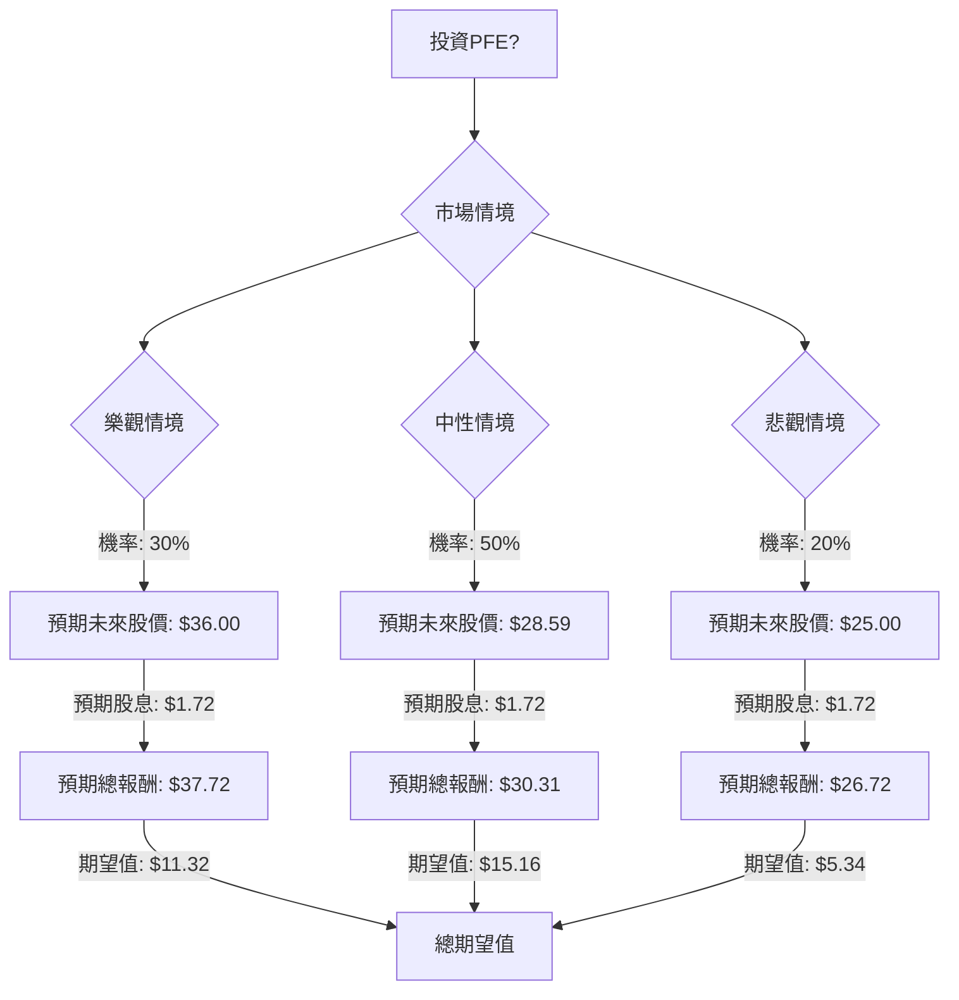

## 輝瑞 (PFE) 投資評估：決策樹與期望值分析

根據對美股公司輝瑞 (PFE) 的基本面數據、最新新聞、財報、市場動態及產業趨勢的綜合分析，我們將運用決策樹分析與期望值分析，評估其目前的投資適合性。

### 核心假設

在進行決策樹分析前，我們建立以下核心假設：

*   **時間範圍**：評估期間為未來一年，與分析師的目標價時間範圍一致。
*   **市場環境**：全球製藥產業預計在2024年實現4.6%的產量增長和5.1%的銷售增長，主要由亞太地區驅動。專業產品、慢性病藥物、學名藥和減肥藥物是主要增長動力。
*   **輝瑞財務表現**：輝瑞正從COVID-19產品銷售高峰回落，並積極透過收購 (如Seagen) 和成本重組來推動非COVID產品的增長。公司已重申2024年和2025年的財務指引。
*   **研發管線**：輝瑞擁有活躍的研發管線，特別是在腫瘤學、疫苗 (如萊姆病疫苗) 和體重管理領域，近期有多項積極的臨床試驗結果。
*   **股息政策**：輝瑞維持高股息政策，儘管派息率較高，但管理層承諾維持股息。
*   **分析師共識**：目前分析師對PFE的共識評級多為「持有」或「溫和買入」，平均目標價顯示短期上漲空間有限。

### 決策樹分析

我們將投資PFE的決策分為三個主要情境：樂觀、中性與悲觀，並為每個情境分配機率及預期報酬。

**當前股價 (PFE)**：$27.04 (截至2026年3月27日或29日)
**年度股息 (DPS)**：$1.72 ($0.43/季 * 4)

#### 決策樹結構 (Markdown)

#### 計算過程

**1. 樂觀情境 (Optimistic Scenario)**
*   **情境名稱**：高增長/管線成功
*   **情境描述**：輝瑞成功推出新藥，關鍵管線資產 (如萊姆病疫苗、腫瘤藥物) 進入後期階段或獲批，Seagen整合超預期，成本節約顯著提升利潤率。市場情緒改善，推動估值上升。
*   **機率 (Probability)**：30%
*   **預期未來股價**：$36.00 (參考分析師最高目標價)
*   **預期股息**：$1.72 (年度)
*   **預期報酬 (Expected Return)**：$36.00 (股價) + $1.72 (股息) = $37.72
*   **期望值 (Expected Value)**：$37.72 * 0.30 = $11.316

**2. 中性情境 (Neutral Scenario)**
*   **情境名稱**：穩定表現/成果參半
*   **情境描述**：輝瑞達成2025年財測，非COVID產品穩定增長，部分管線成功但被輕微挫折或競爭加劇抵消，成本節約符合預期。股價表現符合分析師平均目標。
*   **機率 (Probability)**：50%
*   **預期未來股價**：$28.59 (參考分析師平均目標價，取$29.07、$28.85、$28.23、$28.19 的平均值)
*   **預期股息**：$1.72 (年度)
*   **預期報酬 (Expected Return)**：$28.59 (股價) + $1.72 (股息) = $30.31
*   **期望值 (Expected Value)**：$30.31 * 0.50 = $15.155

**3. 悲觀情境 (Pessimistic Scenario)**
*   **情境名稱**：表現不佳/管線受挫
*   **情境描述**：輝瑞未能達成2025年財測，重要管線項目失敗或延遲，競爭加劇，或監管障礙影響關鍵產品。成本節約不足，高股息派發率引發擔憂，可能導致股息削減。整體市場下行也產生負面影響。
*   **機率 (Probability)**：20%
*   **預期未來股價**：$25.00 (參考分析師最低目標價)
*   **預期股息**：$1.72 (年度)
*   **預期報酬 (Expected Return)**：$25.00 (股價) + $1.72 (股息) = $26.72
*   **期望值 (Expected Value)**：$26.72 * 0.20 = $5.344

**總期望值 (Overall Expected Value)**

將各情境的期望值加總：
總期望值 = 樂觀情境期望值 + 中性情境期望值 + 悲觀情境期望值
總期望值 = $11.316 + $15.155 + $5.344 = $31.815

### 最終結論

根據上述決策樹分析和期望值計算，輝瑞 (PFE) 股票在未來一年的**總期望值為 $31.815**。

*   **適合投資 / 不適合投資**：根據計算結果，PFE 的總期望值 ($31.815) 高於其當前股價 ($27.04)。這表明從期望值分析的角度來看，**PFE 目前適合投資**。

*   **簡短理由**：儘管輝瑞面臨COVID-19產品銷售下降的挑戰，但公司透過收購Seagen強化腫瘤業務，並積極推進多個具潛力的研發管線，包括萊姆病疫苗、腫瘤藥物和體重管理藥物。 此外，公司正在實施大規模的成本節約計畫，預計到2024年底可節省至少40億美元。 分析師的平均目標價也顯示一定的上漲空間，且其高達6.36%的股息收益率在當前市場環境下具有吸引力，儘管派息率較高，但管理層承諾維持股息。 綜合考量，PFE在轉型期展現出增長潛力，且其股息提供了一定的下行保護和穩定收益。