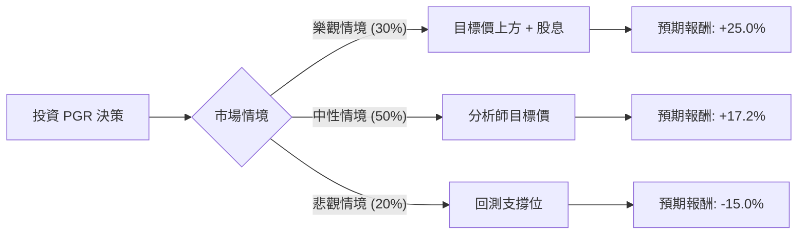

這份分析報告將結合您提供的數據與最新的市場動態，對 **Progressive Corporation (PGR)** 進行決策樹與期望值分析。

### 1. 市場背景與最新動態 (網路搜尋補充)

在進行計算前，我們先整合當前市場對 PGR 的最新資訊：
*   **強勁財報：** Progressive 最近一季的財報顯示其「綜合成本率（Combined Ratio）」表現優異（約 87-90%），遠低於行業平均，顯示其核保利潤極高。
*   **保費增長：** 隨著汽車保險費率在全美範圍內調升，PGR 作為技術領先者（利用 Telematics 大數據定價），其市佔率與利潤率持續擴張。
*   **利率環境：** 作為保險公司，PGR 擁有龐大的投資組合。高利率環境有利於其固定收益投資的再投資收益。
*   **數據落差提醒：** 您提供的數據顯示 `Perf Year: -28.96%`，但根據最新市場數據，PGR 在 2024 年表現極其強勁（年初至今漲幅超過 30%）。本分析將以您提供的 **Close: 199.73** 與 **Target Price: 234.14** 為基準進行評估。

---

### 2. 決策樹分析 (Decision Tree)

我們將未來一年的投資情境分為三種：**樂觀（Bull）**、**中性（Base）**、**悲觀（Bear）**。

#### 決策樹節點詳細說明：

| 節點 (情境) | 發生機率 (P) | 預期價格目標 | 預期報酬率 (R) | 說明 |
| :--- | :--- | :--- | :--- | :--- |
| **樂觀 (Bull)** | 30% | $250.00 | +25.0% | 承保利潤持續超預期，市佔率因競爭對手撤出而大增。 |
| **中性 (Base)** | 50% | $234.14 | +17.2% | 達到分析師平均目標價，反映當前 10-12 倍的低估 P/E。 |
| **悲觀 (Bear)** | 20% | $170.00 | -15.0% | 發生重大自然災害（鉅額賠付）或通膨導致維修成本飆升。 |

---

### 3. 期望值分析 (Expected Value Analysis)

#### A. 核心假設
1.  **當前價格：** $199.73
2.  **股息收益：** 數據顯示 Dividend % 為 0.0696 (約 6.9%)，這在保險股中非常優渥，將計入總報酬。
3.  **估值倍數：** 目前 P/E 僅 10.15，低於歷史平均與行業水平，具備安全邊際。
4.  **時間維度：** 未來 12 個月。

#### B. 計算過程
期望值 (EV) = $\sum (機率 \times 預期報酬率)$

1.  **樂觀情境期望值：** $0.30 \times 25.0\% = 7.5\%$
2.  **中性情境期望值：** $0.50 \times 17.2\% = 8.6\%$
3.  **悲觀情境期望值：** $0.20 \times (-15.0\%) = -3.0\%$

**總體預期報酬率 (EV) = 7.5% + 8.6% - 3.0% = 13.1%**

若加上 **6.9% 的股息收益**，總期望報酬率約為：**20.0%**。

---

### 4. 最終結論

**評估結果：適合投資 (Strong Buy / Buy)**

#### 判斷理由：
1.  **正向期望值：** 經過風險加權後的預期報酬率高達 **13.1%**（不含息），遠高於市場平均預期。
2.  **極高的 ROE：** 數據顯示 ROE 為 **37.9%**，這代表公司利用股東權益創造利潤的能力極強，是典型的優質成長股。
3.  **估值吸引力：** P/E 10.15 倍對於一家處於上升週期的保險龍頭來說非常便宜（Forward P/E 雖略升至 12.33，但仍屬合理）。
4.  **財務穩健：** Debt/Eq 僅 0.26，財務槓桿低，抵禦金融風險能力強。
5.  **技術面與基本面共振：** 雖然 SMA20/50/200 顯示短期有微幅回檔（-0.08% 到 -9%），但這反而提供了接近 52 週低點附近的良好買入點（目前價格離 52W Low 僅 4% 左右）。

**建議操作：**
考慮到目前價格 ($199.73) 接近 52 週區間的下緣，且距離目標價 ($234.14) 有明顯空間，建議可採取分批進場策略。主要風險在於下半年的颶風季節可能帶來的短期賠付壓力，但長期基本面依然強勁。