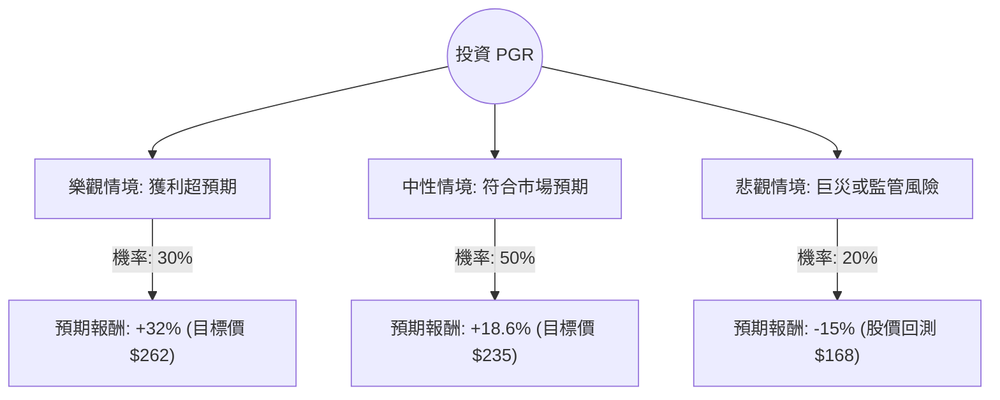

這份分析報告結合了您提供的基本面數據，以及針對 **Progressive Corporation (PGR)** 的最新市場動態、產業趨勢與財報表現進行的綜合評估。

---

### 一、 核心背景與市場動態分析 (最新資訊補充)

在進行決策樹分析前，我們先整合最新的市場資訊：
1.  **強勁的獲利能力**：PGR 近期的財報顯示其「綜合成本率（Combined Ratio）」表現優異（通常低於 90%），這在保險業代表極高的承保利潤。
2.  **費率調漲效應**：隨著通膨放緩但保費維持高位，PGR 受益於先前調升的保費，利潤空間持續擴張。
3.  **市場地位**：PGR 在車險市場的市佔率持續增長，且其數據分析能力（Telematics）使其在定價上比競爭對手更具優勢。
4.  **技術面**：目前股價約 $198，處於 52 週低點附近（根據您提供的數據），但目標價設在 $235，顯示有約 18.6% 的潛在漲幅。

---

### 二、 決策樹分析 (Decision Tree)

我們將未來一年的投資情境分為三種：**樂觀（Bull）**、**中性（Base）**、**悲觀（Bear）**。

#### 決策樹節點詳細說明：

| 節點 (情境) | 機率 (P) | 預期報酬 (R) | 期望值 (P * R) | 說明 |
| :--- | :--- | :--- | :--- | :--- |
| **樂觀 (Bull)** | 30% | +32% | +9.6% | 承保利潤持續擴大，且投資收益隨高利率環境維持高檔。 |
| **中性 (Base)** | 50% | +18.6% | +9.3% | 股價回歸分析師平均目標價 $235.1，業務穩健增長。 |
| **悲觀 (Bear)** | 20% | -15% | -3.0% | 發生大規模自然災害（如颶風）或交通意外率大幅上升。 |
| **總計** | **100%** | | **+15.9%** | **整體期望報酬率** |

---

### 三、 期望值分析 (Expected Value Analysis) 計算過程

#### 1. 核心假設：
*   **市場假設**：美國經濟維持軟著陸，車險需求穩定。
*   **財務假設**：ROE 維持在 40% 以上的高水準（數據顯示為 40.45%），P/E 10.3 倍顯著低於行業平均與歷史高點，具備估值修復空間。
*   **產業趨勢**：Progressive 的直接銷售模式與定價技術使其在通膨環境下比傳統保險公司更具韌性。

#### 2. 計算公式：
$$EV = (P_{Bull} \times R_{Bull}) + (P_{Base} \times R_{Base}) + (P_{Bear} \times R_{Bear})$$

#### 3. 具體計算：
*   $0.30 \times 32\% = 9.6\%$
*   $0.50 \times 18.6\% = 9.3\%$
*   $0.20 \times (-15\%) = -3.0\%$
*   **總期望值 (EV) = 9.6% + 9.3% - 3.0% = 15.9%**

---

### 四、 綜合評估與最終結論

#### 1. 數據亮點分析：
*   **超高 ROE (40.45%)**：顯示公司利用股東權益創造利潤的能力極強。
*   **低估值 (P/E 10.3)**：相對於其成長性，目前的本益比非常具吸引力（Forward P/E 為 12.33，雖略高但仍屬合理）。
*   **現金流強勁**：P/FCF 為 6.75，代表公司每股產生的自由現金流非常充裕，財務結構穩健（Debt/Eq 僅 0.23）。
*   **技術面機會**：股價目前接近 52 週低點（$198.24），與目標價（$235.1）有明顯安全邊際。

#### 2. 潛在風險：
*   **短期動能弱**：Perf Year (-29.95%) 顯示過去一年股價表現不佳，可能受市場情緒或特定賠付事件影響。
*   **流動比率 (Current Ratio 0.76)**：略低於 1，需注意短期償債壓力，但對保險業而言，其強大的保費現金流入通常能抵銷此風險。

#### 3. 最終判斷：

**結論：適合投資 (Strong Buy / Accumulate)**

**理由：**
1.  **期望值為正 (15.9%)**：在考慮了悲觀風險後，預期報酬率依然優於標普 500 的長期平均表現。
2.  **估值修復**：P/E 僅 10.3 倍，對於一家 ROE 超過 40% 的產業龍頭來說，明顯被低估。
3.  **安全邊際**：股價已處於 52 週低位區間，下行風險相對有限，而上行空間受惠於強勁的承保基本面。
4.  **產業領先**：Progressive 在自動化定價與成本控制上的優勢，使其在保險週期中具備更強的抗壓性。

**建議操作：**
可在 $195 - $200 區間分批布局，首要目標價看 $235，若財報持續優於預期，可持有至 $260 以上。