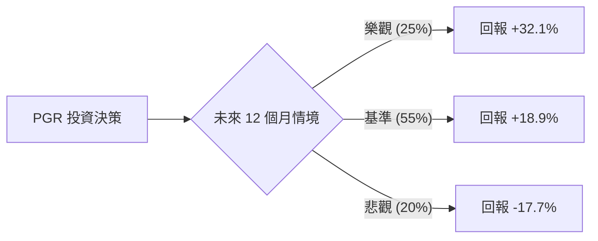

# Progressive Corp (PGR) 定量投資分析報告

## 1. 核心驅動因素與風險 (Drivers & Risks)

### 關鍵催化劑 (Catalysts)
*   **綜合成本率 (Combined Ratio) 持續優化**：PGR 在數據分析與定價能力上領先同業。若未來 6-12 個月其綜合成本率能穩定維持在 90% 以下（低於行業平均），將直接推動 EPS 超預期增長。
*   **保費調漲效應顯現**：為應對通膨導致的維修成本上升，PGR 已在多州完成費率上調。隨著舊保單到期並轉為新費率，利潤率將進入擴張期。
*   **市場份額擴張**：當競爭對手（如 GEICO 或 State Farm）因成本壓力縮減廣告或收緊承保時，PGR 憑藉強大的資產負債表與獲客效率，有望在車險市場獲取更高份額。

### 主要風險點 (Risks)
*   **嚴重賠付通膨 (Severity Inflation)**：若汽車零件價格、醫療費用或法律訴訟成本上升速度超過保費調漲速度，將壓縮利潤空間。
*   **極端氣候與災難損失 (CAT Losses)**：颶風、冰雹等自然災害具有隨機性，若未來一年發生頻率超乎預期，將對短期財報造成衝擊。
*   **監管壓力**：部分州政府可能因應通膨壓力，限制保險公司進一步調漲保費，影響其定價靈活性。

---

## 2. 情境設定與機率賦予 (Scenario Modeling)

### 樂觀情境 (Bull Case)
*   **發生條件**：通膨顯著降溫使維修成本低於預期；保費調漲完全轉化為利潤；綜合成本率優於市場預期。
*   **預估機率**：25%
*   **目標價格與預期回報**：**$260 (+32.1%)**。基於 Forward P/E 回升至歷史高位區間（約 18x-20x）及 EPS 雙位數增長。

### 基準情境 (Base Case)
*   **發生條件**：保費增長與賠付成本達成平衡；市場份額穩步提升；符合分析師目前的平均預期。
*   **預估機率**：55%
*   **目標價格與預期回報**：**$234 (+18.9%)**。基於分析師平均目標價 $234.05，反映合理的估值修復。

### 悲觀情境 (Bear Case)
*   **發生條件**：發生重大自然災害導致巨額賠付；監管機構強烈干預費率；市場進入劇烈波動導致投資收益下滑。
*   **預估機率**：20%
*   **目標價格與預期回報**：**$162 (-17.7%)**。回測至 52 週低點附近，並考慮到 P/B 估值下修至 3.0x 以下的安全邊際。

---

## 3. 期望值計算與決策樹 (EV Calculation & Decision Tree)

### 決策樹結構

### 總期望值計算
*   **EV** = (0.25 * 32.1%) + (0.55 * 18.9%) + (0.20 * -17.7%)
*   **EV** = 8.025% + 10.395% - 3.54% = **14.88%**

### 風險回報比分析
*   **上行潛力 (Upside)**：+18.9% ~ +32.1%
*   **下行空間 (Downside)**：-17.7%
*   **不對稱性評估**：期望值為正（14.88%），且基準情境的回報率（18.9%）足以覆蓋悲觀情境的潛在損失。風險回報比約為 1.45:1（以基準回報計），具備投資吸引力。

---

## 4. 決策總結 (Decision Summary)

| 情境 | 發生機率 (%) | 預期報酬率 (%) | 關鍵驅動/觸發因素 |
| :--- | :--- | :--- | :--- |
| **樂觀 (Bull)** | 25% | +32.1% | 賠付成本大幅下降，P/E 估值擴張 |
| **基準 (Base)** | 55% | +18.9% | 保費調漲抵銷通膨，達成分析師目標價 |
| **悲觀 (Bear)** | 20% | -17.7% | 極端氣候災害或監管費率限制 |
| **整體期望值** | **100%** | **+14.88%** | **加權平均預期回報** |

**最終結論：**
1. **投資建議**：**買入 (Buy)**
2. **核心逻辑**：PGR 目前 P/E 僅 9.79，遠低於其歷史平均與 Forward P/E (11.89)，顯示市場可能低估了其費率上調後的盈利彈性。14.88% 的期望回報率在當前高利率環境下具備競爭力，且 PGR 高達 37.9% 的 ROE 證明了其卓越的資本效率。
3. **風控建議**：若股價跌破 $175（接近 52 週低點與悲觀情境邊界），或連續兩個季度綜合成本率惡化至 96% 以上，應視為基本面轉弱的出場訊號。