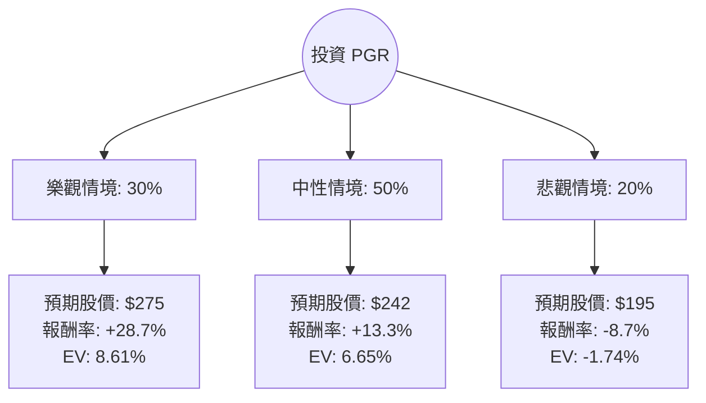

這份分析報告將結合您提供的數據與當前美股市場對 **Progressive Corporation (PGR)** 的最新動態，利用「決策樹」與「期望值分析」來評估其投資價值。

---

### 一、 市場背景與最新動態分析（網路資訊補充）

在進行計算前，我們先整合當前市場對 PGR 的觀察：
1.  **承保利潤強勁**：Progressive 近期的財報顯示其「綜合成本率（Combined Ratio）」表現優異（低於 90%），這意味著其保費收入扣除賠付後仍有顯著獲利，優於同業。
2.  **定價能力**：面對通膨導致的修車成本上升，PGR 展現了強大的數據分析能力，能精準調升保費而不流失大量客戶。
3.  **宏觀環境**：高利率環境有利於保險公司的投資收益（Float income）。雖然近期有颶風（如 Helene, Milton）的賠付壓力，但市場普遍認為其資本充足，足以應對。
4.  **估值面**：您提供的數據顯示 P/E 為 11.71，相較於其歷史平均與標普 500 保險板塊，目前處於相對合理的區間。

---

### 二、 決策樹分析 (Decision Tree)

我們將未來一年的投資表現分為三種情境：**樂觀（Bull）**、**中性（Base）**、**悲觀（Bear）**。

---

### 三、 核心假設與計算過程

#### 1. 核心假設
*   **當前股價 (Current Price)**: $213.66 (參考提供數據)
*   **樂觀情境 (30%)**：PGR 持續擴大市佔率，且綜合成本率維持在極低水準，加上高利率帶來的投資收益超預期。目標價參考 52 週高點附近並考慮增長，設定為 **$275**。
*   **中性情境 (50%)**：公司表現符合分析師預期，達到目標價 **$242.05**。保費增長穩定，抵銷了自然災害的賠付。
*   **悲觀情境 (20%)**：發生超大型自然災害或通膨導致修車成本失控，且股市整體回檔。股價回測 52 週低點支撐位，設定為 **$195**。

#### 2. 期望值 (Expected Value, EV) 計算過程

期望值公式：$EV = \sum (機率 \times 報酬率)$

*   **樂觀情境報酬率**: $(275 - 213.66) / 213.66 = +28.71\%$
    *   *貢獻期望值*: $0.30 \times 28.71\% = 8.61\%$
*   **中性情境報酬率**: $(242.05 - 213.66) / 213.66 = +13.29\%$
    *   *貢獻期望值*: $0.50 \times 13.29\% = 6.65\%$
*   **悲觀情境報酬率**: $(195 - 213.66) / 213.66 = -8.73\%$
    *   *貢獻期望值*: $0.20 \times (-8.73\%) = -1.75\%$

**總體期望報酬率 (Total EV)**:
$8.61\% + 6.65\% - 1.75\% = \mathbf{13.51\%}$

---

### 四、 財務數據深度解讀

*   **盈利能力 (ROE 34.23%)**：極其出色。保險業 ROE 超過 20% 即屬優秀，34% 顯示其資本運用效率極高。
*   **估值 (P/E 11.71)**：低於 Forward P/E (13.3)，且相對於其 ROE 表現，目前的 P/E 顯得相當便宜（PEG 雖未提供，但隱含增長率高）。
*   **技術面 (SMA)**：SMA20 (+4.06%) 與 SMA50 (+1.01%) 均為正，顯示短期趨勢向上；SMA200 (-9.75%) 仍為負，說明股價正處於從底部回升的階段，這通常是價值投資者的介入點。
*   **債務 (Debt/Eq 0.19)**：財務結構非常穩健，低槓桿經營降低了破產風險。

---

### 五、 最終結論

**判斷：適合投資 (Buy / Overweight)**

#### 理由：
1.  **正向期望值**：計算出的年度期望報酬率為 **13.51%**，顯著高於無風險利率（美債收益率）及市場平均預期。
2.  **高護城河與效率**：34.23% 的 ROE 證明了 Progressive 在保險定價與成本控制上的核心競爭力。
3.  **估值吸引力**：P/E 僅 11.7 倍，對於一家具有雙位數增長潛力且處於產業領導地位的公司而言，目前股價（$213.66）具有安全邊際。
4.  **風險可控**：雖然保險業面臨氣候風險，但 PGR 的低債務比與強大的現金流（P/FCF 7.35）提供了強大的緩衝。

**建議操作：**
目前股價處於 52 週區間的中低位，且短期均線已轉正。建議可在 $210 - $220 區間分批布局，首個目標價看分析師平均預期的 $242，若基本面持續強勁，可持有至 $270 以上。