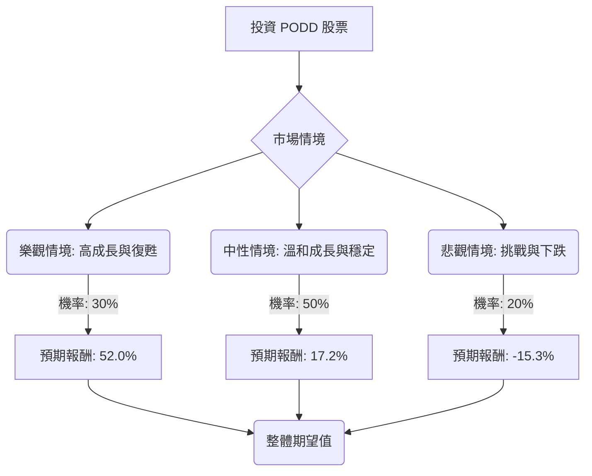

根據對美股公司 Insulet Corporation (PODD) 的基本面數據、最新新聞、財報、市場動態及產業趨勢的綜合分析，以下是基於決策樹分析與期望值分析的投資評估。

### **核心假設 (Core Assumptions)**

1.  **時間範圍 (Time Horizon)**：本次投資評估的時間範圍為未來一年。
2.  **市場成長 (Market Growth)**：糖尿病管理設備市場預計將持續成長，主要受全球糖尿病患病率上升和技術進步的推動。自動胰島素輸送系統 (AID) 市場預計在 2026 年至 2032 年間以 10.09% 的複合年增長率增長。整個糖尿病護理設備市場預計在 2025 年至 2030 年間以 12.3% 的複合年增長率增長。
3.  **競爭格局 (Competitive Landscape)**：胰島素泵市場競爭激烈，主要競爭者包括 Medtronic 和 Tandem Diabetes Care。Tandem 即將推出新的無管 AID 設備 Mobi，其電池壽命比 Omnipod 5 更長。
4.  **公司執行力 (Company Execution)**：Insulet 預計將繼續創新並擴大全球市場，但近期產品缺陷和市場認知可能帶來挑戰。公司管理層預計 2026 年營收將實現中雙位數增長（按固定匯率計算為 20% 至 22%），並預計調整後每股收益增長超過 25%。
5.  **分析師目標價 (Analyst Price Targets)**：分析師的平均目標價約為 $340-$357，可作為樂觀情境下的參考上限。
6.  **當前股價 (Current Stock Price)**：$230.28。值得注意的是，該股近期已跌至新的 52 週低點，例如 $220.28 和 $226.14，低於用戶提供的 52 週低點 $233.29。這表明該股近期承受了顯著的壓力。

### **決策樹分析 (Decision Tree Analysis)**

**決策點：投資 PODD 股票**

#### **情境定義與計算 (Scenario Definition and Calculation)**

**當前股價 (P0) = $230.28**

1.  **樂觀情境 (Optimistic Scenario: High Growth & Recovery)**
    *   **預測情境名稱**：高成長與復甦
    *   **情境描述**：Insulet 成功解決 Omnipod 5 產品缺陷，對品牌聲譽的長期影響最小化。Omnipod 5 在全球範圍內（特別是針對第二型糖尿病患者）持續強勁增長。儘管存在競爭，公司仍能保持市場份額增長。2026 年的財務指引得以實現或超越。市場信心恢復，股價回升至分析師共識目標價。
    *   **對應的機率 (Probability)**：30%
    *   **預期未來股價 (P_opt_f)**：$350 (參考分析師平均目標價 $340-$357 的保守端)
    *   **預期報酬 (R_opt)**：(($350 - $230.28) / $230.28) = 0.520 = 52.0%
    *   **期望值 (Expected Value, EV_opt)**：0.30 * 0.520 = 0.156

2.  **中性情境 (Neutral Scenario: Moderate Growth & Stabilization)**
    *   **預測情境名稱**：溫和成長與穩定
    *   **情境描述**：Omnipod 5 產品缺陷得到控制，但對新客戶獲取或品牌形象造成短期輕微影響。公司繼續增長，但由於競爭壓力或 2026 年預期的增長率放緩，增長速度略低於最樂觀的預期。股價趨於穩定並實現溫和升值，但未能達到較高的分析師目標。
    *   **對應的機率 (Probability)**：50%
    *   **預期未來股價 (P_neu_f)**：$270 (代表從當前價格溫和上漲約 17%，低於 52 週高點但高於近期低點)
    *   **預期報酬 (R_neu)**：(($270 - $230.28) / $230.28) = 0.172 = 17.2%
    *   **期望值 (Expected Value, EV_neu)**：0.50 * 0.172 = 0.086

3.  **悲觀情境 (Pessimistic Scenario: Challenges & Decline)**
    *   **預測情境名稱**：挑戰與下跌
    *   **情境描述**：Omnipod 5 產品缺陷問題惡化，導致更嚴重的聲譽損害或監管問題。競爭加劇（例如 Tandem 的 Mobi 推出），顯著侵蝕 Insulet 的市場份額。市場對 GLP-1 藥物的擔憂比預期更為嚴重，影響了整個糖尿病設備市場或 Insulet 的特定客戶群。公司未能達到財務指引，利潤率受壓。股價進一步下跌，可能重新測試近期低點或跌破。
    *   **對應的機率 (Probability)**：20%
    *   **預期未來股價 (P_pes_f)**：$195 (代表從當前價格下跌約 15%，低於近期 52 週低點 $220.28)
    *   **預期報酬 (R_pes)**：(($195 - $230.28) / $230.28) = -0.153 = -15.3%
    *   **期望值 (Expected Value, EV_pes)**：0.20 * -0.153 = -0.0306

#### **整體期望值計算 (Overall Expected Value Calculation)**

整體期望值 (EV_total) = EV_opt + EV_neu + EV_pes
EV_total = 0.156 + 0.086 + (-0.0306)
**EV_total = 0.2114**

這表示在未來一年內，投資 PODD 的整體預期報酬率約為 **21.14%**。

### **最終結論 (Final Conclusion)**

根據決策樹分析和期望值計算，Insulet Corporation (PODD) **適合投資**。

**簡短理由 (Brief Reasoning)**：
儘管 Insulet 近期面臨 Omnipod 5 產品缺陷和日益激烈的市場競爭等挑戰，導致股價跌至新的 52 週低點，但其強勁的基本面和積極的未來展望抵消了這些風險。公司在 2025 年第四季度和全年表現出色，營收增長強勁，並在美國和歐洲的新客戶啟動方面排名第一。糖尿病管理設備市場的整體增長趨勢，以及 Insulet 在自動胰島素輸送系統領域的領導地位和全球擴張策略，為其提供了堅實的成長基礎。

分析師普遍給予「買入」或「適度買入」評級，平均目標價顯示出顯著的上漲空間。公司管理層對 2026 年的營收和盈利增長持樂觀態度。儘管存在產品召回和競爭加劇的風險，但基於當前股價和各情境下的預期報酬，整體期望值為正 21.14%，表明潛在收益大於潛在風險。因此，對於願意承擔一定風險以追求成長的投資者而言，PODD 股票目前具有吸引力。