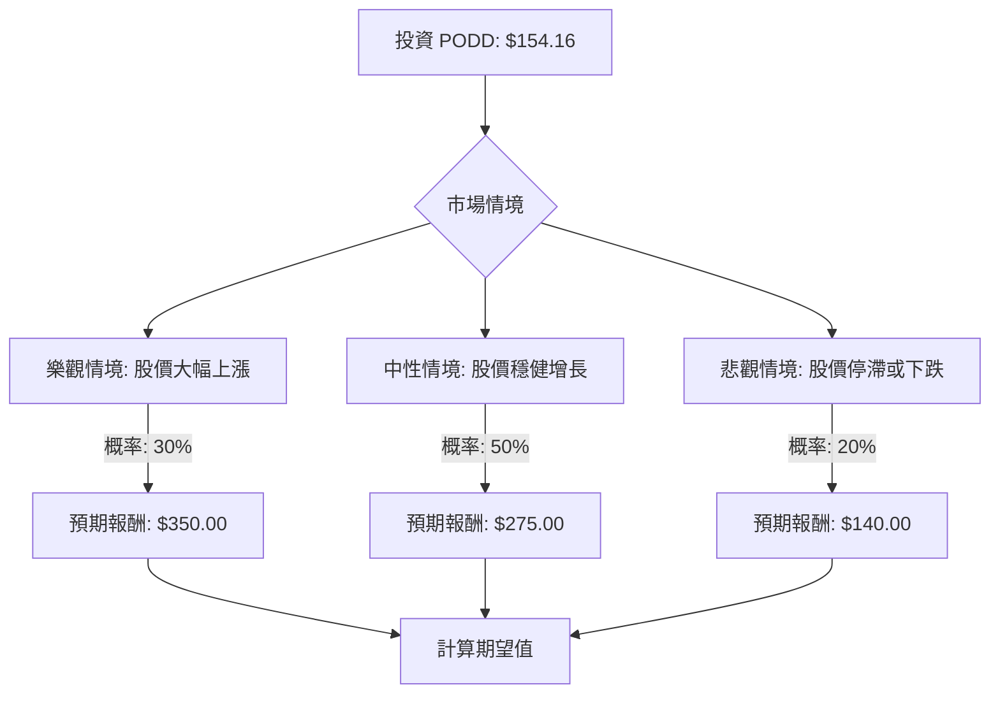

Insulet Corporation (NASDAQ: PODD) 是一家在無管胰島素泵技術領域領先的美股公司，其主要產品為 Omnipod 品牌。根據提供的基本面數據和最新的市場資訊，我們將使用決策樹分析和期望值分析來評估其目前的投資適宜性。

### 最新資訊與核心假設

**公司概況與財務表現：**
*   **最新財報 (2026 年第一季度):** Insulet 公布了強勁的 2026 年第一季度業績，營收達 7.617 億美元，同比增長 33.9% (按固定匯率計算增長 30.1%)，超出公司指導範圍。GAAP 淨利潤為 9110 萬美元 (稀釋後每股收益 1.30 美元)；調整後淨利潤為 9980 萬美元 (調整後每股收益 1.42 美元)。公司上調了全年營收指導並指出利潤率有所擴大。
*   **盈利能力:** 毛利率 0.7164、營業利潤率 0.1747、淨利潤率 0.1044，顯示健康的盈利能力。ROE 0.23、ROA 0.0931、ROI 0.1357 表現良好。
*   **增長潛力:** 2026 年第一季度 EPS 同比增長 158.51%，銷售額同比增長 33.87%。預計未來三年營收年均增長 15%，高於醫療設備行業平均 8.0% 的預期。 預計今年 EPS 增長 86.38%，明年增長 27.38%。
*   **估值:** 目前本益比 (P/E) 為 35.88，遠期本益比 (Forward P/E) 為 18.92，PEG 比率為 0.69，顯示市場預期其未來盈利將快速增長。

**產品與創新：**
*   Omnipod 5 是公司的核心產品，已在中東五個國家推出，並在美國與 Dexcom G7 傳感器整合，在歐洲與多種傳感器整合。
*   公司正在進行 EVOLVE 關鍵試驗，開發針對 2 型糖尿病患者的全閉環自動胰島素輸送系統，計劃於 2027 年提交 510(k) 申請，並於 2028 年推出。
*   近期對部分 Omnipod 5 Pod 批次發起了自願性醫療設備糾正 (召回)，原因是內部導管可能出現小撕裂導致胰島素洩漏。此次召回約佔 Insulet 年產量的 1.5%，預計不會對整體出貨量產生重大影響。

**市場動態與產業趨勢：**
*   **胰島素泵市場增長:** 全球胰島素泵市場預計從 2024 年的 59 億美元增長到 2030 年的 96.6 億美元，複合年增長率 (CAGR) 為 8.42% (2025-2030)。 另有預測 CAGR 為 12.4% (2024-2032) 達到 150 億美元。
*   **增長驅動力:** 市場增長主要受技術進步、胰島素泵對傳統方法的日益採用、老年人口增加、糖尿病發病率上升 (包括 1 型和 2 型糖尿病) 以及肥胖症患病率上升等因素推動。
*   **競爭加劇:** 儘管 Insulet 處於領先地位，但競爭正在加劇。Barclays 因糖尿病領域競爭加劇而下調了 Insulet 的評級和目標價。
*   **高成本挑戰:** 胰島素泵的高成本可能會限制其在某些地區的普及。

**分析師評級與目標價：**
*   分析師普遍給予「買入」或「適度買入」評級。
*   平均目標價介於 250.13 美元至 346.07 美元之間，顯示出 62.25% 至 115.75% 的潛在漲幅。
*   最高目標價為 450 美元，最低目標價為 175 美元 (Barclays 為 198 美元)。

**股票表現：**
*   目前股價為 154.16 美元 (截至 2026 年 5 月 8 日收盤)，接近 52 週低點 (148.30 美元 - 354.88 美元)。
*   過去一年表現不佳，所有短期和長期表現指標均為負值，顯示強勁的下跌趨勢。

### 決策樹分析

我們將基於上述資訊，設定三個未來情境：樂觀、中性、悲觀。

**起始節點：投資 PODD (當前股價 $154.16)**

**情境定義與計算：**

**核心假設：**
*   **市場趨勢:** 胰島素泵市場持續增長，對 Insulet 的產品需求旺盛。
*   **財務表現:** Insulet 能夠維持其強勁的營收和盈利增長，並有效管理成本。
*   **產業競爭:** 競爭環境將影響 Insulet 的市場份額和定價能力。
*   **產品創新:** Omnipod 5 的持續創新和新產品 (如針對 2 型糖尿病的 AID 系統) 的推出將是關鍵驅動力。
*   **召回影響:** 醫療設備召回事件對公司聲譽和銷售的長期影響有限。

**1. 樂觀情境 (Optimistic Scenario)**
*   **情境名稱:** 股價大幅上漲 - Insulet 成功擴大 Omnipod 5 的市場滲透率，特別是在 2 型糖尿病領域，並在競爭中保持領先地位。召回事件影響微乎其微。公司財務業績持續強勁，遠超預期。
*   **情境概率 (Probability):** 30%
*   **預期報酬 (Expected Value - 股價):** $350.00 (接近分析師最高目標價，但考慮到近期股價下跌，略保守於 $450)
*   **計算過程:**
    *   當前投資回報率 = ($350.00 - $154.16) / $154.16 = 127.04%
    *   期望值貢獻 = 127.04% * 30% = 38.11%

**2. 中性情境 (Neutral Scenario)**
*   **情境名稱:** 股價穩健增長 - Insulet 保持穩定的增長，但面臨適度的競爭壓力。Omnipod 5 的採用率穩步上升，財務業績符合或略高於預期。
*   **情境概率 (Probability):** 50%
*   **預期報酬 (Expected Value - 股價):** $275.00 (接近分析師平均目標價)
*   **計算過程:**
    *   當前投資回報率 = ($275.00 - $154.16) / $154.16 = 78.39%
    *   期望值貢獻 = 78.39% * 50% = 39.20%

**3. 悲觀情境 (Pessimistic Scenario)**
*   **情境名稱:** 股價停滯或下跌 - 競爭加劇超出預期，影響 Insulet 的市場份額和盈利能力。召回事件或其他運營問題 (如供應鏈、監管) 導致挫折。增長放緩，財務業績令人失望。
*   **情境概率 (Probability):** 20%
*   **預期報酬 (Expected Value - 股價):** $140.00 (低於當前股價，但仍在 52 週範圍內，反映潛在的負面影響)
*   **計算過程:**
    *   當前投資回報率 = ($140.00 - $154.16) / $154.16 = -9.18%
    *   期望值貢獻 = -9.18% * 20% = -1.84%

### 整體期望值計算

將各情境的期望值貢獻加總，得出整體期望值：

整體期望值 (Expected Value) = (樂觀情境期望值貢獻) + (中性情境期望值貢獻) + (悲觀情境期望值貢獻)
整體期望值 = 38.11% + 39.20% + (-1.84%) = **75.47%**

### 最終結論

根據決策樹分析和期望值計算，PODD 股票的整體期望投資回報率為 **75.47%**。

**判斷:** **適合投資**

**簡短理由:**
儘管 PODD 股票近期表現不佳，且面臨競爭加劇和產品召回等挑戰，但其強勁的最新財報、健康的盈利能力、具吸引力的估值指標 (如 PEG 0.69) 以及胰島素泵市場的長期增長趨勢，都顯示出巨大的潛在上漲空間。分析師普遍給予「買入」評級，且平均目標價遠高於當前股價。雖然存在悲觀情境的風險，但樂觀和中性情境下的高預期報酬足以抵消潛在的下行風險，使得整體期望值顯著為正，表明目前是一個適合投資的機會。公司在產品創新和市場擴張方面的努力，特別是針對 2 型糖尿病市場的潛力，有望在未來推動股價回升。