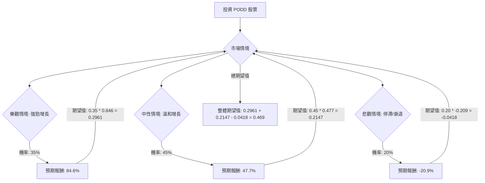

為了評估美股公司 PODD 目前是否適合投資，我們將結合其基本面數據、最新市場資訊，並運用決策樹分析與期望值分析。

首先，我們需要獲取 PODD 的最新資訊，以補充提供的基本面數據。

### 綜合資訊與核心假設

**公司概況與產品：**
Insulet Corporation (PODD) 是無管胰島素泵技術的全球領導者，其主要產品是 Omnipod 胰島素管理系統，特別是 Omnipod 5。該系統為胰島素依賴型糖尿病患者提供隱蔽且易於使用的解決方案，並已獲得 FDA 批准用於 2 型糖尿病成人患者的自動胰島素輸送 (AID)。

**財務表現：**
*   2025 年第四季度營收達到 7.84 億美元，同比增長 31%，超出分析師預期。
*   2025 年全年營收達到 27 億美元，增長 30.7%。
*   2025 年第四季度稀釋後每股收益 (EPS) 為 1.44 美元，略低於預期，但全年調整後 EPS 為 4.97 美元。
*   公司預計 2026 年 Omnipod 營收將增長 21-23%，調整後 EPS 增長超過 25%。
*   毛利率為 71.6%，營業利潤率為 17.5%。
*   P/E 為 54.15，P/B 為 8.81，P/S 為 4.85。
*   預期未來一年 EPS 增長 27.11%。

**市場與產業趨勢：**
*   美國胰島素泵市場正在經歷強勁增長，主要受技術進步和糖尿病患病率上升的推動。
*   全球胰島素泵市場預計在 2026 年至 2035 年間以 8.15% 至 13.45% 的複合年增長率增長。
*   北美地區在 2025 年佔全球胰島素泵市場收入的 47% 以上。
*   貼片泵 (Patch pumps) 預計在 2025 年至 2030 年間以最快的速度增長。
*   人工智慧 (AI) 正在改變胰島素泵市場，透過自動化、預測和個性化糖尿病管理。
*   Insulet 在無管胰島素泵領域處於領先地位，並透過 Omnipod 5 擴展到 2 型糖尿病市場。
*   公司計劃積極進行國際擴張，目標是到 2025 年底在歐洲市場佔有 20% 的份額，並在 10 多個新國家推出 Omnipod 5。

**競爭與風險：**
*   胰島素泵市場競爭加劇，主要競爭對手包括 Tandem Diabetes Care 和 Medtronic。
*   近期有分析師下調 PODD 評級至「中性」或「持有」，並下調目標價，理由是競爭加劇和潛在的產品線延遲。
*   Insulet 最近因製造問題導致胰島素洩漏而自願召回部分 Omnipod 5 Pods。
*   儘管分析師普遍給予「買入」或「強烈買入」評級，但平均目標價在過去 3 個月內有所下調。
*   股票近期表現不佳，接近 52 週低點。

**核心假設：**
*   **市場趨勢：** 糖尿病患病率的持續上升和對先進、便捷胰島素管理解決方案的需求將推動胰島素泵市場的長期增長。
*   **公司財務：** Insulet 的 Omnipod 5 產品線將繼續保持強勁的營收增長，尤其是在國際市場和 2 型糖尿病患者群體中的滲透率提高。公司能夠有效管理成本並維持健康的利潤率。
*   **產業競爭：** 儘管競爭激烈，Insulet 的無管技術和持續創新（如與 CGM 和 AI 的整合）將使其保持競爭優勢。
*   **監管與產品：** 公司能夠有效應對產品召回等問題，並維持產品的質量和安全性。新的產品發布和市場擴張計劃將按預期進行。
*   **估值：** 儘管目前 P/E 較高，但考慮到其增長潛力，市場願意給予較高的估值。

### 決策樹分析

**決策點：** 投資 PODD 股票

**情境設定：**
我們將基於上述資訊，設定三種主要情境：
1.  **樂觀情境 (Strong Growth)：** Insulet 成功擴大市場份額，Omnipod 5 在全球範圍內被廣泛採用，特別是在 2 型糖尿病市場，且競爭影響有限。公司營收和盈利能力超預期增長。
2.  **中性情境 (Moderate Growth)：** Insulet 保持穩健增長，但面臨來自競爭對手的壓力，市場擴張速度符合預期，但未有重大突破。盈利能力受成本和競爭影響。
3.  **悲觀情境 (Stagnation/Decline)：** 競爭加劇導致市場份額流失，產品召回或監管問題對品牌聲譽和銷售造成負面影響，新產品推出不及預期，或宏觀經濟逆風影響醫療設備支出。

**當前股價 (Close):** $189.56
**分析師平均目標價 (Target Price):** $329.87 (來自基本面數據) / $327.24 (來自最新搜尋結果) / $363.7 (來自 ChartMill) / $333.30 (來自 Investing.com)
我們取一個相對保守的平均值作為樂觀情境的參考，並考慮近期分析師下調目標價的趨勢。

**情境預期報酬計算：**
我們將使用分析師目標價作為潛在上漲空間的參考，並結合當前股價和歷史波動性來估計各情境下的股價。

*   **樂觀情境 (Strong Growth)：**
    *   假設股價達到分析師平均目標價的較高區間，甚至略有超越，考慮到其增長潛力。
    *   我們取 $350 作為目標價。
    *   預期報酬 = ($350 - $189.56) / $189.56 = 84.6%

*   **中性情境 (Moderate Growth)：**
    *   假設股價達到分析師平均目標價的保守區間，或略低於平均值，反映穩健增長但有競爭壓力。
    *   我們取 $280 作為目標價 (約為當前價格上漲 47.7%)。
    *   預期報酬 = ($280 - $189.56) / $189.56 = 47.7%

*   **悲觀情境 (Stagnation/Decline)：**
    *   假設股價進一步下跌，可能接近 52 週低點或因負面消息而跌破。
    *   我們取 $150 作為目標價 (約為當前價格下跌 20.9%)。
    *   預期報酬 = ($150 - $189.56) / $189.56 = -20.9%

**機率分配：**
基於目前的市場資訊和分析師共識：
*   分析師普遍給予「買入」或「強烈買入」評級，但近期有下調評級和目標價的情況，且股價接近 52 週低點，顯示市場存在一定擔憂。
*   公司營收增長強勁，產品創新和市場擴張計劃積極。
*   胰島素泵市場長期增長趨勢明確。
*   競爭加劇和產品召回是潛在風險。

綜合考慮，我們分配以下機率：
*   樂觀情境 (Strong Growth): 35%
*   中性情境 (Moderate Growth): 45%
*   悲觀情境 (Stagnation/Decline): 20%

---

### 決策樹 (Markdown)

**節點標示與計算：**

*   **A (投資 PODD 股票):** 這是我們的初始決策點。
*   **B (市場情境):** 這是機會節點，代表市場可能出現的不同情境。
*   **C (樂觀情境: 強勁增長):**
    *   **預測情境名稱:** 強勁增長
    *   **對應的機率 (Probability):** 35%
    *   **預期報酬:** 84.6% (股價從 $189.56 上漲至 $350)
    *   **期望值 (Expected Value):** 0.35 * 0.846 = 0.2961
*   **D (中性情境: 溫和增長):**
    *   **預測情境名稱:** 溫和增長
    *   **對應的機率 (Probability):** 45%
    *   **預期報酬:** 47.7% (股價從 $189.56 上漲至 $280)
    *   **期望值 (Expected Value):** 0.45 * 0.477 = 0.2147
*   **E (悲觀情境: 停滯/衰退):**
    *   **預測情境名稱:** 停滯/衰退
    *   **對應的機率 (Probability):** 20%
    *   **預期報酬:** -20.9% (股價從 $189.56 下跌至 $150)
    *   **期望值 (Expected Value):** 0.20 * -0.209 = -0.0418
*   **F (整體期望值):**
    *   **整體期望值:** 0.2961 + 0.2147 - 0.0418 = 0.469

### 期望值分析 (Expected Value Analysis)

**計算過程：**

整體期望值 = (樂觀情境機率 * 樂觀情境預期報酬) + (中性情境機率 * 中性情境預期報酬) + (悲觀情境機率 * 悲觀情境預期報酬)

整體期望值 = (0.35 * 0.846) + (0.45 * 0.477) + (0.20 * -0.209)
整體期望值 = 0.2961 + 0.2147 - 0.0418
整體期望值 = 0.469

這表示投資 PODD 股票的預期平均報酬率為 46.9%。

### 最終結論

根據決策樹分析和期望值分析，投資美股公司 PODD 的**整體期望值為 0.469 (即預期報酬率為 46.9%)**。

**判斷：適合投資**

**理由：**
儘管 PODD 近期股價表現不佳，且面臨競爭加劇和潛在的產品召回風險，但其核心業務 Omnipod 5 在無管胰島素泵市場中具有領先地位，並積極擴展 2 型糖尿病市場和國際市場。公司在 2025 年第四季度和全年都展現了強勁的營收增長，且分析師普遍給予「買入」或「強烈買入」評級，並預期未來一年 EPS 將有顯著增長。 胰島素泵市場的長期增長趨勢，以及 AI 等新技術的整合，為 Insulet 提供了持續增長的潛力。 儘管我們考慮了悲觀情境，但樂觀和中性情境下的預期報酬足以抵消潛在的損失，並帶來可觀的整體正向期望值。因此，基於目前的資訊和分析，PODD 股票目前適合投資。