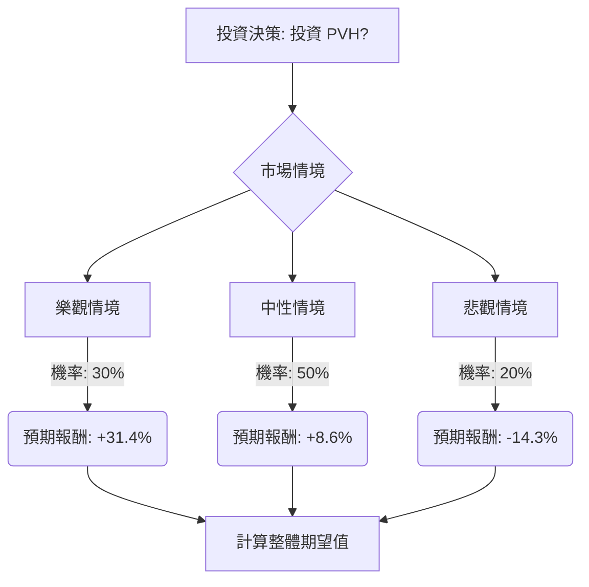

PVH Corp. (NYSE: PVH) 是一家全球性的服裝和生活方式公司，旗下擁有 Calvin Klein 和 Tommy Hilfiger 等知名品牌。本文將根據其最新的財務數據、市場動態、產業趨勢以及分析師預期，運用決策樹分析與期望值分析，評估 PVH 目前是否適合投資。

### **核心假設**

在進行決策樹分析之前，我們基於以下核心假設：

*   **市場假設**：全球經濟環境持續面臨通膨、關稅和地緣政治不確定性，消費者支出趨於謹慎，對服裝購買更具選擇性。然而，部分市場（如亞洲）預計將恢復增長，且直營（DTC）渠道被視為增長動力。
*   **財務假設**：PVH 能夠有效執行其 PVH+ 計劃，包括成本控制、品牌活化和數位化轉型。公司預計 2026 財年營收將略有增長，非 GAAP 營運利潤率保持穩定在 8.8% 左右，儘管面臨顯著的關稅逆風。公司將繼續透過股票回購向股東返還資本。
*   **產業趨勢假設**：服裝產業面臨增長放緩、利潤率收緊和消費者需求多樣化的挑戰。品牌需提供差異化價值（價格、永續性、個性化）並優化庫存管理。數位化和全通路零售體驗將是成功的關鍵。

### **PVH 投資決策樹分析**

我們將評估「投資 PVH」這一決策，並根據市場情境預測三種結果：樂觀、中性、悲觀。

**當前股價 (P0)**：約 $87.50

#### **情境定義與預期報酬**

1.  **樂觀情境 (Strong Growth/Recovery)**
    *   **預測情境名稱**：PVH 成功應對關稅影響，品牌活化策略奏效，DTC 渠道加速增長，整體服裝市場表現優於預期。
    *   **預期報酬**：股價上漲至 $115.00，相當於約 31.4% 的回報。此預期參考了分析師最高目標價 ($120.00) 及 Seeking Alpha 估計的潛在上漲空間 (66% 至 $115.9)。
    *   **機率 (Probability)**：30% (考量到公司積極的應對措施、分析師的「適度買入」評級以及潛在的品牌復甦，但仍需面對市場挑戰)。

2.  **中性情境 (Stable Performance)**
    *   **預測情境名稱**：PVH 按照公司指引，有效管理關稅影響，維持穩定的營運利潤率，並實現營收的溫和增長。股價呈現與分析師平均目標價一致的溫和上漲。
    *   **預期報酬**：股價上漲至 $95.00，相當於約 8.6% 的回報。此預期基於分析師平均目標價範圍 ($88.93 至 $96.25)。
    *   **機率 (Probability)**：50% (與公司 2026 財年營收略增、營運利潤率持平的指引以及分析師「持有」評級的共識相符)。

3.  **悲觀情境 (Underperformance/Decline)**
    *   **預測情境名稱**：關稅影響超出預期，緩解措施不足，品牌吸引力持續面臨挑戰，消費者支出進一步疲軟。
    *   **預期報酬**：股價下跌至 $75.00，相當於約 -14.3% 的損失。此預期參考了分析師最低目標價 ($70.00)。
    *   **機率 (Probability)**：20% (考慮到顯著的關稅逆風、品牌在固定匯率下增長緩慢以及整體市場的不確定性)。

#### **決策樹繪製 (Markdown)**

#### **期望值計算過程**

**1. 各情境的預期報酬計算：**

*   **樂觀情境**：
    *   預期股價 = $115.00
    *   預期報酬 = (($115.00 - $87.50) / $87.50) = 0.314 = 31.4%

*   **中性情境**：
    *   預期股價 = $95.00
    *   預期報酬 = (($95.00 - $87.50) / $87.50) = 0.086 = 8.6%

*   **悲觀情境**：
    *   預期股價 = $75.00
    *   預期報酬 = (($75.00 - $87.50) / $87.50) = -0.143 = -14.3%

**2. 整體期望值 (Expected Value) 計算：**

整體期望值 = (樂觀情境預期報酬 × 樂觀情境機率) + (中性情境預期報酬 × 中性情境機率) + (悲觀情境預期報酬 × 悲觀情境機率)

整體期望值 = (0.314 × 0.30) + (0.086 × 0.50) + (-0.143 × 0.20)
整體期望值 = 0.0942 + 0.0430 + (-0.0286)
整體期望值 = 0.1086

因此，投資 PVH 的整體期望值為 **10.86%**。

### **最終結論**

根據決策樹分析和期望值計算，投資 PVH 的整體期望值為 **10.86%**。

**判斷**：**適合投資**

**簡短理由**：
儘管 PVH 面臨關稅逆風和服裝市場的挑戰，但公司在 2025 財年第四季度表現超出預期，並對 2026 財年給出了穩定的營運利潤率和略微增長的營收指引。公司積極採取關稅緩解措施，並透過股票回購展現對未來增長的信心。分析師的共識評級介於「持有」至「適度買入」之間，且平均目標價顯示出一定的上漲空間。 綜合考量，雖然存在風險，但其預期的正向回報率表明 PVH 股票目前具有投資價值。