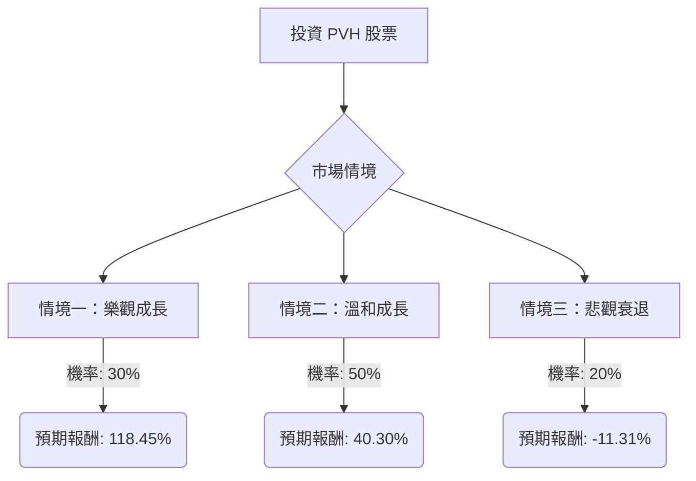

PVH 公司投資評估：決策樹分析與期望值分析

根據提供的基本面數據以及最新的市場資訊，我們將對美股公司 PVH 進行決策樹分析與期望值分析，以評估其目前的投資適合性。

### 核心假設

1.  **市場環境：** 預計全球消費環境將持續不穩定，宏觀經濟存在不確定性，但不會出現嚴重的全球經濟衰退。
2.  **公司財務表現：** PVH 將繼續執行其「PVH+ 計畫」，專注於核心品牌（Calvin Klein 和 Tommy Hilfiger）、數位轉型和直接面向消費者（DTC）的成長。公司將有效應對關稅影響和供應鏈挑戰。
3.  **產業趨勢：** 服裝產業將持續朝向 DTC 模式、數位化參與和永續發展方向演進，PVH 的策略與這些趨勢保持一致。
4.  **分析師目標價：** 分析師的目標價提供了一個合理的未來股價區間，但並非保證。
5.  **時間範圍：** 本分析基於 12 個月的投資時間範圍。
6.  **股息穩定性：** 假設目前的股息收益率保持穩定。

### 最新資訊補充與分析

*   **當前股價：** $67.82 (來自用戶提供數據)。
*   **分析師共識：** 大多數分析師給予「中度買入」或「買入」評級。
*   **12 個月平均目標價：** 約 $95.00 (與用戶提供數據一致，並得到 Zacks 分析師的確認)。
*   **最高目標價：** $148.00。
*   **最低目標價：** $70.00。然而，考慮到過去 12 個月股價下跌超過 35%，且 52 週低點為 $59.28，我們將在悲觀情境中採用更低的股價預期。
*   **近期財報 (2025 年 Q3)：** 2025 年 12 月 3 日公布的第三季度財報顯示，營收和每股盈餘均超出預期。營收成長 2% 至 22.9 億美元，調整後每股盈餘為 $2.83，高於預期的 $2.53。
*   **2025 財年展望：** 公司將全年非 GAAP 每股盈餘展望收窄至 $10.85-$11.00，營收預期收緊至「低個位數成長」。
*   **關稅影響：** 關稅對毛利率產生負面影響 (Q3 2025 毛利率從 58.4% 降至 56.3%)。預計 2025 財年關稅對 EBIT 的淨負面影響約為 6500 萬美元，或每股 $1.05。
*   **區域表現：** 2025 年 Q3，EMEA 營收成長 4% (按固定匯率計算下降 2%)，美洲營收成長 2%，亞太地區營收下降 1% (按固定匯率計算持平)。亞太地區表現超出預期，而歐洲市場面臨挑戰。
*   **PVH+ 計畫：** 公司正積極執行其多年戰略計畫，專注於 Calvin Klein 和 Tommy Hilfiger 兩大核心品牌，透過產品創新、行銷和營運效率提升來推動品牌、數位和 DTC 驅動的成長。
*   **DTC 轉型：** PVH 正在減少批發合作夥伴，以提升 DTC 業務，但此轉型尚未完全實現。
*   **CFO 變動：** 財務長 Zac Coughlin 將於 2025 年底離職，Melissa Stone 被任命為臨時財務長。
*   **股票回購：** 2024 年回購約 5 億美元股票，並計畫在 2025 年再回購 5 億美元。
*   **成長預期：** 預計 2026-2028 年年度每股盈餘成長率為 25.74%，優於美國服裝製造業平均水平 (25.02%)，但低於美國市場平均水平 (40.61%)。同期年度營收成長率預計為 1.98%，低於產業 (9.26%) 和市場 (23.07%) 平均水平。

### 決策樹分析

**決策點：投資 PVH 股票**

#### 情境定義與預期報酬計算

**當前股價 (Close):** $67.82
**年度股息率 (Dividend %):** 0.22% (年股息約 $0.15)

**1. 情境一：樂觀成長 (Strong Growth)**
*   **情境描述：** PVH+ 計畫執行超預期，關稅影響減輕，全球消費需求強勁復甦，特別是亞太地區和數位通路表現出色。公司股價達到分析師最高目標價。
*   **預期股價 (12 個月後)：** $148.00
*   **資本利得：** ($148.00 - $67.82) / $67.82 = 1.1823 = 118.23%
*   **股息報酬：** 0.22%
*   **預期總報酬 (Expected Return)：** 118.23% + 0.22% = **118.45%**
*   **機率 (Probability)：** 30%

**2. 情境二：溫和成長 (Moderate Growth)**
*   **情境描述：** PVH 繼續穩健執行其計畫，但仍面臨宏觀經濟逆風、關稅和歐洲市場挑戰。公司股價達到分析師平均目標價。
*   **預期股價 (12 個月後)：** $95.00
*   **資本利得：** ($95.00 - $67.82) / $67.82 = 0.4008 = 40.08%
*   **股息報酬：** 0.22%
*   **預期總報酬 (Expected Return)：** 40.08% + 0.22% = **40.30%**
*   **機率 (Probability)：** 50%

**3. 情境三：悲觀衰退 (Underperformance)**
*   **情境描述：** 宏觀經濟挑戰惡化，關稅對盈利能力造成顯著衝擊，DTC 轉型進展緩慢，市場競爭加劇。公司股價跌至 52 週低點附近。
*   **預期股價 (12 個月後)：** $60.00 (略低於 52 週低點 $59.28，以反映更悲觀情境)
*   **資本利得：** ($60.00 - $67.82) / $67.82 = -0.1153 = -11.53%
*   **股息報酬：** 0.22%
*   **預期總報酬 (Expected Return)：** -11.53% + 0.22% = **-11.31%**
*   **機率 (Probability)：** 20%

### 期望值分析 (Expected Value Analysis)

整體期望值 (Expected Value) = (情境一預期報酬 × 情境一機率) + (情境二預期報酬 × 情境二機率) + (情境三預期報酬 × 情境三機率)

整體期望值 = (118.45% × 0.30) + (40.30% × 0.50) + (-11.31% × 0.20)
整體期望值 = 35.535% + 20.15% - 2.262%
整體期望值 = **53.423%**

### 最終結論

根據決策樹分析和期望值計算，PVH 股票的整體期望值為 **53.423%**。

**判斷：適合投資**

**理由：**
儘管 PVH 面臨全球消費環境不確定、關稅影響和歐洲市場挑戰等逆風，但公司透過其「PVH+ 計畫」積極應對，專注於核心品牌、數位化和 DTC 成長。最新的財報顯示其營收和每股盈餘均超出預期，且分析師普遍給予「買入」評級，平均目標價顯示出可觀的潛在漲幅。

雖然悲觀情境下存在約 11.31% 的潛在虧損，但樂觀和溫和情境下的潛在報酬遠高於此，且溫和情境的機率最高。綜合考量下，超過 50% 的正向期望值表明，在當前股價水平下，投資 PVH 具有吸引力。公司在管理層變動和供應鏈多元化方面的努力 也顯示出其適應市場變化的能力。因此，PVH 目前適合投資。