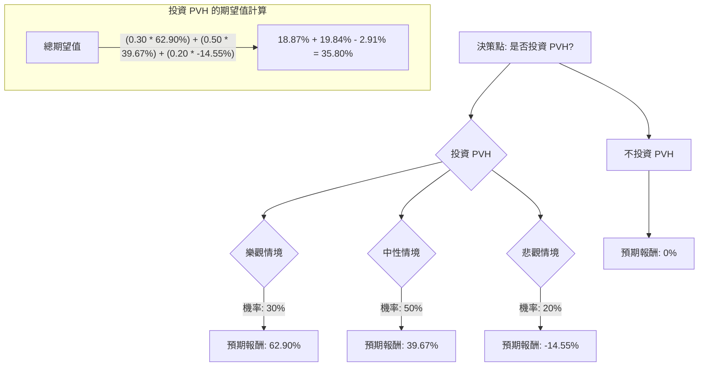

為了評估美股公司 PVH 目前是否適合投資，我們將運用決策樹分析（Decision Tree Analysis）與期望值分析（Expected Value Analysis），並結合最新的市場資訊與公司基本面數據進行全面評估。

### 核心假設

在進行決策樹分析前，我們基於收集到的資訊做出以下核心假設：

1.  **市場趨勢假設：**
    *   **樂觀情境：** 全球經濟復甦加速，消費者可支配支出增加，特別是在服裝領域。關稅影響減輕或 PVH 的緩解策略非常有效。
    *   **中性情境：** 當前的宏觀經濟挑戰（通膨、利率、地緣政治緊張）持續存在，但沒有顯著惡化。關稅仍是阻力，但 PVH 能夠部分抵消其影響。
    *   **悲觀情境：** 全球經濟放緩或衰退，消費者支出大幅下降。關稅升級或緩解措施失敗，導致利潤率進一步壓縮。激烈的競爭和促銷活動持續侵蝕盈利能力。

2.  **財務表現假設（PVH 公司特定）：**
    *   **樂觀情境：** PVH+ 計劃執行非常成功，推動 Calvin Klein 和 Tommy Hilfiger 品牌強勁增長，尤其是在國際和 DTC（直接面向消費者）渠道。庫存水平得到有效管理，毛利率改善。每股盈餘（EPS）增長超出分析師預期。
    *   **中性情境：** PVH+ 計劃取得中等成果。核心品牌 Calvin Klein 和 Tommy Hilfiger 保持市場份額，但面臨持續的競爭壓力。庫存管理得當，毛利率穩定。EPS 增長符合當前預測。
    *   **悲觀情境：** PVH+ 計劃難以取得進展。美洲地區持續表現不佳。庫存問題持續存在，導致激進的折扣和毛利率進一步侵蝕。關稅影響比預期更嚴重。EPS 下降或大幅低於預期。

3.  **產業趨勢假設（服裝製造業）：**
    *   **樂觀情境：** 品牌服裝需求強勁，成功適應數位零售，並在整個行業中有效管理供應鏈。
    *   **中性情境：** 行業表現參差不齊，部分細分市場增長，部分面臨阻力。持續向電子商務轉型，但線上競爭激烈。
    *   **悲觀情境：** 服裝總體需求下降，消費者對價格敏感度增加，以及嚴重的供應鏈中斷。

### 決策樹分析與期望值計算

**當前股價 (Close):** $64.55

**情境預測與報酬估計：**

*   **樂觀情境 (Optimistic Scenario)**
    *   **機率 (Probability):** 30%
    *   **預期股價：** 考慮到分析師平均目標價約為 $92.50 - $98.94，以及 52 週高點 $103.22，我們預計在樂觀情境下，股價可能達到 $105.00。
    *   **預期報酬：** (($105.00 - $64.55) / $64.55) + 股息率 (0.0024) = (40.45 / 64.55) + 0.0024 ≈ 0.6266 + 0.0024 = 62.90%
    *   **期望值 (Expected Value):** 0.30 \* 62.90% = 18.87%

*   **中性情境 (Neutral Scenario)**
    *   **機率 (Probability):** 50%
    *   **預期股價：** 考慮到分析師普遍給予「買入」或「適度買入」評級，但同時存在關稅和美洲市場疲軟的挑戰，我們預計股價可能達到平均分析師目標價的較低端，約 $90.00。
    *   **預期報酬：** (($90.00 - $64.55) / $64.55) + 股息率 (0.0024) = (25.45 / 64.55) + 0.0024 ≈ 0.3943 + 0.0024 = 39.67%
    *   **期望值 (Expected Value):** 0.50 \* 39.67% = 19.84%

*   **悲觀情境 (Pessimistic Scenario)**
    *   **機率 (Probability):** 20%
    *   **預期股價：** 考慮到 PVH 過去一年股價表現不佳，以及關稅、競爭加劇和美洲地區表現不佳的風險，我們預計股價可能跌至 52 週低點以下，約 $55.00。
    *   **預期報酬：** (($55.00 - $64.55) / $64.55) + 股息率 (0.0024) = (-9.55 / 64.55) + 0.0024 ≈ -0.1479 + 0.0024 = -14.55%
    *   **期望值 (Expected Value):** 0.20 \* (-14.55%) = -2.91%

**決策樹 (Decision Tree):**

**所有計算過程：**

1.  **樂觀情境期望值：** 0.30 (機率) \* 62.90% (預期報酬) = 18.87%
2.  **中性情境期望值：** 0.50 (機率) \* 39.67% (預期報酬) = 19.84%
3.  **悲觀情境期望值：** 0.20 (機率) \* (-14.55%) (預期報酬) = -2.91%
4.  **投資 PVH 的總期望值：** 18.87% + 19.84% - 2.91% = **35.80%**
5.  **不投資 PVH 的總期望值：** 0% (假設資金存放於無風險資產，報酬率為零)

### 最終結論

根據決策樹分析和期望值計算，投資 PVH 的總期望值為 **35.80%**。

**判斷：適合投資**

**理由：**

PVH 的總期望值為正且相對較高，達到 35.80%，這表明在考慮了不同市場情境及其發生機率後，投資 PVH 預期能帶來可觀的報酬。儘管公司面臨關稅影響、美洲市場疲軟和毛利率壓力等挑戰，但其核心品牌 Calvin Klein 和 Tommy Hilfiger 表現強勁，且公司正積極執行 PVH+ 計劃以推動增長、優化運營和擴大國際市場份額。分析師普遍給予「買入」或「適度買入」評級，並給出顯著高於當前股價的目標價。此外，PVH 預計未來幾年盈利將有顯著增長（預計每年增長 20.3%），且公司計劃在 2025 年回購 5 億美元股票，顯示管理層對公司未來發展的信心。綜合來看，儘管存在風險，但其潛在報酬足以抵消風險，因此目前適合投資。