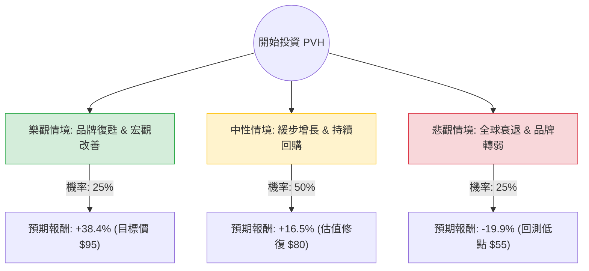

針對美股公司 **PVH Corp. (PVH)** 的投資評估，我已結合您提供的基本面數據，並透過網路搜尋整合了最新的市場動態（如 2024 年第二季財報表現、中國與歐洲市場挑戰、以及 PVH+ 策略進度）。

以下是基於**決策樹分析**與**期望值分析**的詳細報告。

---

### 一、 市場現況與核心假設 (Core Assumptions)

在建立模型前，我們先彙整當前的關鍵資訊：
1.  **估值極低**：目前 P/E 約 10.3，Forward P/E 僅 5.74，P/B 0.64。這顯示市場對其未來極度悲觀，但也提供了極大的安全邊際。
2.  **品牌表現分化**：Calvin Klein (CK) 與 Tommy Hilfiger (TH) 在北美表現穩健，但**中國市場消費疲軟**與**歐洲批發通路萎縮**是目前最大的利空。
3.  **財務策略**：公司積極執行 **PVH+ Plan**，專注於提升毛利（目前高達 57.37%）與庫存管理，並持續進行大規模股票回購（這也是 Forward P/E 較低的主因）。
4.  **分析師預期**：平均目標價約為 $95，較現價 ($68.65) 有約 38% 的潛在漲幅。

---

### 二、 決策樹分析圖 (Decision Tree)

我們將未來一年的投資情境分為三種：**樂觀（復甦）**、**中性（盤整）**、**悲觀（衰退）**。

---

### 三、 期望值分析與計算過程

#### 1. 參數設定與理由
*   **現價 (Current Price)**: $68.65
*   **樂觀情境 (Bull Case)**: 
    *   **假設**：中國經濟刺激政策奏效，歐洲批發市場回暖，PVH+ 策略使營運利潤率突破 10%。
    *   **目標價**：$95 (參考分析師 Target Price)。
    *   **報酬率**：($95 - $68.65) / $68.65 = **+38.4%**。
*   **中性情境 (Base Case)**: 
    *   **假設**：營收持平或微跌，但透過股票回購支撐 EPS，P/E 回升至歷史平均約 8-9 倍。
    *   **目標價**：$80。
    *   **報酬率**：($80 - $68.65) / $68.65 = **+16.5%**。
*   **悲觀情境 (Bear Case)**: 
    *   **假設**：全球消費性支出持續低迷，CK/TH 品牌力下降，股價回測 52 週低點甚至更低。
    *   **目標價**：$55。
    *   **報酬率**：($55 - $68.65) / $68.65 = **-19.9%**。

#### 2. 期望值 (Expected Value, EV) 計算
$$EV = (P_{Bull} \times R_{Bull}) + (P_{Base} \times R_{Base}) + (P_{Bear} \times R_{Bear})$$

*   $EV = (0.25 \times 38.4\%) + (0.50 \times 16.5\%) + (0.25 \times -19.9\%)$
*   $EV = 9.6\% + 8.25\% - 4.975\%$
*   **$EV = 12.875\%$**

---

### 四、 綜合評估與最終結論

#### 1. 核心分析總結
*   **價值陷阱 vs. 價值投資**：PVH 目前的 P/B 0.64 顯示其股價低於淨資產價值，這通常是極度低估的訊號。雖然短期內受中國與歐洲市場拖累，但其核心品牌（CK, TH）在全球仍具備強大的護城河。
*   **財務韌性**：儘管 EPS Q/Q 下跌，但毛利率維持在 57% 的高水準，且 Forward P/E 極低，顯示市場已過度反應負面消息。
*   **技術面壓力**：股價目前低於 SMA20, 50, 200，短期趨勢偏弱，但這也為長期投資者提供了較低的入場成本。

#### 2. 最終判斷：**適合投資 (Buy / Overweight)**

**理由：**
1.  **正向期望值**：計算出的預期報酬率為 **12.875%**，遠高於無風險利率，且在下行風險（-19.9%）可控的情況下，上行空間（+38.4%）極具吸引力。
2.  **安全邊際充足**：0.64 的 P/B 與 5.74 的遠期本益比提供了強大的估值保護，即便業績僅維持現狀，透過回購也能推升股價。
3.  **品牌溢價**：PVH 擁有的不是無名品牌，而是具備全球認可度的 CK 與 TH，這類資產在經濟週期復甦時通常反彈最快。

**建議操作策略：**
*   **分批進場**：由於目前技術面仍處於空頭排列（SMA 指標皆為負），建議在 $65 - $68 區間分批建倉。
*   **風險監控**：需密切關注中國零售數據與歐洲批發訂單。若股價跌破 $59 (52W Low)，需重新評估品牌基本面是否發生結構性惡化。

---
*免責聲明：本分析僅供參考，不構成具體投資建議。投資股票具有風險，入市前請務必自行審慎評估。*