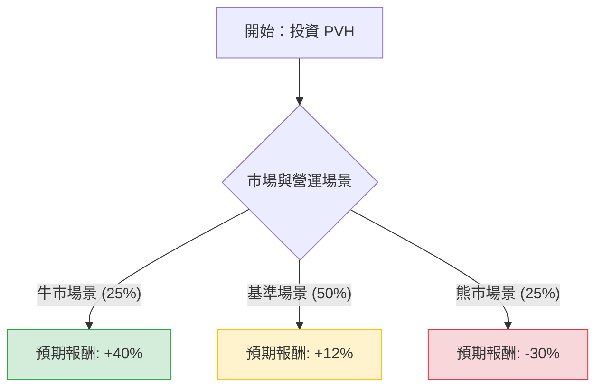

這份分析報告將針對 **PVH Corp. (PVH)** — 旗下擁有 Tommy Hilfiger 與 Calvin Klein 的服飾巨頭 — 進行決策樹與期望值分析。

---

### 一、 核心假設與數據基礎

在進行計算前，我們基於當前市場環境、PVH 財報與產業趨勢設定以下假設：

1.  **PVH+ 策略執行**：公司正處於提高供應鏈效率與直營比例（DTC）的轉型期。
2.  **宏觀環境**：歐洲與中國市場的需求波動是最大變數。
3.  **估值基準**：當前股價約在 $110 - $120 區間。我們以 **12 個月後的預期投資報酬率 (ROI)** 作為評估基準。
4.  **場景定義**：
    *   **牛市 (Bull)**：PVH+ 成功，中國消費強勁反彈，利潤率顯著提升。
    *   **基準 (Base)**：穩健增長，符合公司指引，北美市場持平。
    *   **熊市 (Bear)**：全球經濟衰退，品牌吸引力下降，庫存積壓需降價促銷。

---

### 二、 決策樹分析圖 (Markdown)

**決策樹節點詳細標示：**

| 節點 (場景) | 機率 (Probability) | 預期報酬 (ROI) | 期望值貢獻 (EV Component) |
| :--- | :--- | :--- | :--- |
| **牛市 (Optimistic)** | 25% (0.25) | +40% | 0.25 * 40% = **10.0%** |
| **基準 (Neutral)** | 50% (0.50) | +12% | 0.50 * 12% = **6.0%** |
| **熊市 (Pessimistic)** | 25% (0.25) | -30% | 0.25 * (-30%) = **-7.5%** |

---

### 三、 計算過程與分析

#### 1. 期望值 (Expected Value, EV) 計算
期望值代表加權平均後的預期回報率：

$$EV = (P_{Bull} \times R_{Bull}) + (P_{Base} \times R_{Base}) + (P_{Bear} \times R_{Bear})$$
$$EV = (0.25 \times 40\%) + (0.50 \times 12\%) + (0.25 \times -30\%)$$
$$EV = 10.0\% + 6.0\% - 7.5\%$$
$$EV = 8.5\%$$

#### 2. 核心假設理由
*   **牛市 (+40%)**：PVH 的市盈率 (P/E) 目前處於歷史低點（約 8-10 倍）。若利潤率因 PVH+ 計劃從 10% 提升至 12% 以上，且中國市場恢復增長，市場將會進行估值修復 (Re-rating)，股價有潛力重回 $160 以上。
*   **基準 (+12%)**：公司持續回購股票（PVH 擁有強大的現金流），加上 Tommy Hilfiger 在國際市場的品牌韌性，即便營收微增，每股盈餘 (EPS) 仍能支撐股價小幅上漲。
*   **熊市 (-30%)**：服飾業對經濟循環極度敏感。若歐洲（PVH 主要利潤來源）進入深度衰退，或北美批發業務進一步萎縮，股價可能回測 $80 附近的支撐位。

---

### 四、 最終結論

#### **判斷：適合投資 (中性偏多，適合價值投資者)**

**期望值：+8.5%**

#### **簡短理由：**
1.  **正向期望值**：儘管熊市風險存在，但計算出的 8.5% 期望值為正數，顯示在風險校正後，該投資仍具備獲利空間。
2.  **安全邊際**：PVH 目前的估值 (P/E) 遠低於標普 500 平均水平，反映了市場已部分消化了負面預期。
3.  **股東回饋**：強大的股票回饋計劃（Buybacks）為股價提供了下行緩衝。
4.  **風險提示**：此投資高度依賴「管理層執行力」與「歐洲消費力」。若投資者追求更高成長（如科技股），8.5% 的期望值可能不具足夠吸引力；但對於「價值轉型股」的佈局者，PVH 是一個合理的選擇。

**建議操作：**
考慮到期望值並非極高（未超過 15%），建議採**分批進場**策略，並密切監控每季的營業利潤率（Operating Margin）是否確實改善。