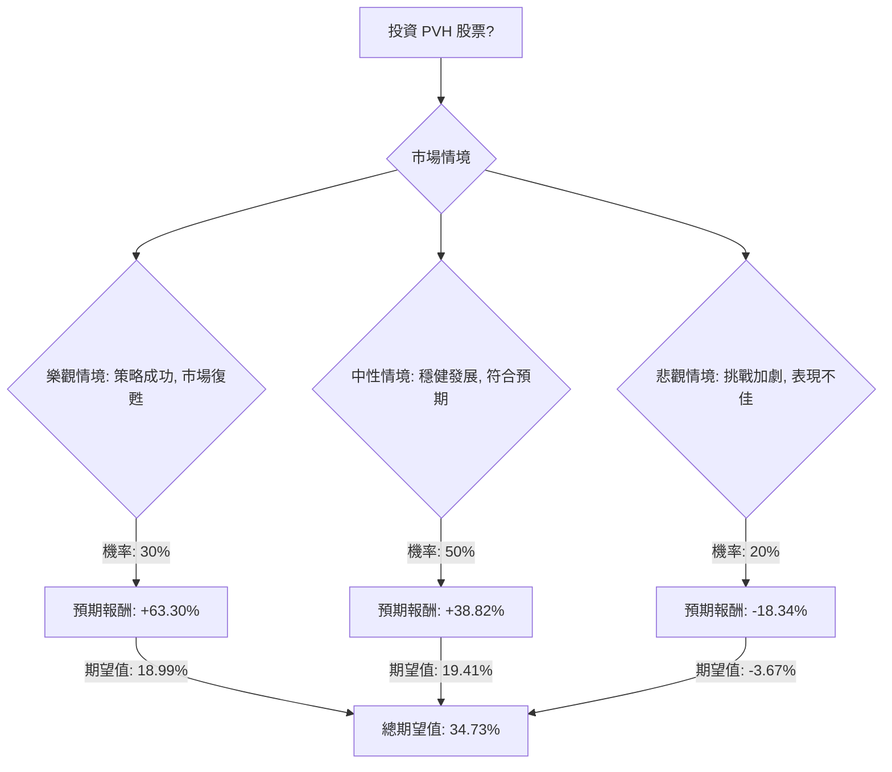

為了評估美股公司 PVH 目前是否適合投資，我們將結合其基本面數據與最新的市場資訊，運用決策樹分析（Decision Tree Analysis）和期望值分析（Expected Value Analysis）進行評估。

### 最新資訊摘要：

根據最新的網路搜尋結果，PVH 的關鍵資訊如下：

*   **分析師評級與目標價：** 大多數分析師對 PVH 持「買入」或「強烈買入」共識，平均目標價約為 $88.50 至 $97.00，最高可達 $148.00，最低為 $79.00。這意味著相較於目前股價 $61.23，存在顯著的潛在上漲空間。
*   **近期財務表現 (2025 年第三季度)：** 營收增長 2% 至 22.94 億美元，超出預期。毛利率為 56.3%，儘管受到關稅、運費上漲和促銷活動的壓力。調整後每股盈餘 (EPS) 為 $2.83，雖較去年同期下降但優於分析師預期。
*   **2025 財年展望：** 預計營收持平或略有增長。非 GAAP 營業利潤率預計約為 8.5%（低於 2024 年的 10.0%），非 GAAP EPS 預計在 $10.75 至 $11.00 之間，其中包含約 $1.05/股的關稅負面影響。
*   **戰略舉措：** 公司正積極推動「PVH+ 計劃」，專注於品牌和數位化驅動的直接面向消費者 (DTC) 增長。2024 年 DTC 銷售額佔總營收約 45%。公司還與 OpenAI 合作，將 AI 技術整合到產品設計、需求規劃、庫存優化和客戶互動等環節，以提升效率和品牌建設。
*   **主要品牌：** Calvin Klein 和 Tommy Hilfiger 是其核心品牌，透過產品創新和有效的行銷活動保持品牌動能。
*   **挑戰與風險：** 關稅、高昂的運費和促銷活動持續對毛利率構成壓力。全球經濟不確定性、通膨、消費者信心疲軟（尤其在北美和中國）以及激烈的市場競爭是主要風險。
*   **估值：** 目前 PVH 的遠期本益比 (Forward P/E) 約為 5.7 倍，遠低於其歷史平均本益比 13.6 倍，顯示其估值被低估。
*   **股東回報：** 2024 年回購約 5 億美元股票，並計劃在 2025 年再回購 5 億美元。過去五年流通股數減少了 35.6%。

### 核心假設：

1.  **市場趨勢：** 全球服裝市場將持續受到數位化轉型、電子商務增長和消費者偏好變化的影響。消費者對價值和個性化體驗的需求日益增加，同時對永續發展的關注度提高。
2.  **財務表現：** PVH 能夠有效執行其「PVH+ 計劃」，透過成本效率和戰略性行銷來應對毛利率壓力。AI 技術的導入預計將在中長期提升營運效率和消費者參與度。
3.  **產業競爭：** 服裝行業競爭激烈，PVH 需依賴其核心品牌的實力、產品創新和全球分銷網絡來維持競爭優勢。

### 決策樹分析與期望值計算：

**當前股價 (Close Price):** $61.23

**決策點：** 投資 PVH 股票

**情境設定與預期報酬計算：**

我們將設定三種未來情境，並為其分配機率和預期報酬。預期報酬的計算基於股價變動，不考慮股息（因為股息率僅 0.0024，對短期報酬影響甚微）。

1.  **樂觀情境 (Strong Growth/Recovery)**
    *   **預測情境名稱：** 策略成功，市場復甦
    *   **情境描述：** PVH 的「PVH+ 計劃」和 AI 整合取得顯著成效，品牌動能強勁，關稅壓力緩解，全球消費者信心顯著回升。公司營收和盈利能力超預期增長。
    *   **預期目標價：** $100 (高於分析師中位數，但低於最高預期，反映強勁增長)
    *   **預期報酬 (Return)：** (($100 - $61.23) / $61.23) = 63.30%
    *   **機率 (Probability)：** 30% (基於分析師的「買入」評級和公司積極的戰略舉措)
    *   **期望值 (Expected Value)：** 0.30 * 63.30% = 18.99%

2.  **中性情境 (Steady Performance/Meeting Expectations)**
    *   **預測情境名稱：** 穩健發展，符合預期
    *   **情境描述：** PVH 繼續穩健執行其戰略，有效管理成本壓力，品牌實力得以維持。營收和 EPS 符合或略高於公司和分析師的預期。市場環境保持不溫不火。
    *   **預期目標價：** $85 (接近分析師平均目標價的下限，反映穩健但非爆發性增長)
    *   **預期報酬 (Return)：** (($85 - $61.23) / $61.23) = 38.82%
    *   **機率 (Probability)：** 50% (考慮到公司面臨的挑戰與戰略優勢並存，這是最可能的情境)
    *   **期望值 (Expected Value)：** 0.50 * 38.82% = 19.41%

3.  **悲觀情境 (Underperformance/Challenges Intensify)**
    *   **預測情境名稱：** 挑戰加劇，表現不佳
    *   **情境描述：** 關稅、運費和促銷壓力加劇，全球消費者需求進一步疲軟，特別是在關鍵市場。公司戰略未能有效應對挑戰，導致利潤率受損，盈利不及預期。股價可能跌至接近 5 年低點。
    *   **預期目標價：** $50 (接近 5 年低點，反映顯著的下行風險)
    *   **預期報酬 (Return)：** (($50 - $61.23) / $61.23) = -18.34%
    *   **機率 (Probability)：** 20% (儘管公司有強大品牌和積極策略，但宏觀經濟和行業風險不容忽視)
    *   **期望值 (Expected Value)：** 0.20 * (-18.34%) = -3.67%

---

### 決策樹 (Decision Tree)：

### 計算過程：

**1. 樂觀情境期望值：**
   *   預期報酬 = 63.30%
   *   機率 = 30%
   *   期望值 = 0.30 * 63.30% = 18.99%

**2. 中性情境期望值：**
   *   預期報酬 = 38.82%
   *   機率 = 50%
   *   期望值 = 0.50 * 38.82% = 19.41%

**3. 悲觀情境期望值：**
   *   預期報酬 = -18.34%
   *   機率 = 20%
   *   期望值 = 0.20 * (-18.34%) = -3.67%

**4. 整體期望值 (Overall Expected Value)：**
   *   整體期望值 = 樂觀情境期望值 + 中性情境期望值 + 悲觀情境期望值
   *   整體期望值 = 18.99% + 19.41% + (-3.67%) = **34.73%**

### 最終結論：

根據決策樹分析和期望值計算，投資 PVH 股票的整體期望值為 **34.73%**。

**判斷：適合投資**

**理由：**
PVH 目前的估值相對較低（遠期 P/E 僅 5.7x，遠低於歷史平均），且分析師普遍給予「買入」或「強烈買入」評級，並預期有顯著的股價上漲空間。儘管公司面臨關稅、運費和促銷活動帶來的毛利率壓力，以及全球經濟不確定性等挑戰，但其核心品牌 Calvin Klein 和 Tommy Hilfiger 仍具強大實力。公司積極推動「PVH+ 計劃」並與 OpenAI 合作導入 AI 技術，顯示其致力於數位轉型和提升營運效率的決心，這些戰略舉措有望在中長期推動增長和盈利能力。

綜合考量，儘管存在風險，但 PVH 的低估值、積極的戰略轉型以及分析師普遍看好的前景，使得其投資的整體期望報酬為正且相對吸引人。因此，目前判斷 PVH 適合投資。