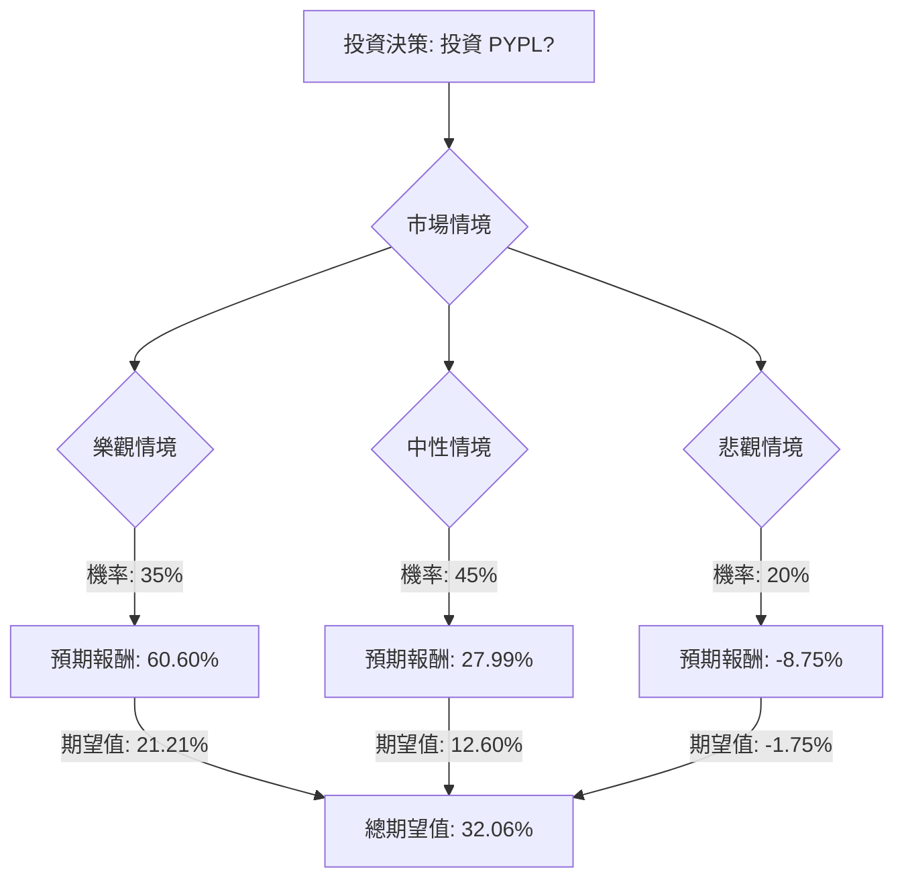

## PYPL 投資評估：決策樹分析與期望值分析

根據提供的基本面數據和最新的市場資訊，我們將對美股公司 PayPal (PYPL) 進行決策樹分析與期望值分析，以評估其目前的投資適合性。

### 核心假設

在進行決策樹分析之前，我們需要建立以下核心假設，這些假設將影響情境的機率分配和預期報酬：

*   **市場趨勢 (Market Trend)**：
    *   **數位支付產業成長**：全球金融科技服務市場預計在 2023 年至 2030 年間以 17.5% 的複合年增長率增長，美國市場預計增長 16.6%。數位支付的採用率將加速，並伴隨更清晰的監管框架。
    *   **競爭加劇**：PayPal 面臨來自 Apple Pay、Google Pay 以及 Block (Square、Cash App) 等競爭對手的激烈競爭，這可能限制其業務增長和總支付量 (TPV)。
    *   **監管環境演變**：2026 年支付行業的變化可能圍繞監管動態展開，特別是穩定幣和「先買後付」(BNPL) 等新興支付方式的監管。
*   **公司財務 (Company Financials)**：
    *   **估值偏低**：PYPL 目前的 P/E (11.09) 和 P/S (1.57) 相對於歷史水平和市場中位數較低，顯示其可能被低估。
    *   **盈利能力穩定但面臨壓力**：PayPal 過去幾年保持了強勁的自由現金流和盈利，但由於競爭加劇，利潤率從 2022 年之前的 20% 以上下降到目前的 14.94%。
    *   **策略轉型**：PayPal 正透過成本控制、AI 整合、專注於高價值 Braintree 交易、Venmo 貨幣化以及「先買後付」服務來提升盈利能力和增長。
    *   **即將發布財報**：PayPal 預計於 2026 年 2 月 3 日發布 2025 年第四季度財報，市場預期營收為 87.9 億美元，EPS 為 1.29 美元。
*   **分析師預期 (Analyst Expectations)**：
    *   **普遍「適度買入」評級**：多數分析師對 PYPL 持「適度買入」評級，平均目標價介於 67.00 美元至 75.84 美元之間，最高目標價達 120.00 美元，最低為 51.00 美元。
    *   **潛在上漲空間**：中位數目標價意味著約 19.9% 至 32.42% 的潛在漲幅。

### 決策樹分析

我們將考慮「投資 PYPL」作為初始決策點，並根據市場情境預測不同的結果。

**初始投資金額 (Current Price)**: $55.89 (來自提供數據)

#### 決策點：投資 PYPL

*   **情境 1：樂觀情境 (Bullish Scenario)**
    *   **描述**：PayPal 成功執行其戰略轉型，新產品（如 Fastlane、AI 合作夥伴關係、Venmo 貨幣化）表現強勁，Q4 財報超出預期，數位支付市場持續快速增長，且監管環境有利。市場對其估值進行重新評估。
    *   **機率 (Probability)**：35% (基於分析師普遍看好長期增長潛力，以及公司積極的戰略調整)
    *   **預期股價**：$89.76 (參考 24/7 Wall St. 2026 年底預測，以及分析師最高目標價)
    *   **預期報酬 (Expected Return)**：($89.76 - $55.89) / $55.89 = 60.60%
    *   **期望值 (Expected Value)**：0.35 * 60.60% = 21.21%

*   **情境 2：中性情境 (Neutral Scenario)**
    *   **描述**：PayPal 業績符合市場預期，戰略轉型穩步推進但未有重大突破，數位支付市場保持穩定增長，但競爭壓力持續存在。股價向分析師中位數目標價靠攏。
    *   **機率 (Probability)**：45% (基於分析師普遍「適度買入」和「持有」評級，以及中位數目標價)
    *   **預期股價**：$71.54 (參考分析師中位數一年目標價)
    *   **預期報酬 (Expected Return)**：($71.54 - $55.89) / $55.89 = 27.99%
    *   **期望值 (Expected Value)**：0.45 * 27.99% = 12.60%

*   **情境 3：悲觀情境 (Bearish Scenario)**
    *   **描述**：PayPal Q4 財報不及預期，競爭加劇導致市場份額進一步流失，宏觀經濟逆風影響消費者支出，或出現不利的監管政策。市場對其增長前景感到擔憂，股價可能跌至分析師最低目標價附近。
    *   **機率 (Probability)**：20% (考慮到過去一年股價表現不佳，以及競爭和宏觀經濟風險)
    *   **預期股價**：$51.00 (參考分析師最低目標價)
    *   **預期報酬 (Expected Return)**：($51.00 - $55.89) / $55.89 = -8.75%
    *   **期望值 (Expected Value)**：0.20 * -8.75% = -1.75%

#### 決策樹圖 (Markdown 格式)

### 計算過程

1.  **樂觀情境期望值計算**：
    *   預期報酬 = (預期股價 - 當前股價) / 當前股價 = ($89.76 - $55.89) / $55.89 = 0.6060 = 60.60%
    *   期望值 = 機率 * 預期報酬 = 0.35 * 60.60% = 21.21%

2.  **中性情境期望值計算**：
    *   預期報酬 = (預期股價 - 當前股價) / 當前股價 = ($71.54 - $55.89) / $55.89 = 0.2799 = 27.99%
    *   期望值 = 機率 * 預期報酬 = 0.45 * 27.99% = 12.60%

3.  **悲觀情境期望值計算**：
    *   預期報酬 = (預期股價 - 當前股價) / 當前股價 = ($51.00 - $55.89) / $55.89 = -0.0875 = -8.75%
    *   期望值 = 機率 * 預期報酬 = 0.20 * -8.75% = -1.75%

4.  **整體期望值 (Overall Expected Value)**：
    *   整體期望值 = 樂觀情境期望值 + 中性情境期望值 + 悲觀情境期望值
    *   整體期望值 = 21.21% + 12.60% + (-1.75%) = 32.06%

### 最終結論

根據決策樹分析和期望值計算，投資 PYPL 的**整體期望值為 32.06%**。

**判斷：適合投資**

**理由**：

儘管 PayPal 在過去一年表現不佳，且面臨激烈的市場競爭，但其目前的估值相對較低，且分析師普遍給予「適度買入」評級，並預期有顯著的潛在上漲空間。 數位支付行業的長期增長趨勢依然強勁，PayPal 透過積極的戰略轉型、成本控制、AI 整合以及 Venmo 和 BNPL 等新興業務的發展，有望在未來實現增長。 雖然存在競爭和宏觀經濟的風險，但高於 30% 的正向期望值表明，在當前價格下，投資 PYPL 具有吸引力的風險報酬比。即將發布的 Q4 財報也可能成為股價上漲的催化劑，特別是如果業績超出預期。