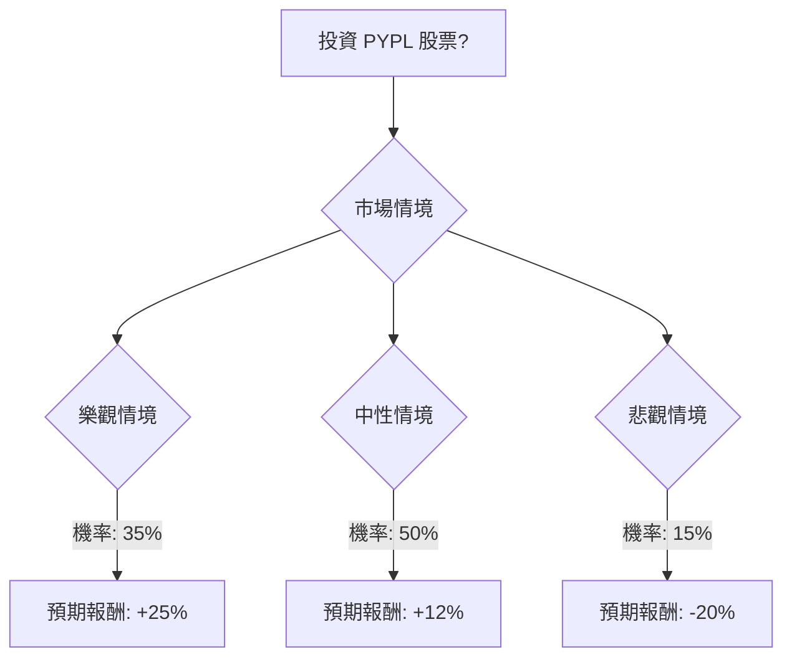

根據對美股公司 **PYPL (PayPal Holdings, Inc.)** 的基本面數據、最新新聞、財報、市場動態及產業趨勢的綜合評估，以下將使用決策樹分析與期望值分析來判斷其目前是否適合投資。

### 核心假設

**市場假設：**
*   數位支付產業將持續強勁增長，主要受電子商務、行動支付普及以及BNPL（先買後付）、加密貨幣等新技術的推動。
*   支付領域的競爭依然激烈，可能對PayPal的交易費率（take rate）構成壓力。
*   全球經濟狀況（如通膨、利率）將影響消費者支出和支付總量。

**財務假設 (PYPL 特定)：**
*   PayPal的營收預計將繼續溫和增長，這得益於總支付量（TPV）的增加以及Venmo、BNPL、PYUSD穩定幣和與Canva整合等戰略舉措。
*   公司正致力於提高獲利能力，控制營運費用並改善交易利潤率，儘管2026年的財測顯示近期利潤率可能面臨壓力。
*   股票回購計劃將持續進行，為每股盈餘（EPS）提供一定支撐。
*   公司擁有穩健的現金部位。

**產業趨勢假設 (PYPL 特定)：**
*   PayPal將利用其強大的市場地位和品牌知名度，把握數位支付趨勢帶來的機會。
*   對新技術（如AI、嵌入式支付、加密貨幣）的投資對於其長期競爭力至關重要。
*   Venmo向日常消費領域的擴展是其重要的增長動力。

### 決策樹分析

**決策點：投資 PYPL 股票**

**情境說明與預期報酬計算：**

*   **當前股價 (Close):** $50.48

1.  **樂觀情境 (Bullish Scenario):**
    *   **預測情境名稱:** 溫和增長加速
    *   **情境描述:** PayPal成功執行其戰略舉措，有效改善交易利潤率，並從數位支付產業的強勁增長中顯著受益。市場情緒好轉，導致估值倍數擴張。
    *   **機率 (Probability):** 35%
    *   **預期報酬 / 期望值 (Expected Value):**
        *   基於分析師較高目標價 $63.00。
        *   預期報酬率 = (($63.00 - $50.48) / $50.48) * 100% = 24.80% ≈ +25%
        *   期望值 = 0.35 * (+25%) = +8.75%

2.  **中性情境 (Neutral Scenario):**
    *   **預測情境名稱:** 穩定表現 / 持有
    *   **情境描述:** PayPal營收保持溫和增長，但利潤率壓力持續存在，且競爭限制了顯著的上漲空間。股價表現符合分析師的共識目標。
    *   **機率 (Probability):** 50%
    *   **預期報酬 / 期望值 (Expected Value):**
        *   基於分析師平均目標價 $56.55。
        *   預期報酬率 = (($56.55 - $50.48) / $50.48) * 100% = 12.03% ≈ +12%
        *   期望值 = 0.50 * (+12%) = +6.00%

3.  **悲觀情境 (Bearish Scenario):**
    *   **預測情境名稱:** 停滯 / 下滑
    *   **情境描述:** PayPal未能有效解決利潤率壓力，市場份額被競爭對手侵蝕，或面臨更廣泛的經濟下行。分析師下調評級，股價進一步下跌。
    *   **機率 (Probability):** 15%
    *   **預期報酬 / 期望值 (Expected Value):**
        *   假設股價下跌至 $40.00 (高於分析師最低目標價 $32-$34)。
        *   預期報酬率 = (($40.00 - $50.48) / $50.48) * 100% = -20.76% ≈ -20%
        *   期望值 = 0.15 * (-20%) = -3.00%

### 期望值分析 (Expected Value Analysis)

**整體期望值計算：**

整體期望值 = (樂觀情境期望值) + (中性情境期望值) + (悲觀情境期望值)
整體期望值 = (+8.75%) + (+6.00%) + (-3.00%)
**整體期望值 = +11.75%**

### 最終結論

根據決策樹分析和期望值分析，投資 PYPL 股票的**整體期望值為 +11.75%**。

**判斷：適合投資**

**簡短理由：**
儘管PayPal在近期財報中顯示出一些利潤率壓力和EPS未達預期，但其營收增長穩健，自由現金流強勁，並且在數位支付這個快速增長的產業中保持領先地位。公司積極推動Venmo、BNPL和PYUSD等戰略性產品和服務，這些都有助於其長期發展。分析師的共識評級為「持有」，但平均目標價仍顯示出約12%的潛在漲幅。綜合考量各情境的機率與預期報酬，其正向的整體期望值表明，PYPL目前具有一定的投資吸引力。