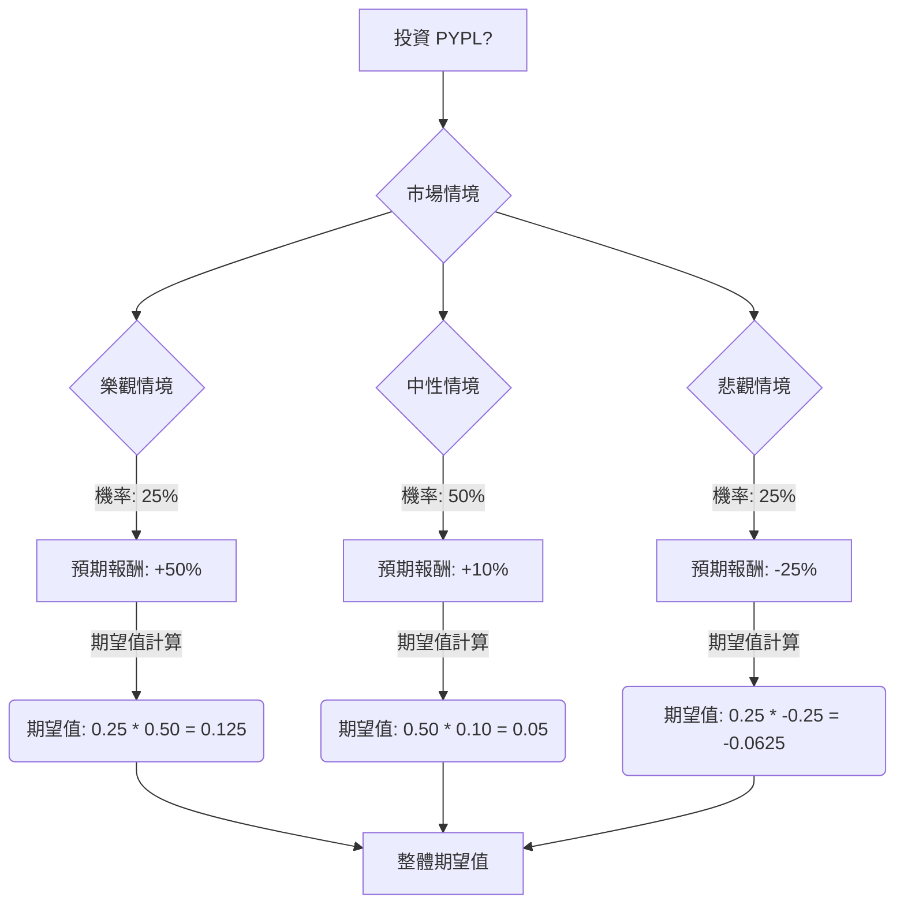

根據對美股公司 **PYPL (PayPal Holdings, Inc.)** 的基本面數據、最新新聞、財報、市場動態及產業趨勢的綜合評估，以下將使用決策樹分析與期望值分析來判斷其目前是否適合投資。

### 核心假設

1.  **市場趨勢：** 金融科技 (Fintech) 產業持續成長，數位錢包、AI/ML 應用、嵌入式支付和先買後付 (BNPL) 是主要驅動力。然而，市場競爭激烈，大型科技公司和專業支付平台如 Adyen、Stripe 帶來挑戰，同時監管審查日益嚴格。
2.  **公司策略與財務狀況：** PayPal 正在經歷「轉型年」(2024)，重點在於成本控制、營運效率提升，並重新聚焦於品牌結帳服務和 Venmo 變現。公司目標是到 2027 年實現高個位數的交易利潤增長和雙位數的非 GAAP 每股盈餘增長。 儘管 2024 年第一季度營收超出預期，但每股盈餘未達標。 公司擁有健康的資產負債表和強勁的自由現金流。
3.  **分析師情緒：** 目前分析師普遍給予「持有」評級，平均目標價介於 $49.32 至 $66.74 之間，顯示出溫和的潛在漲幅。

### 決策樹分析與期望值計算

**當前股價 (P0):** $45.37

**決策點：** 投資 PYPL

**情境設定與預期報酬：**

1.  **樂觀情境 (Optimistic Scenario):**
    *   **情境描述：** PayPal 成功執行其轉型策略，成本控制和營運效率顯著提升，品牌結帳和 Venmo 變現取得突破。市場對數位支付的需求強勁，AI 整合帶來競爭優勢。公司市場份額擴大，盈利能力大幅改善。
    *   **預期股價：** 股價回升至接近 52 週高點或分析師較高目標價區間。假設股價達到 $68.05 (約 +50% 報酬)。
    *   **機率 (Probability):** 25%

2.  **中性情境 (Neutral Scenario):**
    *   **情境描述：** PayPal 在轉型過程中取得穩健進展，但仍面臨持續的競爭壓力，市場增長速度適中。公司財務表現符合分析師的「持有」評級和平均目標價。
    *   **預期股價：** 股價達到分析師平均目標價區間的低端，例如 $49.91 (約 +10% 報酬)。
    *   **機率 (Probability):** 50%

3.  **悲觀情境 (Pessimistic Scenario):**
    *   **情境描述：** PayPal 的轉型策略執行不力，未能有效應對競爭。宏觀經濟逆風（如消費者支出減少、監管挑戰）對業務造成負面影響。用戶參與度下降，盈利能力受損。
    *   **預期股價：** 股價跌至 52 週低點或分析師最低目標價。假設股價達到 $34.03 (約 -25% 報酬)。
    *   **機率 (Probability):** 25%

---

**決策樹 (Decision Tree):**

**計算過程：**

1.  **樂觀情境期望值 (EV_Optimistic):**
    *   預期報酬 = +50%
    *   機率 = 25%
    *   EV_Optimistic = 0.25 * 0.50 = 0.125

2.  **中性情境期望值 (EV_Neutral):**
    *   預期報酬 = +10%
    *   機率 = 50%
    *   EV_Neutral = 0.50 * 0.10 = 0.05

3.  **悲觀情境期望值 (EV_Pessimistic):**
    *   預期報酬 = -25%
    *   機率 = 25%
    *   EV_Pessimistic = 0.25 * -0.25 = -0.0625

4.  **整體期望值 (Overall Expected Value):**
    *   Overall EV = EV_Optimistic + EV_Neutral + EV_Pessimistic
    *   Overall EV = 0.125 + 0.05 + (-0.0625)
    *   Overall EV = 0.1125

**整體期望值 (以股價計算):**
*   預期股價 = 當前股價 * (1 + 整體期望值)
*   預期股價 = $45.37 * (1 + 0.1125)
*   預期股價 = $45.37 * 1.1125
*   預期股價 = $50.47

### 最終結論

根據決策樹分析和期望值計算，投資 PYPL 的**整體期望值為 +11.25%**，對應的預期股價為 **$50.47**。

**判斷：適合投資**

**理由：**
儘管 PayPal 正處於轉型期，面臨激烈的市場競爭和用戶增長放緩的挑戰，但其強勁的自由現金流、健康的盈利能力以及對成本控制和核心業務的重新聚焦，為未來的增長奠定了基礎。 分析師普遍給予「持有」評級，且平均目標價顯示出一定的上漲空間。 考慮到其目前較低的本益比 (P/E 8.51, Forward P/E 7.87) 和市銷率 (P/S 1.18)，相對於其在數位支付領域的領導地位和未來潛在的盈利增長，PYPL 似乎被市場低估。 整體正向的期望值表明，在承擔合理風險的情況下，PYPL 具有一定的投資吸引力。