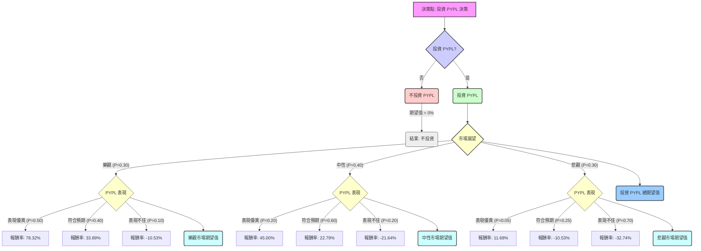

根據您提供的基本面數據以及對 PayPal (PYPL) 最新市場資訊的查詢結果，以下將透過決策樹分析與期望值分析，評估 PYPL 目前是否適合投資。

### **核心假設**

在進行決策樹分析前，我們將基於以下核心假設來建立情境與機率：

1.  **市場趨勢假設**：
    *   **樂觀市場**：全球經濟強勁增長，數位支付需求持續擴大，通膨受控。
    *   **中性市場**：經濟溫和增長，消費者支出穩定，但競爭持續激烈。
    *   **悲觀市場**：經濟放緩或衰退，消費者支出減少，競爭加劇，監管壓力上升。
2.  **公司財務與營運假設**：
    *   **PYPL 表現優異**：新任 CEO 成功執行轉型策略，核心品牌結帳業務復甦，新服務（如 AI 驅動的支付、嵌入式金融）獲得顯著市場份額，成本效率提升。
    *   **PYPL 符合預期**：公司達成其已下調的 2026 年財測目標，維持現有市場份額，但受競爭影響增長有限。
    *   **PYPL 表現不佳**：轉型努力失敗，品牌結帳業務持續下滑，市場份額被競爭對手侵蝕，法律訴訟帶來負面影響。
3.  **投資時間框架**：本次評估以未來 12 個月為期。
4.  **當前股價**：採用您提供的 `Close` 價格 $45.02。

### **最新資訊摘要**

根據網路搜尋結果，PYPL 的最新動態如下：

*   **近期財報 (2025 年第四季度)**：PayPal 2025 年第四季度營收為 86.8 億美元，低於預期的 87.9 億美元；調整後每股盈餘 (EPS) 為 1.23 美元，低於預期的 1.29 美元。核心的品牌結帳 (Branded Checkout) 總支付量 (TPV) 增長顯著放緩至 1%，遠低於第三季度的 5% 增長。
*   **2026 年財測**：公司對 2026 年的展望疲軟，預計第一季度調整後 EPS 將出現中個位數下降，全年調整後 EPS 則為低個位數下降至略微持平。全年營收增長預計為 3-4%。
*   **股價反應**：財報發布後，PYPL 股價暴跌 16-20%，跌至 12 個月新低。
*   **領導層變動**：Alex Chriss 卸任 CEO，Enrique Lores 於 2026 年 3 月 1 日起接任新任總裁兼 CEO，旨在加速執行和加強紀律。
*   **法律訴訟**：多起證券詐欺集體訴訟已針對 PayPal 提起，指控公司在 2025 年 2 月 25 日至 2026 年 2 月 2 日期間誤導投資者。
*   **分析師評級**：目前分析師共識評級為「持有」(Hold)，中位目標價介於 46.50 美元至 59.03 美元之間。近期有分析師下調評級和目標價，反映對增長前景和競爭壓力的擔憂。
*   **產業趨勢 (2026)**：數位支付正朝向更智慧、更快速、更「無形」的方向發展。主要趨勢包括代理商商務 (Agentic Commerce，由 AI 代理發起交易)、強化數位身份、即時支付、代幣化、嵌入式金融以及銀行支付 (Pay by Bank) 的普及。AI 驅動的詐欺預防也是重點。
*   **潛在利好**：
    *   擁有 4.38 億活躍帳戶，用戶參與度高，每活躍帳戶交易量增加。
    *   Venmo 業務在 2025 年增長約 20%，達到 17 億美元。
    *   積極的股票回購計畫 (2025 財年回購 60 億美元，剩餘授權 130 億美元)。
    *   資產負債表穩健，擁有淨現金和強勁的 GAAP 利潤率。
    *   估值較低 (預期本益比約 8-11 倍，自由現金流倍數約 6.5 倍)。
    *   新任 CEO Lores 被視為注重營運紀律和資本效率的轉型領導者。
    *   部分看漲評論認為近期拋售創造了買入機會。
*   **主要挑戰**：
    *   品牌結帳業務表現疲軟，面臨來自 Apple Pay、Google Pay、Stripe 和 Adyen 等競爭對手的巨大壓力。
    *   交易費率 (take rate) 下降。
    *   2026 年營收和 EPS 增長指引放緩。
    *   集體訴訟帶來的法律不確定性。
    *   對新 CEO 僅專注營運而非創新的擔憂。

### **決策樹分析**

我們將以投資 PYPL 作為初始決策點，並考慮不同的市場情境和公司表現。

**當前股價 (P0)**: $45.02
**股息率**: 0.62% (0.0062)

**情境預期股價與報酬率計算**：
*   **樂觀市場 + PYPL 表現優異**：預期股價 $80.00。報酬率 = (($80.00 - $45.02) / $45.02) + 0.0062 = 77.70% + 0.62% = **78.32%**
*   **樂觀市場 + PYPL 符合預期**：預期股價 $60.00。報酬率 = (($60.00 - $45.02) / $45.02) + 0.0062 = 33.27% + 0.62% = **33.89%**
*   **樂觀市場 + PYPL 表現不佳**：預期股價 $40.00。報酬率 = (($40.00 - $45.02) / $45.02) + 0.0062 = -11.15% + 0.62% = **-10.53%**
*   **中性市場 + PYPL 表現優異**：預期股價 $65.00。報酬率 = (($65.00 - $45.02) / $45.02) + 0.0062 = 44.38% + 0.62% = **45.00%**
*   **中性市場 + PYPL 符合預期**：預期股價 $55.00。報酬率 = (($55.00 - $45.02) / $45.02) + 0.0062 = 22.17% + 0.62% = **22.79%**
*   **中性市場 + PYPL 表現不佳**：預期股價 $35.00。報酬率 = (($35.00 - $45.02) / $45.02) + 0.0062 = -22.26% + 0.62% = **-21.64%**
*   **悲觀市場 + PYPL 表現優異**：預期股價 $50.00。報酬率 = (($50.00 - $45.02) / $45.02) + 0.0062 = 11.06% + 0.62% = **11.68%**
*   **悲觀市場 + PYPL 符合預期**：預期股價 $40.00。報酬率 = (($40.00 - $45.02) / $45.02) + 0.0062 = -11.15% + 0.62% = **-10.53%**
*   **悲觀市場 + PYPL 表現不佳**：預期股價 $30.00。報酬率 = (($30.00 - $45.02) / $45.02) + 0.0062 = -33.36% + 0.62% = **-32.74%**

### **期望值計算過程**

我們從決策樹的末端節點開始，逐步計算每個節點的期望值。

1.  **計算各市場情境下 PYPL 表現的期望值**：

    *   **樂觀市場情境下的期望值 (EV_Optimistic)**:
        *   EV_Optimistic = (0.50 * 78.32%) + (0.40 * 33.89%) + (0.10 * -10.53%)
        *   EV_Optimistic = 39.16% + 13.56% - 1.05% = **51.67%**

    *   **中性市場情境下的期望值 (EV_Neutral)**:
        *   EV_Neutral = (0.20 * 45.00%) + (0.60 * 22.79%) + (0.20 * -21.64%)
        *   EV_Neutral = 9.00% + 13.67% - 4.33% = **18.34%**

    *   **悲觀市場情境下的期望值 (EV_Pessimistic)**:
        *   EV_Pessimistic = (0.05 * 11.68%) + (0.25 * -10.53%) + (0.70 * -32.74%)
        *   EV_Pessimistic = 0.58% - 2.63% - 22.92% = **-24.97%**

2.  **計算「投資 PYPL」的總期望值 (EV_Invest)**：

    *   EV_Invest = (市場樂觀機率 * EV_Optimistic) + (市場中性機率 * EV_Neutral) + (市場悲觀機率 * EV_Pessimistic)
    *   EV_Invest = (0.30 * 51.67%) + (0.40 * 18.34%) + (0.30 * -24.97%)
    *   EV_Invest = 15.50% + 7.34% - 7.49% = **15.35%**

3.  **計算「不投資 PYPL」的期望值 (EV_Not_Invest)**：
    *   EV_Not_Invest = **0%** (假設不投資則無收益也無損失)

### **最終結論**

根據決策樹分析和期望值計算，**投資 PYPL 的總期望報酬率為 15.35%**。

**判斷**：**適合投資**

**簡短理由**：
儘管 PayPal 近期面臨財報不及預期、2026 年財測疲軟、CEO 變動以及法律訴訟等多重挑戰，導致股價大幅下跌，但其目前的估值已顯著偏低 (本益比約 8-11 倍，自由現金流倍數約 6.5 倍)。公司仍擁有龐大的活躍用戶基礎 (4.38 億)、強勁的現金流產生能力 和積極的股票回購計畫。新任 CEO Enrique Lores 被寄予厚望，有望透過加強營運紀律和執行力來推動公司轉型。

綜合考量，雖然存在顯著風險，但 PYPL 在當前低估值下，若新管理層能有效執行轉型策略並應對競爭，其潛在的上漲空間 (15.35% 的期望報酬率) 高於不投資的零報酬。這表明在風險可控的前提下，PYPL 具有一定的投資吸引力。然而，投資者應密切關注公司在品牌結帳業務復甦、新服務推廣以及法律訴訟進展方面的實際表現。