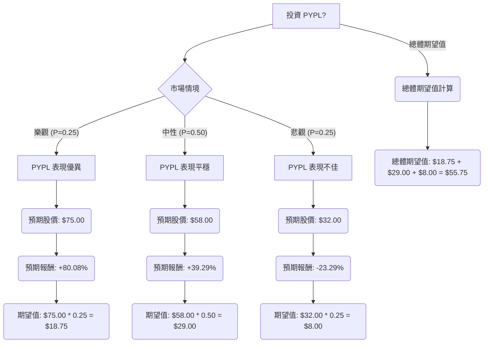

根據對美股公司 PayPal (PYPL) 的基本面數據、最新新聞、財報、市場動態及產業趨勢的綜合評估，以下將透過決策樹分析與期望值分析，評估其目前是否適合投資。

### **核心假設**

1.  **市場趨勢：** 數位支付產業整體仍處於成長趨勢，受惠於非接觸式支付、電子商務普及、AI 於詐欺偵測與代理商務的應用、跨境支付加速以及先買後付 (BNPL) 的持續流行。
2.  **財務表現：** PayPal 展現出穩健的自由現金流，並透過股票回購支持股東價值。然而，營收增長可能保持溫和，活躍帳戶增長面臨挑戰。
3.  **產業競爭：** 來自 Apple Pay、Shopify Pay 等金融科技公司以及傳統金融機構的激烈競爭，將持續對 PayPal 的市場份額造成壓力，尤其是在行動支付領域。 PayPal 的成功將取決於其透過 AI 和新商務體驗進行創新和差異化的能力。
4.  **公司治理與執行：** 近期管理層變動（新任 CEO Enrique Lores 於 2026 年 3 月 1 日上任）以及相關的證券詐欺集體訴訟，為公司帶來不確定性和執行風險。 2024 年的財測表現不如分析師預期，也顯示出轉型之路可能較為漫長。

### **決策樹分析與期望值計算**

**當前股價 (P0):** $41.65

我們將設定三種情境來評估 PYPL 的未來表現：

#### **1. 樂觀情境 (Optimistic Scenario)**
*   **情境描述：** PayPal 的新任 CEO 成功執行轉型策略，AI 相關合作夥伴關係（如與 Sabre、Mindtrip、Google、Microsoft 的合作）和產品創新（如收購 Cymbio）迅速取得市場認可，有效穩定並恢復市場份額。公司營收和利潤增長超出預期，投資者信心顯著回升。
*   **預期股價 (P_optimistic):** $75.00 (參考分析師最高目標價，取較保守值)
*   **預期報酬 (Return_optimistic):** ($75.00 - $41.65) / $41.65 = 80.08%
*   **機率 (Probability_optimistic):** 25% (考慮到近期挑戰和「持有」共識評級，此情境發生機率較低)

#### **2. 中性情境 (Neutral Scenario)**
*   **情境描述：** PayPal 的轉型策略取得部分進展，但市場份額流失仍在持續，不過整體數位支付市場的增長和公司成本控制、股票回購等措施，支撐了每股盈餘 (EPS)。股價朝向分析師平均目標價靠攏。
*   **預期股價 (P_neutral):** $58.00 (參考分析師平均目標價，取中間值)
*   **預期報酬 (Return_neutral):** ($58.00 - $41.65) / $41.65 = 39.29%
*   **機率 (Probability_neutral):** 50% (基於分析師普遍「持有」評級、混合的財報表現以及產業競爭現狀，此情境最有可能發生)

#### **3. 悲觀情境 (Pessimistic Scenario)**
*   **情境描述：** PayPal 的新策略執行不力，未能有效應對競爭，活躍帳戶持續下降。宏觀經濟逆風影響消費者支出，加上近期 CEO 變動和證券詐欺訴訟等負面消息進一步打擊投資者信心，導致股價跌至分析師預期低點甚至更低。
*   **預期股價 (P_pessimistic):** $32.00 (參考分析師最低目標價)
*   **預期報酬 (Return_pessimistic):** ($32.00 - $41.65) / $41.65 = -23.29%
*   **機率 (Probability_pessimistic):** 25% (考慮到近期負面消息和競爭壓力，此情境仍有一定機率發生)

---

#### **決策樹 (Decision Tree)**

#### **計算過程**

1.  **樂觀情境期望值 (EV_optimistic):**
    *   預期股價 = $75.00
    *   機率 = 0.25
    *   EV_optimistic = $75.00 * 0.25 = $18.75

2.  **中性情境期望值 (EV_neutral):**
    *   預期股價 = $58.00
    *   機率 = 0.50
    *   EV_neutral = $58.00 * 0.50 = $29.00

3.  **悲觀情境期望值 (EV_pessimistic):**
    *   預期股價 = $32.00
    *   機率 = 0.25
    *   EV_pessimistic = $32.00 * 0.25 = $8.00

4.  **總體期望值 (Total Expected Value):**
    *   Total EV = EV_optimistic + EV_neutral + EV_pessimistic
    *   Total EV = $18.75 + $29.00 + $8.00 = $55.75

### **最終結論**

根據期望值分析，投資 PYPL 的總體期望值為 **$55.75**。

由於當前股價為 $41.65，而計算出的總體期望值 $55.75 高於當前股價，這表示從期望值的角度來看，**PYPL 目前適合投資**。

**簡短理由：**
儘管 PayPal 面臨激烈的市場競爭、活躍帳戶增長放緩以及近期管理層變動和法律訴訟等挑戰，導致分析師普遍給予「持有」評級，但其在數位支付領域的領先地位、穩健的自由現金流、積極的股票回購計劃以及在 AI 和新商務體驗方面的戰略投資，為其提供了潛在的增長動力。 綜合考量不同情境下的潛在報酬與其發生機率，PYPL 的預期未來價值高於其當前股價，顯示出一定的上行空間。 然而，投資者應密切關注公司新策略的執行情況以及市場競爭格局的變化。