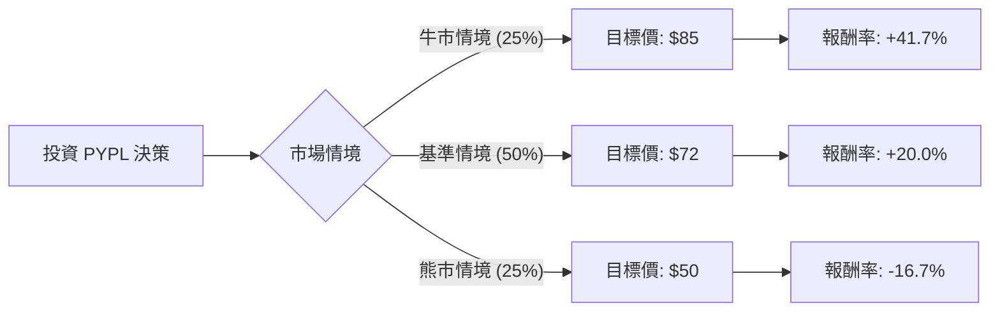

根據您提供的數據與最新的市場資訊（包括 2024 年第一季財報與產業趨勢），我將運用**決策樹分析（Decision Tree）**與**期望值分析（Expected Value Analysis）**來評估 PayPal (PYPL) 的投資價值。

### 一、 核心假設與當前市場背景分析

在建立模型前，我們先整合最新資訊：
1.  **估值吸引力**：目前 P/E 僅約 12 倍，Forward P/E 約 10.26 倍，PEG 為 0.84。這顯示相對於其增長速度，股價處於歷史低位。
2.  **轉型期**：新任 CEO Alex Chriss 重點在於提高獲利能力（如 Fastlane 結帳優化、Venmo 變現）與縮減開支。
3.  **競爭壓力**：Apple Pay 與 Google Pay 在移動支付端持續施壓，導致 PayPal 市佔與毛利率（Gross Margin 41.6%）面臨挑戰。
4.  **資本分配**：公司計畫在 2024 年投入至少 50 億美元進行股票回購，這對 EPS 有強大的支撐作用。

---

### 二、 決策樹分析 (Decision Tree)

假設投資期限為 **12 個月**，現價約為 **$60**（以數據中 $59.81 近似）。

#### 決策樹節點詳細說明：

| 情境節點 | 發生機率 | 預期股價 | 預期報酬率 | 說明 |
| :--- | :--- | :--- | :--- | :--- |
| **牛市 (Optimistic)** | 25% | $85 | +41.7% | Fastlane 轉換率超預期，利潤率顯著回升，聯準會降息提振金融科技估值。 |
| **基準 (Base Case)** | 50% | $72 | +20.0% | 營收穩定增長 (7-8%)，大規模回購支撐 EPS，股價回歸分析師平均目標價 ($77 左右)。 |
| **熊市 (Pessimistic)**| 25% | $50 | -16.7% | Apple Pay 競爭加劇導致市佔流失，消費者支出受衰退影響下滑，股價跌破近期支撐。 |

---

### 三、 期望值分析 (Expected Value Analysis)

#### 1. 計算過程
我們將各情境的機率與預期報酬相乘，得出總期望報酬率：

*   **牛市期望貢獻**：$0.25 \times 41.7\% = 10.425\%$
*   **基準期望貢獻**：$0.50 \times 20.0\% = 10.000\%$
*   **熊市期望貢獻**：$0.25 \times (-16.7\%) = -4.175\%$

**總預期報酬率 (Expected Return) = 10.425% + 10.000% - 4.175% = 16.25%**

#### 2. 期望價值 (Expected Price)
$60 \times (1 + 16.25\%) = \mathbf{\$69.75}$

#### 3. 核心假設依據
*   **估值修復**：假設市場願意給予 PYPL 至少 13-14 倍的 Forward P/E（目前僅 10 倍）。
*   **獲利能力**：ROE 達 24.36%，ROI 15.34%，顯示其仍具備高效賺錢能力，只是增長溢價消失。
*   **技術面**：SMA20/50/200 皆為負值，顯示短期趨勢偏弱，但股價已接近 52 週低點 (55.85)，下行風險相對受限。

---

### 四、 最終結論

**評估結果：適合投資 (適合價值投資者 / 中長期持有)**

#### 判斷理由：
1.  **期望值為正且具吸引力**：計算出的期望報酬率為 **16.25%**，高於標普 500 指數的歷史長期平均報酬率。
2.  **安全邊際 (Margin of Safety)**：
    *   PEG 僅 0.84，顯示股價被低估。
    *   強大的自由現金流（P/FCF 10.06）與 50 億美元的回購計畫提供了強大的底部支撐（Floor Price）。
3.  **風險回報比優異**：牛市潛在獲利 (41.7%) 遠高於熊市潛在損失 (-16.7%)，這在數學上是一個極具勝率的交易。
4.  **轉型動能**：雖然目前技術指標（SMA）顯示賣壓沉重，但基本面（EPS Q/Q 增長 31.8%）已出現轉機。

**風險提示：**
*   短期內技術面仍處於空頭排列，可能需要時間築底。
*   需密切關注下一次財報中「交易利潤率 (Transaction Margin)」是否止跌回升，這是市場重拾信心的關鍵指標。

**建議策略：**
考慮到目前處於 SMA 低點，建議採「分批買入」策略，以應對可能的短期波動，並將目標鎖定在一年後的估值修復。