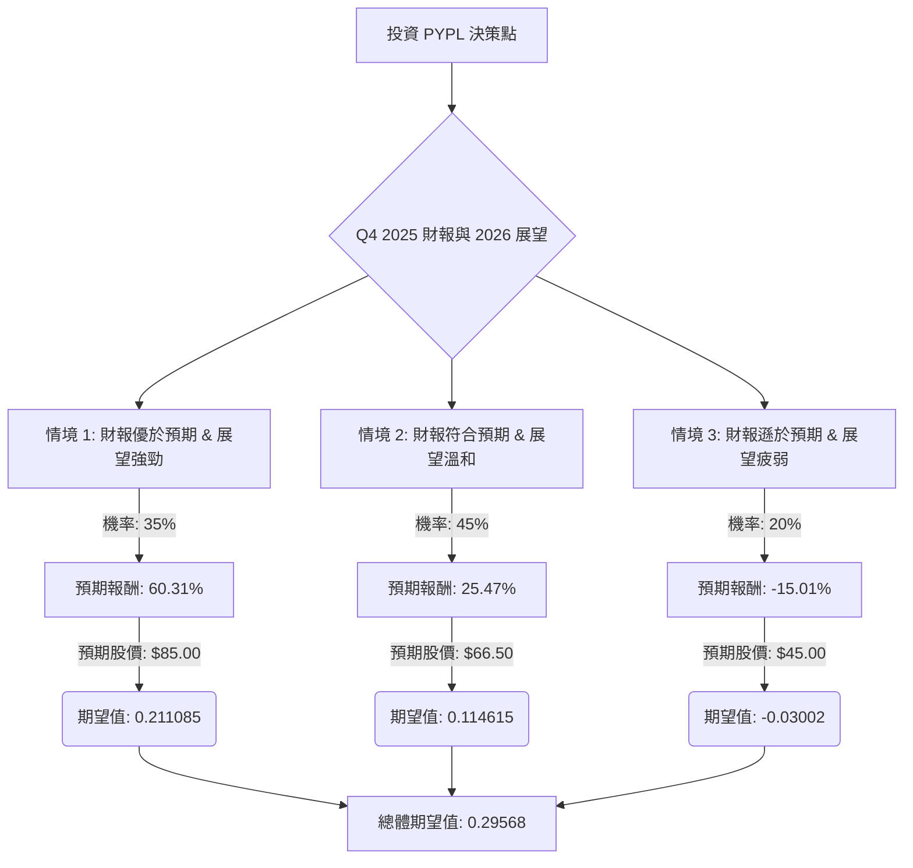

根據對美股公司 PayPal (PYPL) 的基本面數據、最新市場資訊、財報預期及產業趨勢的綜合評估，以下將透過決策樹分析與期望值分析，判斷其目前是否適合投資。

### 核心假設

在進行決策樹分析前，我們建立以下核心假設：

*   **當前股價 (P0)**：$53.11 (截至 2026 年 1 月 29 日的收盤價)。
*   **時間範圍**：一年期投資評估，以涵蓋分析師的目標價和 2026 年的展望。
*   **市場情緒**：目前市場對 PayPal 抱持謹慎態度，主要受成長放緩預期和競爭加劇影響，但其估值具吸引力。
*   **財報影響**：即將於 2026 年 2 月 3 日公佈的 2025 年第四季度財報，將是影響股價的關鍵短期催化劑。
*   **產業趨勢**：數位支付產業持續成長，但面臨來自 Apple Pay、Google Pay 等科技巨頭及傳統卡片網絡的激烈競爭。PayPal 透過收購 Cymbio、與 Authvia 合作、拓展錢包服務及發展 AI 商務等策略性舉措，以應對挑戰並尋求未來成長。
*   **分析師目標價**：綜合分析師意見，中位目標價為 $66.50，最高目標價可達 $105.00 (或 Seeking Alpha 較為樂觀的 $106.755)，最低目標價約為 $50-$51。
*   **股息率**：0.0026 (0.26%)。

### 決策樹分析

以下決策樹將評估投資 PYPL 的不同情境及其預期報酬。

### 計算過程

**1. 當前股價 (P0)**: $53.11

**2. 股息率 (Dividend Yield)**: 0.0026

**3. 情境設定與預期報酬計算**

*   **情境 1: 財報優於預期 & 展望強勁 (Optimistic Scenario)**
    *   **預測情境名稱**：PayPal 2025 年第四季度財報表現出色，超出分析師預期，並對 2026 年給出強勁的成長指引，特別是其 AI 商務、Cymbio 收購和 Authvia 合作等新策略展現出顯著成效。市場對其轉型和競爭力重拾信心。
    *   **對應機率 (Probability)**：35%
        *   理由：儘管分析師普遍下調了 2026 年的成長預期，但 PayPal 在上一季度曾超出預期。若新策略能帶來超預期的成長，市場情緒可能迅速反轉。
    *   **預期股價 (1 年後)**：$85.00
        *   理由：此價格接近分析師目標價區間的較高水平，反映了市場對公司未來成長的強烈信心。
    *   **預期報酬 (Return)**：
        *   股價報酬 = ($85.00 - $53.11) / $53.11 = 0.6005
        *   總報酬 = 股價報酬 + 股息率 = 0.6005 + 0.0026 = 0.6031 (即 60.31%)
    *   **期望值 (Expected Value)**：0.35 \* 0.6031 = 0.211085

*   **情境 2: 財報符合預期 & 展望溫和 (Neutral Scenario)**
    *   **預測情境名稱**：PayPal 2025 年第四季度財報符合分析師的共識預期，2026 年的展望也與管理層先前指引的溫和成長相符。公司在數位支付領域的競爭壓力持續存在，但其核心業務保持穩定。
    *   **對應機率 (Probability)**：45%
        *   理由：分析師已將 2026 年的成長預期下調，因此符合這些修正後的預期是較為可能的情況。
    *   **預期股價 (1 年後)**：$66.50
        *   理由：此價格為目前分析師的共識中位目標價。
    *   **預期報酬 (Return)**：
        *   股價報酬 = ($66.50 - $53.11) / $53.11 = 0.2521
        *   總報酬 = 股價報酬 + 股息率 = 0.2521 + 0.0026 = 0.2547 (即 25.47%)
    *   **期望值 (Expected Value)**：0.45 \* 0.2547 = 0.114615

*   **情境 3: 財報遜於預期 & 展望疲弱 (Pessimistic Scenario)**
    *   **預測情境名稱**：PayPal 2025 年第四季度財報表現不佳，未能達到分析師預期，且 2026 年的成長指引進一步下調，顯示其在競爭激烈的市場中面臨更大挑戰，新策略的執行效果不彰。
    *   **對應機率 (Probability)**：20%
        *   理由：近期有分析師下調評級至「賣出」並給出較低的目標價，反映了市場對其競爭壓力和成長前景的擔憂。
    *   **預期股價 (1 年後)**：$45.00
        *   理由：此價格低於目前分析師的最低目標價 ($50-$51)，反映了市場對公司前景的嚴重悲觀情緒。
    *   **預期報酬 (Return)**：
        *   股價報酬 = ($45.00 - $53.11) / $53.11 = -0.1527
        *   總報酬 = 股價報酬 + 股息率 = -0.1527 + 0.0026 = -0.1501 (即 -15.01%)
    *   **期望值 (Expected Value)**：0.20 \* -0.1501 = -0.03002

**4. 整體期望值 (Overall Expected Value)**

*   總體期望值 = 情境 1 期望值 + 情境 2 期望值 + 情境 3 期望值
*   總體期望值 = 0.211085 + 0.114615 + (-0.03002) = 0.29568

### 最終結論

根據上述決策樹分析和期望值計算，投資 PayPal (PYPL) 的**整體期望值為 0.29568 (約 29.57%)**。

**判斷：適合投資**

**簡短理由：**
儘管 PayPal 目前股價接近 52 週低點，且市場對其 2026 年的成長前景持謹慎態度，但其目前的估值具有吸引力 (P/E 10.85, Forward P/E 9.41, PEG 0.83)。公司在 2026 年 2 月 3 日即將公佈的 Q4 2025 財報將是關鍵催化劑。

分析顯示，即使在財報表現符合預期的中性情境下，仍有約 25.47% 的預期報酬。若財報優於預期並給出強勁展望，潛在報酬更高達 60.31%。雖然存在財報遜於預期的風險，導致約 15.01% 的虧損，但其機率相對較低 (20%)。

綜合來看，PayPal 正在積極透過收購 Cymbio 強化 AI 商務能力、與 Authvia 合作拓展支付渠道、以及擴展錢包服務 等策略來應對競爭並尋求成長。公司保持健康的財務狀況 (Piotroski Score 9)，並透過股票回購和股息回饋股東。

考慮到其相對較低的估值、積極的戰略轉型以及正向的整體期望值，PayPal 在當前價格下，對於願意承擔一定風險以追求潛在較高報酬的投資者而言，是**適合投資**的標的。然而，投資者應密切關注即將發布的財報及其對 2026 年的具體指引，這將是驗證這些情境和假設的關鍵。