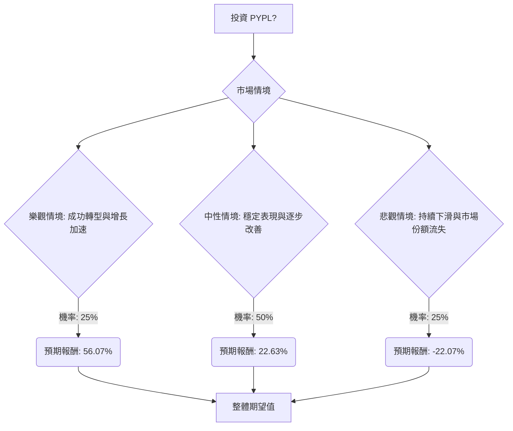

根據對 PayPal (PYPL) 基本面數據和最新市場資訊的綜合分析，以下是基於決策樹分析和期望值分析的投資評估。

### **核心假設**

在進行決策樹分析之前，我們基於收集到的資訊做出以下核心假設：

*   **市場假設：** 數位支付市場競爭激烈，Apple Pay、Stripe 和 Block (Square) 等強勁競爭者持續挑戰 PayPal 的市場份額，尤其是在品牌結帳業務方面。 然而，整體金融科技市場仍在增長，受即時支付、穩定幣和人工智慧等趨勢推動。
*   **財務假設：** PayPal 2025 年第四季度財報表現不及預期，2026 年財測疲軟，預計交易利潤額持平或略有下降，非 GAAP 每股盈餘 (EPS) 增長為低個位數至略微正增長。 公司擁有強勁的自由現金流，並透過股票回購和股息向股東返還資本。
*   **產業趨勢假設：** 替代支付方式、開放銀行、人工智慧在詐欺防範中的應用以及穩定幣（如 PYUSD）的採用是關鍵趨勢。 PayPal 將 PYUSD 擴展到 70 個市場是其在這一領域的重要舉措。 公司也正轉向人工智慧基礎設施。
*   **管理層假設：** 新任執行長 Enrique Lores 專注於執行和強化品牌結帳業務。 Alyssa Henry 加入董事會帶來了相關經驗。

### **決策樹分析**

我們將評估投資 PYPL 的決策，並考慮三種主要情境：樂觀、中性、悲觀。

**當前股價 (PYPL)：** $44.85

#### **情境說明與計算過程**

1.  **樂觀情境 (Optimistic Scenario): 成功轉型與增長加速**
    *   **情境描述：** PayPal 的戰略舉措（PYUSD 擴展、AI 代理支付、專注於品牌結帳、Venmo/BNPL 增長）取得顯著進展。新任執行長 Enrique Lores 成功執行轉型策略，有效應對競爭，市場份額穩定或略有增加。宏觀經濟狀況改善，提振消費者支出。分析師情緒好轉，導致更高的目標價。
    *   **預期股價：** $70.00 (參考分析師高目標價 $100 及分析報告中高情境的 $75，取一個較為保守但積極的目標)
    *   **預期報酬：** (($70.00 - $44.85) / $44.85) * 100% = 56.07%
    *   **機率 (Probability)：** 25%
    *   **期望值 (Expected Value)：** 56.07% * 0.25 = 14.0175%

2.  **中性情境 (Moderate Scenario): 穩定表現與逐步改善**
    *   **情境描述：** PayPal 穩定其核心業務，但由於持續的競爭壓力和市場成熟，增長保持溫和。戰略舉措顯示出一些潛力，但未能導致快速增長。收益和收入符合修正後的較低預期。股價徘徊在當前分析師中位目標附近。
    *   **預期股價：** $55.00 (參考公司提供的目標價 $51.21 及分析師中位目標 $46.00-$59.03，取一個中間值)
    *   **預期報酬：** (($55.00 - $44.85) / $44.85) * 100% = 22.63%
    *   **機率 (Probability)：** 50%
    *   **期望值 (Expected Value)：** 22.63% * 0.50 = 11.315%

3.  **悲觀情境 (Pessimistic Scenario): 持續下滑與市場份額流失**
    *   **情境描述：** PayPal 未能有效應對競爭，導致品牌結帳業務市場份額進一步流失。戰略舉措未能達到預期效果。宏觀經濟逆風持續或惡化。收益和收入持續令人失望，導致進一步的評級下調和更低的目標價。法律問題變得更加嚴重。
    *   **預期股價：** $35.00 (參考分析師低目標價 $32.00 及 Intellectia AI 的「強烈賣出」建議，取一個較為悲觀的目標)
    *   **預期報酬：** (($35.00 - $44.85) / $44.85) * 100% = -22.07%
    *   **機率 (Probability)：** 25%
    *   **期望值 (Expected Value)：** -22.07% * 0.25 = -5.5175%

#### **整體期望值計算**

整體期望值 = (樂觀情境期望值) + (中性情境期望值) + (悲觀情境期望值)
整體期望值 = 14.0175% + 11.315% + (-5.5175%)
整體期望值 = 19.815%

### **最終結論**

根據上述決策樹分析和期望值計算，PYPL 的整體期望值為 **19.815%**。

**判斷：適合投資**

**理由：** 儘管 PayPal 面臨激烈的競爭、近期財報表現不佳以及 2026 年財測疲軟等挑戰，但其整體期望值為正，顯示出潛在的投資回報。公司正在積極進行戰略轉型，包括擴展穩定幣 PYUSD 業務、探索 AI 代理支付 以及強化核心品牌結帳服務。此外，PayPal 擁有強勁的自由現金流，並透過股票回購和股息向股東返還資本。新任執行長和董事會成員的加入也可能為公司帶來新的執行力和戰略方向。

雖然存在下行風險，但考慮到其市場領導地位、積極的轉型策略以及相對較低的估值（P/E 8.29，P/B 2.04），如果公司能夠成功執行其策略並在競爭激烈的市場中重新獲得增長動力，則存在顯著的上行空間。因此，對於願意承擔一定風險以追求潛在回報的投資者而言，PYPL 目前適合投資。