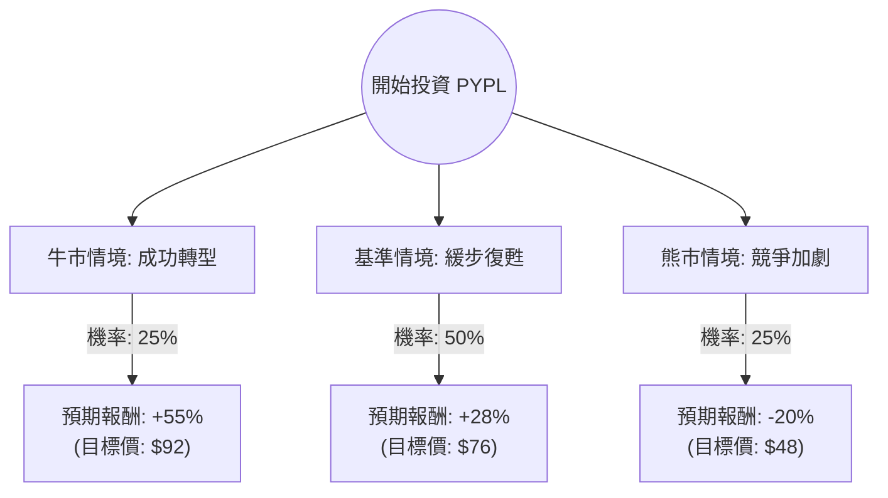

這份分析報告將結合您提供的基本面數據與最新的市場動態（包含 2024 年新任 CEO Alex Chriss 的轉型計畫、利潤率壓力及競爭態勢），利用**決策樹（Decision Tree）**與**期望值（Expected Value）**進行評估。

---

### 一、 核心假設與市場背景分析

在計算前，我們必須建立以下核心假設：

1.  **轉型期挑戰（2024 為過渡年）：** PayPal 目前正處於從「增長股」轉向「價值股/平台股」的陣痛期。新 CEO 強調 2024 年重點在於獲利能力而非單純營收增長。
2.  **利潤率壓力：** 雖然 Braintree（無品牌支付）增長強勁，但其毛利較低；核心 PayPal 品牌（高毛利）面臨 Apple Pay 與 Google Pay 的激烈競爭。
3.  **估值修復：** 目前 P/E 約 11.88x，遠低於歷史平均（約 30x-50x）及行業平均。這代表市場已反映了大部分利空，但也缺乏上攻動能。
4.  **資本配置：** 公司擁有強大的自由現金流（P/FCF 9.96），並持續進行大規模股票回購，這將支撐 EPS。

---

### 二、 決策樹分析 (Decision Tree)

以下為 PayPal 未來一年的三種可能情境預測：

#### 節點詳細說明：

1.  **牛市情境 (Bull Case) - 25%：**
    *   **條件：** 新推出的 "Fastlane" 結帳優化與 AI 應用大幅提升轉化率；中小企業市場份額回升；利潤率止跌回升。
    *   **估值：** 市場給予 Forward P/E 15x。
    *   **預期報酬：** 約 +55%。

2.  **基準情境 (Base Case) - 50%：**
    *   **條件：** 營收維持中個位數增長；股票回購抵銷了利潤率的微幅下滑；分析師目標價（$76.31）達成。
    *   **估值：** 市場維持目前 P/E 12x 左右。
    *   **預期報酬：** 約 +28%。

3.  **熊市情境 (Bear Case) - 25%：**
    *   **條件：** Apple Pay 滲透率持續壓迫 PayPal 品牌支付；電商增長放緩；宏觀經濟衰退導致交易量下降。
    *   **估值：** P/E 進一步壓縮至 8x-9x。
    *   **預期報酬：** 約 -20%。

---

### 三、 期望值分析 (Expected Value Analysis)

#### 1. 計算過程
我們以目前股價 **$59.49** 為基準，計算一年後的預期收益率：

*   **牛市期望值：** $0.25 \times 55\% = 13.75\%$
*   **基準期望值：** $0.50 \times 28\% = 14.00\%$
*   **熊市期望值：** $0.25 \times (-20\%) = -5.00\%$

**總期望報酬率 (Total EV) = 13.75% + 14.00% - 5.00% = 22.75%**

#### 2. 財務數據支持點
*   **PEG 0.84：** 數值小於 1，顯示相對於其盈利增長，股價目前被低估。
*   **ROE 24.36%：** 顯示公司依然具備極強的資產獲利能力。
*   **P/FCF 9.96：** 現金流極其充沛，這為公司提供了「安全邊際」，可用於回購股票或併購。

---

### 四、 最終結論

#### **判斷：適合投資 (Buy / Accumulate)**

#### **理由：**
1.  **極高的安全邊際：** 目前 11-12 倍的 P/E 已經接近歷史最低水平，且低於標普 500 平均水平。即便在最差的熊市情境下，下行空間相較於上行潛力顯得較小（風險回報比優異）。
2.  **正向期望值：** 22.75% 的預期報酬率顯著高於市場平均預期。
3.  **基本面穩健：** 儘管面臨競爭，PayPal 依然是全球支付龍頭，擁有超過 4 億活躍用戶。ROE 與 ROI 數據顯示其核心業務仍具競爭力。
4.  **技術面超賣：** 52 週表現為 -32.9%，且 SMA20/50/200 均為負值，顯示股價處於底部區域，適合價值投資者分批進場。

**投資建議：**
這是一筆**「價值修復」**型的投資，而非「高速成長」型。建議投資者採取**分批買入（Dollar Cost Averaging）**策略，並做好持有 12-24 個月以等待轉型成效顯現的心理準備。

---
*風險提示：美股投資受宏觀經濟、利率政策及產業競爭影響，以上分析僅供參考，不構成法律或專業投資建議。*