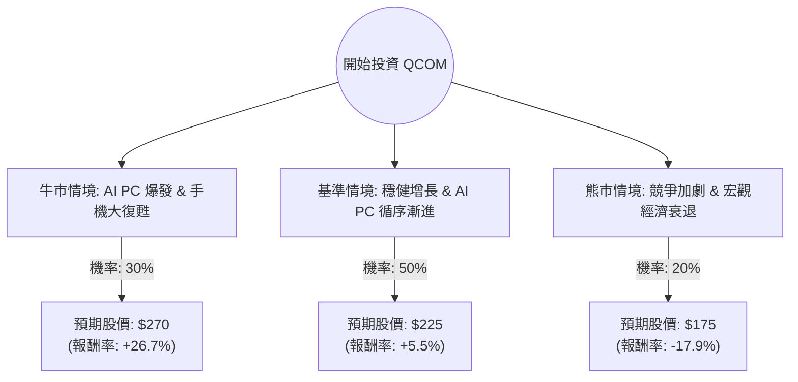

這份分析報告將結合您提供的基本面數據與最新的市場動態（如 AI PC 趨勢、手機市場復甦、Apple 合作關係等），利用**決策樹（Decision Tree）**與**期望值分析（Expected Value Analysis）**評估高通（Qualcomm, QCOM）的投資價值。

---

### 一、 核心假設與市場動態分析

在建立決策樹之前，我們基於最新資訊設定以下核心假設：

1.  **AI PC 轉型（利多）**：高通推出的 Snapdragon X Elite 處理器已進入微軟 Copilot+ PC 首波名單。這標誌著高通從手機晶片商轉型為 PC 運算挑戰者，估值邏輯可能從「成熟手機股」轉向「AI 成長股」。
2.  **手機市場復甦（中性偏多）**：全球智慧型手機市場（尤其是高端 Android 陣營）正在復甦，且高通在中國市場的市佔率依然穩固。
3.  **Apple 關係（風險緩解）**：Apple 已將與高通的基頻晶片供應合約延長至 2026/2027 年，短期內消除了巨大的營收缺口風險。
4.  **估值壓力（風險）**：目前股價（約 $213）已接近 52 週高點，且遠高於數據中的 Target Price ($176.72)，顯示市場已提前反應部分利多。

---

### 二、 決策樹分析 (Decision Tree)

以下為未來 12 個月的投資情境預測：

#### 節點詳細說明：

1.  **牛市情境 (Bull Case) - 30% 機率**：
    *   **條件**：Snapdragon X Elite 成功奪取 Windows 筆電 15% 以上市佔；AI 手機換機潮超乎預期。
    *   **預期報酬**：股價挑戰 $270（對應 Forward P/E 約 25x）。
2.  **基準情境 (Base Case) - 50% 機率**：
    *   **條件**：AI PC 貢獻穩定但未立即取代 Intel/AMD；手機市場保持個位數增長；Apple 訂單穩定。
    *   **預期報酬**：股價緩步推升至 $225（對應 Forward P/E 約 20x）。
3.  **熊市情境 (Bear Case) - 20% 機率**：
    *   **條件**：聯發科（MediaTek）在高階市場競爭加劇；AI PC 軟體相容性不佳導致銷量慘淡；全球消費力下降。
    *   **預期報酬**：股價回落至 $175（接近數據中的 Target Price 與 SMA200 支撐位）。

---

### 三、 期望值計算 (Expected Value Calculation)

我們以目前股價 **$213.17** 為基準，計算一年後的預期價值（Expected Value, EV）：

| 情境 | 預期股價 (P) | 報酬率 (R) | 機率 (W) | 加權期望值 (P × W) |
| :--- | :--- | :--- | :--- | :--- |
| **牛市** | $270 | +26.7% | 0.30 | $81.0 |
| **基準** | $225 | +5.5% | 0.50 | $112.5 |
| **熊市** | $175 | -17.9% | 0.20 | $35.0 |
| **總計** | | | **1.00** | **$228.5** |

#### 計算過程：
*   **預期股價 EV** = ($270 × 0.3) + ($225 × 0.5) + ($175 × 0.2) = **$228.5**
*   **預期報酬率** = ($228.5 - $213.17) / $213.17 ≈ **7.19%**

---

### 四、 綜合評估與最終結論

#### 1. 基本面優勢：
*   **獲利能力強勁**：ROE 36.08% 與 ROI 23.6% 顯示極高的資本效率。
*   **財務穩健**：Current Ratio 2.37，債務比例（Debt/Eq 0.56）處於健康水平。
*   **成長動能**：EPS Q/Q 增長 172.6%，顯示獲利結構正在優化。

#### 2. 潛在風險：
*   **技術指標過熱**：股價高於 SMA20/50/200 甚多（SMA50 高出 45%），短期有回檔壓力。
*   **內部人拋售**：Insider Trans 為 -6.67%，顯示公司內部人在高位有套現動作。

#### 最終結論：**適合投資（但建議「分批買進」或「等待回檔」）**

**判斷理由：**
1.  **期望值為正**：計算出的預期股價 $228.5 高於現價，且具備約 7.2% 的預期報酬率，在大型半導體股中屬穩健。
2.  **估值重估（Re-rating）**：高通正從單一的手機晶片商轉型為 AI 運算平台公司。隨著 AI PC 出貨量在 2024 下半年進入市場，其 P/E 倍數有望從目前的 22x 提升至類比 NVIDIA/AMD 的更高水平。
3.  **安全邊際**：雖然目前股價偏高，但其強大的現金流（P/FCF 17.73）與穩定的股息（1.69%）提供了下行保護。

**操作建議：**
由於目前股價與 SMA50 乖離率較大，且內部人近期減持，**不建議在 $213 以上全力追高**。較理想的策略是在股價回落至 **$195 - $200** 區間時分批佈局，以獲取更高的風險報酬比。