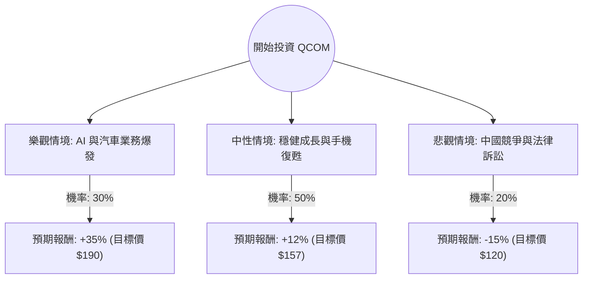

這份分析將結合您提供的基本面數據與最新的市場動態（包含 2024 年底的產業趨勢、AI PC 發展及財報表現），利用**決策樹（Decision Tree）**與**期望值分析（Expected Value Analysis）**評估高通（Qualcomm, QCOM）的投資價值。

---

### 一、 核心假設與市場背景分析

在建立決策樹之前，我們基於數據與最新資訊設定以下核心假設：

1.  **估值面（Valuation）**：目前 P/E 約 29.5，但 **Forward P/E 僅 12.72**，顯示市場預期未來一年獲利將大幅成長。PEG 高達 21.94 顯示短期成長溢價較高，但 P/FCF 11.79 顯示現金流非常健康。
2.  **成長動能（Growth Drivers）**：
    *   **AI 轉型**：Snapdragon 8 Elite 晶片與 AI PC（Snapdragon X Elite）進入收割期。
    *   **多元化**：汽車業務（Automotive）營收持續創紀錄，減少對手機市場的依賴。
    *   **蘋果關係**：與 Apple 的基頻晶片協議延長至 2026/2027 年，短期利空消除。
3.  **風險因素（Risks）**：
    *   **中國市場**：高通約 40% 營收來自中國，面臨華為競爭與地緣政治風險。
    *   **Arm 訴訟**：與 Arm 的授權爭議若惡化，可能影響核心架構使用。
    *   **手機飽和**：全球智慧型手機換機週期拉長。

---

### 二、 決策樹分析 (Decision Tree)

我們將未來一年的投資情境分為三種：**樂觀（Bull）**、**中性（Base）**、**悲觀（Bear）**。

#### 節點詳細說明：

1.  **樂觀情境 (Bull Case) - 30% 機率**
    *   **描述**：AI PC 滲透率超預期，Snapdragon 8 Elite 統治高端安卓市場，汽車業務營收佔比顯著提升。
    *   **預期股價**：回升至 52 週高點附近（約 $190 - $200）。
    *   **報酬率計算**：($190 - $140.41) / $140.41 ≈ **+35.3%**

2.  **中性情境 (Base Case) - 50% 機率**
    *   **描述**：符合分析師平均預期（Target Price $157.09）。手機市場溫和復甦，Apple 訂單穩定，AI 功能帶動小規模換機潮。
    *   **預期股價**：達到分析師目標價 $157。
    *   **報酬率計算**：($157.09 - $140.41) / $140.41 ≈ **+11.9%**

3.  **悲觀情境 (Bear Case) - 20% 機率**
    *   **描述**：與 Arm 訴訟敗訴或需支付高額賠償；中國手機品牌加速去美化；宏觀經濟導致消費電子持續疲軟。
    *   **預期股價**：回測 52 週低點（約 $120）。
    *   **報酬率計算**：($120 - $140.41) / $140.41 ≈ **-14.5%**

---

### 三、 期望值分析 (Expected Value Analysis)

#### 1. 計算過程：
期望值 (EV) = (樂觀機率 × 樂觀報酬) + (中性機率 × 中性報酬) + (悲觀機率 × 悲觀報酬)

*   **EV** = (0.30 × 35.3%) + (0.50 × 11.9%) + (0.20 × -14.5%)
*   **EV** = 10.59% + 5.95% - 2.9%
*   **EV = 13.64%**

#### 2. 股利收益補充：
高通目前的 **Dividend % 為 2.46%**。
*   **總預期報酬 (Total EV)** = 13.64% + 2.46% = **16.1%**

---

### 四、 綜合評估與最終結論

#### 數據洞察：
*   **技術面**：目前股價 ($140.41) 遠低於 SMA50 (-11.6%) 與 SMA200 (-11.1%)，且接近 52 週低點區域，顯示股價處於**超跌或修正末端**。
*   **財務面**：ROE 21.48% 表現優異，Forward P/E 12.72 顯示目前股價相對於明年獲利非常便宜。
*   **籌碼面**：Short Float 僅 3.2%，空方勢力不大；Insider Trans -25% 需留意內部人減持，但通常與期權行使有關。

#### 最終結論：**適合投資 (Buy / Accumulate)**

**理由：**
1.  **正向期望值**：經風險加權後的預期報酬率為 **16.1%**，優於標普 500 的長期平均回報。
2.  **估值安全邊際**：Forward P/E 僅 12.7 倍，對於一家處於 AI 轉型期的半導體龍頭而言，估值具有極高吸引力。
3.  **技術面支撐**：股價已從高點回落約 30%（52W High -0.3062），目前處於相對低位，下行風險（Bear Case）已部分反映在股價中。
4.  **多元化轉型成功**：高通不再只是「手機晶片公司」，其在汽車電子與邊緣運算 AI 的佈局提供了長期的結構性成長機會。

**建議策略：**
由於目前股價低於所有移動平均線（SMA），建議採取**分批進場**策略，以應對短期內可能因 Arm 訴訟或地緣政治引發的波動，並長期持有以獲取 AI PC 轉型紅利與穩定股息。