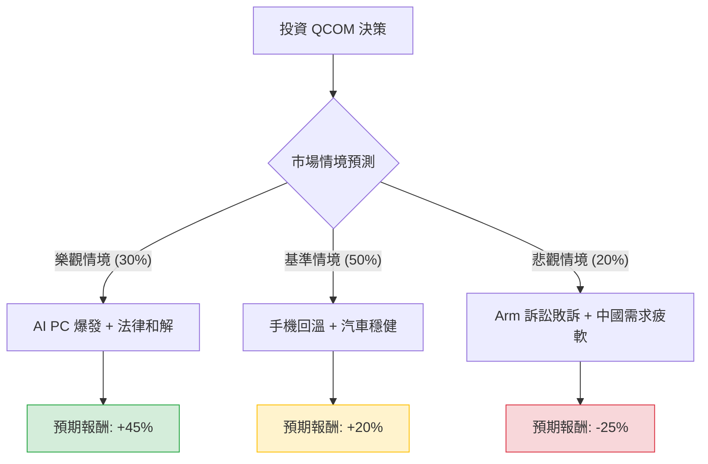

這份分析報告結合了您提供的基本面數據，以及最新的市場動態（包含 2024 年 11 月發布的最新財報與 Arm 法律糾紛進展），透過**決策樹（Decision Tree）**與**期望值分析（Expected Value Analysis）**評估 Qualcomm (QCOM) 的投資價值。

---

### 一、 核心假設與市場背景分析

在建立決策樹之前，我們必須考慮以下關鍵因素：

1.  **強勁財報與指引（利多）：** QCOM 最新一季財報顯示營收與獲利均優於預期，特別是汽車業務（Automotive）營收年增 55%，且 Snapdragon 8 Elite 晶片在高端手機市場需求強勁。
2.  **AI PC 與邊緣運算（利多）：** Snapdragon X Elite 進入 PC 市場，打破 Intel/AMD 壟斷，為公司提供長期增長動能。
3.  **Arm 法律訴訟（利空/風險）：** Arm 威脅取消 QCOM 的架構授權，這可能導致產品設計受阻或權利金大幅上升。
4.  **估值分析：** 目前 Forward P/E 僅約 11.37 倍，遠低於半導體行業平均與其歷史高位，顯示市場已部分反映風險。

---

### 二、 決策樹分析 (Decision Tree)

以下為 QCOM 未來一年的投資決策樹模型：

#### 節點詳細說明：

1.  **樂觀情境 (Bull Case) - 30% 機率：**
    *   **條件：** 與 Arm 達成和解；AI PC 出貨量超預期；汽車業務持續翻倍增長。
    *   **目標價預估：** $185 - $200 (基於 P/E 回升至 18x)。
    *   **預期報酬：** ~45%。

2.  **基準情境 (Base Case) - 50% 機率：**
    *   **條件：** 手機市場緩步復甦；Apple 訂單延續至 2026；法律訴訟拖延但不影響銷售。
    *   **目標價預估：** $153 (參考分析師平均目標價)。
    *   **預期報酬：** ~20.7% (從 $127.11 計算)。

3.  **悲觀情境 (Bear Case) - 20% 機率：**
    *   **條件：** Arm 贏得訴訟導致產品停售或支付巨額賠償；中國手機品牌自研晶片替代率上升。
    *   **目標價預估：** $95 - $100 (回測 52 週低點以下)。
    *   **預期報酬：** -25%。

---

### 三、 期望值計算 (Expected Value Calculation)

我們根據上述情境的機率與報酬率，計算投資 QCOM 的**預期報酬率 (Expected Return)**：

$$EV = (P_{Bull} \times R_{Bull}) + (P_{Base} \times R_{Base}) + (P_{Bear} \times R_{Bear})$$

*   **計算過程：**
    *   樂觀：$0.30 \times 45\% = 13.5\%$
    *   基準：$0.50 \times 20.7\% = 10.35\%$
    *   悲觀：$0.20 \times (-25\%) = -5.0\%$

*   **總期望報酬率：**
    $$13.5\% + 10.35\% - 5.0\% = 18.85\%$$

*   **期望價值 (以目前股價 $127.11 計算)：**
    $$127.11 \times (1 + 18.85\%) \approx \$151.07$$

---

### 四、 綜合評估與最終結論

#### 1. 數據洞察
*   **估值極具吸引力：** Forward P/E 11.37 顯示股價被低估，且 P/FCF (10.49) 顯示現金流強勁，具備良好的安全邊際。
*   **技術面壓力：** 股價目前低於 SMA20, 50, 200，顯示短期趨勢偏弱，正處於築底階段。
*   **財務體質：** ROE 21.48% 與 Gross Margin 55.1% 顯示其在專利授權與高端晶片市場仍具備極強的獲利能力。

#### 2. 最終判斷：**適合投資 (Suitable for Investment)**

#### 3. 理由總結：
1.  **正向期望值：** 經過風險加權後的預期報酬率為 **18.85%**，遠高於無風險利率與大盤平均預期。
2.  **多元化轉型成功：** QCOM 已不再僅依賴手機，汽車與物聯網（IoT/PC）的增長正在抵消手機市場的波動。
3.  **利空已部分反應：** 股價從高點回落近 38%，已大幅消化了 Arm 訴訟與中國市場的擔憂。
4.  **股息支撐：** 2.8% 的股息率在科技成長股中相當優渥，提供下行保護。

**建議策略：**
鑑於目前技術面（SMA 指標）仍呈空頭排列，建議採取**分批買進（Dollar Cost Averaging）**策略，首批資金可在 $120-$127 區間佈局，並密切關注 12 月份關於 Arm 訴訟的法庭進展。