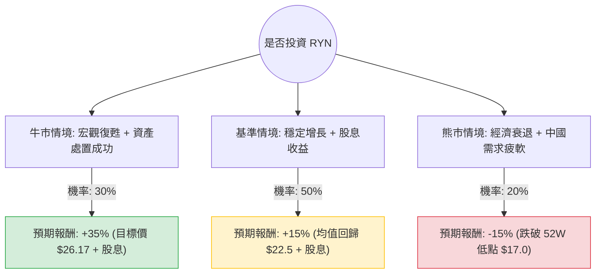

這份分析報告將結合您提供的財務數據與最新的市場動態（包含 Rayonier Inc. 的資產處置計畫、木材市場趨勢及宏觀經濟環境），利用**決策樹（Decision Tree）**與**期望值分析（Expected Value Analysis）**評估 RYN 的投資價值。

---

### 一、 核心假設與市場背景分析

在建立決策樹之前，我們基於最新資訊設定以下核心假設：

1.  **資產處置計畫（關鍵催化劑）：** RYN 正在執行一項 10 億美元的資產處置計畫，旨在降低槓桿並回饋股東。這將直接影響其 P/B 比（目前 1.15，處於合理偏低水位）。
2.  **利率環境：** 作為 REITs，RYN 對利率極其敏感。市場預期 2024 年下半年可能降息，這有利於房地產信託的估值修復。
3.  **終端需求：** 美國房屋開工量（Housing Starts）影響木材需求。目前美國房市因庫存短缺仍具韌性，但紐西蘭出口市場（受中國房地產影響）仍是變數。
4.  **財務數據：** 目前 P/E 較高（49.11），但 Forward P/E 降至 32.06，顯示市場預期明年盈利將大幅改善（EPS next Y 成長 55.27%）。

---

### 二、 決策樹分析 (Decision Tree)

以下決策樹模擬未來一年的三種主要情境：

#### 節點詳細說明：

1.  **牛市情境 (Optimistic Case) - 30% 機率**
    *   **條件：** 美國聯準會啟動降息，房市需求爆發；10 億美元資產處置進度超前，公司進行大規模股票回購。
    *   **預期報酬：** 股價回升至分析師目標價 $26.17，加上 5.15% 股息，總報酬約 **35%**。

2.  **基準情境 (Base Case) - 50% 機率**
    *   **條件：** 利率維持高位震盪但不再上升；木材價格平穩；公司按計畫減債。
    *   **預期報酬：** 股價回升至 SMA200 水準（約 $22.5），加上 5.15% 股息，總報酬約 **15%**。

3.  **熊市情境 (Pessimistic Case) - 20% 機率**
    *   **條件：** 全球經濟陷入深度衰退；中國房地產危機惡化導致紐西蘭木材出口崩潰；債務成本壓力增加。
    *   **預期報酬：** 股價跌破 52 週低點至 $17.0 左右，扣除股息後總報酬約 **-15%**。

---

### 三、 期望值計算過程 (Expected Value Calculation)

我們將各情境的「機率」與「預期報酬」相乘，得出投資 RYN 的總期望報酬率。

**計算公式：**
$EV = (P_{Bull} \times R_{Bull}) + (P_{Base} \times R_{Base}) + (P_{Bear} \times R_{Bear})$

**代入數值：**
1.  **牛市貢獻：** $0.30 \times 35\% = 10.5\%$
2.  **基準貢獻：** $0.50 \times 15\% = 7.5\%$
3.  **熊市貢獻：** $0.20 \times (-15\%) = -3.0\%$

**總期望報酬率 (Total EV)：**
$10.5\% + 7.5\% - 3.0\% = \mathbf{15.0\%}$

---

### 四、 綜合評估與最終結論

#### 1. 財務數據支持點：
*   **安全邊際：** P/B 僅 1.15，且股價接近 52 週低點（$20.02 接近 $19.49），下行空間受限。
*   **現金流與股息：** 5.15% 的股息率在 REITs 中具有吸引力，且 Current Ratio 2.53 顯示短期流動性無虞。
*   **成長預期：** 明年 EPS 預期成長 55%，這將大幅稀釋目前過高的 P/E。

#### 2. 風險提示：
*   **技術面偏弱：** SMA20, 50, 200 全線負值，顯示短期內仍受壓制，可能需要時間築底。
*   **內部人交易：** Insider Trans 為 -0.057，顯示近期內部人有小幅減持，需留意。

#### 3. 最終判斷：

**結論：適合投資 (建議分批買入)**

**理由：**
1.  **期望值正向：** 15% 的預期報酬率顯著高於無風險利率（美債收益率），且風險報酬比（Risk-Reward Ratio）理想。
2.  **資產價值支撐：** RYN 擁有的實體林地具有抗通膨特性，且目前的資產處置計畫是明確的價值釋放催化劑。
3.  **股息保護：** 在等待股價回升至目標價 $26.17 的過程中，5.15% 的股息提供了良好的現金流緩衝。

**建議操作：**
由於技術指標（SMA）顯示目前處於空頭排列，建議不要一次性投入，而是在 $19.5 - $20.5 區間採取**分批佈局**策略，以降低短期波動風險。