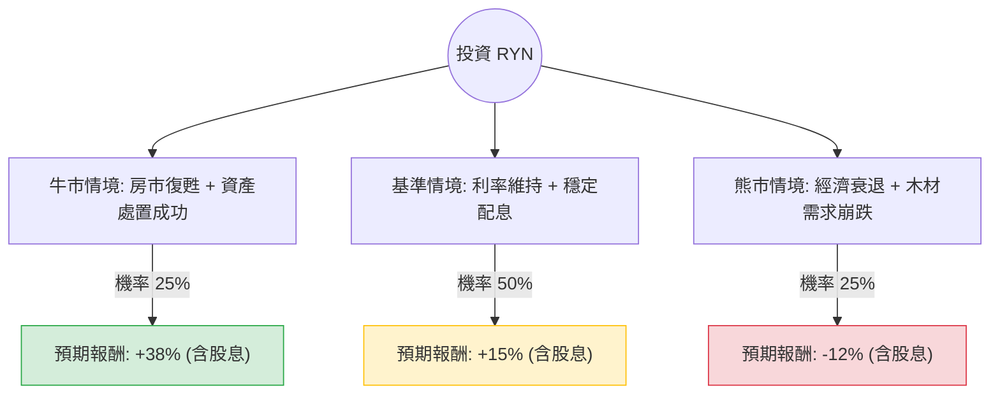

這份分析報告將結合您提供的財務數據與最新的市場動態（包含 Rayonier Inc. 的資產處置計畫、木材市場趨勢及碳信用發展），利用**決策樹（Decision Tree）**與**期望值分析（Expected Value Analysis）**評估 RYN 的投資價值。

---

### 1. 核心背景與市場動態分析

在進入計算前，我們必須釐清 RYN 目前的關鍵基本面：
*   **資產處置計畫（關鍵動能）**：RYN 正在執行一項 **10 億美元的資產處置計畫**，旨在簡化投資組合、降低槓桿並回饋股東。這解釋了為何數據中 `Sales Q/Q` 出現劇烈波動（通常與大宗土地交易的時間點有關）。
*   **宏觀環境**：高利率環境對 REITs 普遍不利，但 RYN 的 `Debt/Eq (0.48)` 相對穩健。木材價格受房地產市場影響，目前處於盤整期。
*   **新興增長點**：RYN 積極佈局**碳捕集與封存（CCS）**及太陽能租賃，這為傳統木材業務提供了額外的估值溢價空間。
*   **技術面**：股價接近 52 週低點（$19.49），且低於所有移動平均線（SMA20/50/200），顯示短期動能極弱，但具備價值投資的「安全邊際」。

---

### 2. 決策樹分析圖 (Decision Tree)

我們預測未來一年的三種主要情境：

---

### 3. 期望值分析與計算過程

#### A. 核心假設
1.  **當前股價**：$20.31
2.  **股息收益率**：5.16% (固定計入總報酬)
3.  **目標價參考**：分析師平均目標價 $26.83 (約 32% 漲幅空間)

#### B. 情境計算
1.  **牛市情境 (Optimistic) - 25% 機率**
    *   **假設**：聯準會降息帶動房市，木材價格大漲；10 億美元資產處置超預期完成並進行大規模回購。
    *   **預期股價**：$27.00 (接近分析師目標價)
    *   **資本利得**：(27 - 20.31) / 20.31 = +32.9%
    *   **總報酬**：32.9% + 5.16% = **38.06%**

2.  **基準情境 (Base Case) - 50% 機率**
    *   **假設**：利率維持高位但不再上升；資產處置進度平穩；碳信用業務開始貢獻微薄利潤。股價回歸均值。
    *   **預期股價**：$22.30 (回補部分 SMA200 缺口)
    *   **資本利得**：(22.3 - 20.31) / 20.31 = +9.8%
    *   **總報酬**：9.8% + 5.16% = **14.96%**

3.  **熊市情境 (Pessimistic) - 25% 機率**
    *   **假設**：美國經濟陷入衰退，新屋開工率創低點；資產處置因市場冷清而延期。
    *   **預期股價**：$16.80 (跌破 52 週低點)
    *   **資本利得**：(16.8 - 20.31) / 20.31 = -17.28%
    *   **總報酬**：-17.28% + 5.16% = **-12.12%**

#### C. 總期望值 (Expected Value, EV) 計算
$$EV = (0.25 \times 38.06\%) + (0.50 \times 14.96\%) + (0.25 \times -12.12\%)$$
$$EV = 9.515\% + 7.48\% - 3.03\%$$
$$EV = \mathbf{13.965\%}$$

---

### 4. 最終結論

**投資判斷：適合投資 (建議分批買入)**

#### 理由：
1.  **正向期望值**：計算出的年度預期報酬率約為 **13.97%**，顯著高於無風險利率（美債約 4.5%）及多數 REITs 的平均表現。
2.  **安全邊際高**：目前股價 $20.31 處於 52 週低位區間，且 P/B 僅 1.48，對於擁有大量土地實體資產的公司而言，下行風險相對受控。
3.  **強大的現金流回饋**：5.16% 的股息率提供了良好的防禦性，且公司正在進行的資產優化計畫（10 億美元處置）是股價催化劑（Catalyst）。
4.  **財務穩健**：Debt/Eq 0.48 顯示財務結構健康，足以應對高利率環境。

**風險提示**：
*   短期內技術面呈空頭排列（SMA 指標全負），股價可能仍有探底壓力。
*   需密切關注 `Sales Q/Q` 的波動，確認是否為資產處置的正常週期，而非核心木材業務的永久性衰退。

**建議策略**：
考慮到目前技術面較弱，建議採取**分批進場（Dollar-cost averaging）**策略，首批資金於 $20 附近建立基本倉位，若股價進一步下探至 $19.5 支撐位則加碼。