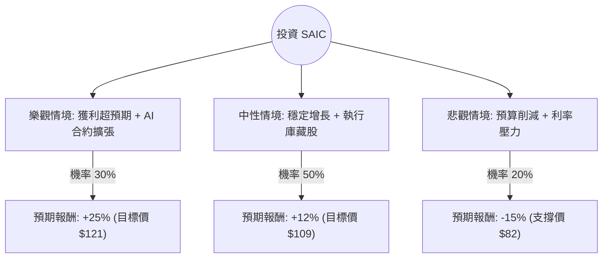

這份分析報告將結合您提供的基本面數據與最新的市場動態（包含 2024 年 6 月發布的最新財報資訊），利用**決策樹（Decision Tree）**與**期望值分析（Expected Value Analysis）**評估 SAIC（Science Applications International Corp）的投資價值。

---

### 一、 市場動態與核心假設 (Core Assumptions)

在進行計算前，我們先整合最新的市場資訊：
1.  **最新財報表現 (Q1 FY25)**：SAIC 最近公布的財報顯示營收為 18.5 億美元（略低於預期），但調整後 EPS 為 1.92 美元（優於預期）。公司上調了全年 EPS 指引，顯示獲利能力提升。
2.  **產業趨勢**：身為美國政府主要的 IT 與國防服務供應商，SAIC 受益於國防預算增加、網路安全需求以及政府部門的 AI 轉型（其 "Innovation Factory" 戰略）。
3.  **財務健康度**：P/FCF（股價自由現金流比）僅 7.48，顯示現金流極其強勁；Forward P/E 9.3 倍，顯著低於行業平均與歷史水平，具備價值股特徵。
4.  **風險因素**：高債務比（Debt/Eq 1.8）在持續高利率環境下增加利息支出壓力；政府合約競爭激烈且受預算週期影響。

---

### 二、 決策樹分析 (Decision Tree)

我們預測未來一年的三種情境：**樂觀（牛市）**、**中性（基準）**、**悲觀（熊市）**。

#### 決策樹節點詳細說明：

| 情境 | 機率 (P) | 預期報酬 (R) | 說明 |
| :--- | :--- | :--- | :--- |
| **樂觀 (Bull)** | 30% | +25% | 成功標得大型 AI/雲端合約，利潤率因自動化提升，估值修復至 P/E 15x。 |
| **中性 (Base)** | 50% | +12% | 符合公司指引，EPS 增長 11%，維持穩定派息與庫藏股，股價回歸 Target Price。 |
| **悲觀 (Bear)** | 20% | -15% | 美國政府預算僵局導致合約延遲，利息支出侵蝕利潤，股價回測 52W 低點。 |

---

### 三、 期望值計算 (Expected Value Calculation)

期望值 (EV) 是將各情境的報酬率乘以其發生機率的總和：

$$EV = (P_{Bull} \times R_{Bull}) + (P_{Base} \times R_{Base}) + (P_{Bear} \times R_{Bear})$$

**計算過程：**
1.  **樂觀部分**：$0.30 \times 25\% = 7.5\%$
2.  **中性部分**：$0.50 \times 12\% = 6.0\%$
3.  **悲觀部分**：$0.20 \times (-15\%) = -3.0\%$

**總期望報酬率：**
$$7.5\% + 6.0\% - 3.0\% = 10.5\%$$

加上 **股息收益率 (Dividend Yield)**：1.49%
**總預期年度回報 (Total Expected Return) ≈ 11.99%**

---

### 四、 綜合評估與最終結論

#### 1. 數據亮點分析：
*   **估值極具吸引力**：Forward P/E 9.3 與 P/FCF 7.48 顯示股價被低估。相較於同業（如 Leidos 或 CACI），SAIC 的價值面更強。
*   **獲利能力穩定**：ROE 高達 23.27%，顯示管理層利用股東權益創造回報的能力極佳。
*   **技術面修復**：SMA20 與 SMA50 均為正值（5.34% 與 3.22%），顯示短期股價已從低迷中反彈，動能轉強。

#### 2. 潛在風險：
*   **負債比偏高**：Debt/Eq 1.8 是主要隱憂，需關注其利息覆蓋倍數。
*   **增長緩慢**：Sales Q/Q 下降 4.79%，顯示營收增長並非爆發式，而是依賴利潤率優化與庫藏股支撐 EPS。

#### 3. 最終結論：

**判斷：適合投資 (Buy / Overweight)**

**理由：**
1.  **正向期望值**：11.99% 的預期回報率優於許多成熟產業的平均水平，且下行風險（-15%）在強勁現金流支撐下相對可控。
2.  **安全邊際**：目前股價（$97.26）距離分析師平均目標價（$112.89）有約 16% 的上漲空間，且 Forward P/E 處於歷史低位，提供了良好的安全邊際。
3.  **防禦屬性**：在經濟不確定性中，政府合約的穩定性使 SAIC 成為良好的防禦型配置，適合追求穩健增長與股息的投資者。

**建議操作：**
可在 $95 - $98 區間分批布局，首要目標價看 $113，若跌破 $85（長期支撐位）則需重新評估基本面是否惡化。