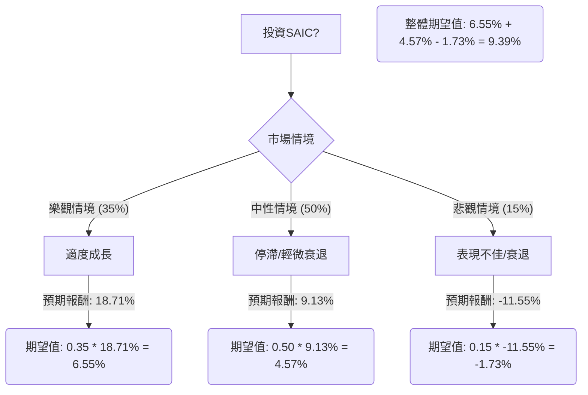

SAIC (Science Applications International Corporation) 投資評估報告

根據對SAIC基本面數據及最新市場資訊的綜合分析，本報告將運用決策樹分析與期望值分析，評估SAIC目前是否適合投資。

**核心假設：**

*   **市場趨勢：** 聯邦政府對數位轉型、人工智慧 (AI)、網路安全和雲端現代化的投資將持續增加，為政府承包商提供成長機會。然而，政府合約環境複雜，面臨更嚴格的審查、不斷變化的機構優先事項和日益增加的合規要求。
*   **財務狀況：** SAIC已展現出強勁的盈利能力（高ROE），並透過成本節約措施和策略性收購（如SilverEdge）來提升利潤和現金流。然而，公司預計2026財年有機收入將下降2-3%，這表明營收增長面臨壓力。儘管如此，積壓訂單連續兩個季度增加，自由現金流展望改善。
*   **產業趨勢：** 國防開支在2025財年創下新高，且2026財年的國防授權法案 (NDAA FY26) 預示著非FAR（聯邦採購條例）採購方式（如OTA和CSO）的更廣泛應用，這有利於具備敏捷性的承包商。

---

### 1. 決策樹分析

以下是評估投資SAIC的決策樹：

**節點說明與計算：**

*   **起始節點：投資SAIC?**
    *   這是我們的決策點。
*   **機會節點：市場情境**
    *   代表未來可能發生的不同市場狀況。
*   **情境節點：**
    *   **樂觀情境 (Moderate Growth)**
        *   **預測情境名稱：** SAIC成功應對營收逆風，受益於成本節約、策略性收購（如SilverEdge）以及聯邦政府在AI、網路安全和數位現代化方面的支出。有機收入下降幅度小於預期，甚至在2026財年末/2027財年轉為正增長。股票回購也提供支撐。
        *   **對應機率 (Probability)：** 35%
        *   **預期報酬計算：**
            *   假設股價達到分析師目標區間的高端，例如 $128。
            *   股價上漲報酬 = (($128 - $109.07) / $109.07) = 17.36%
            *   股息收益率 = 1.35% (來自提供數據)
            *   總預期報酬 = 17.36% + 1.35% = **18.71%**
        *   **期望值 (Expected Value)：** 0.35 \* 18.71% = **6.55%**
    *   **中性情境 (Stagnation/Slight Decline)**
        *   **預測情境名稱：** SAIC面臨預期的有機收入下降挑戰，但成本節約和收購部分抵消了這些問題。整體增長持平或略微負增長。股價達到分析師平均目標價。
        *   **對應機率 (Probability)：** 50%
        *   **預期報酬計算：**
            *   假設股價達到平均分析師目標價，例如 $117.56 (來自提供數據的Target Price)。
            *   股價上漲報酬 = (($117.56 - $109.07) / $109.07) = 7.78%
            *   股息收益率 = 1.35%
            *   總預期報酬 = 7.78% + 1.35% = **9.13%**
        *   **期望值 (Expected Value)：** 0.50 \* 9.13% = **4.57%**
    *   **悲觀情境 (Underperformance/Decline)**
        *   **預測情境名稱：** 營收逆風加劇，新合約延遲持續，且關鍵合約續約失敗。高負債成為更嚴重的問題。公司未能充分利用現代化趨勢，導致營收和盈利進一步承壓。
        *   **對應機率 (Probability)：** 15%
        *   **預期報酬計算：**
            *   假設股價跌至分析師目標區間的低端，例如 $95 (低於當前價格和部分分析師最低目標價 $91)。
            *   股價下跌報酬 = (($95 - $109.07) / $109.07) = -12.90%
            *   股息收益率 = 1.35% (假設股息維持)
            *   總預期報酬 = -12.90% + 1.35% = **-11.55%**
        *   **期望值 (Expected Value)：** 0.15 \* -11.55% = **-1.73%**

---

### 2. 期望值分析計算

**整體期望值 (Overall Expected Value) = (樂觀情境期望值) + (中性情境期望值) + (悲觀情境期望值)**

整體期望值 = 6.55% + 4.57% + (-1.73%) = **9.39%**

---

### 3. 最終結論

根據決策樹和期望值分析，投資SAIC的整體期望值為 **9.39%**。

**判斷：適合投資**

**理由：**

儘管SAIC面臨有機收入下降的預期和政府合約環境的挑戰，但其最近的財報顯示調整後每股收益超出預期，並上調了盈利指引。公司積極實施成本節約措施，並透過收購SilverEdge來增強其在AI和IP領域的實力，預計將在未來財年對EPS和利潤率產生積極影響。此外，SAIC的積壓訂單連續兩個季度增長，自由現金流展望改善。

分析師普遍給予「持有」或「溫和買入」的評級，平均目標價顯示出一定的上漲空間。雖然公司負債權益比相對較高，但其流動比率和速動比率尚可，且P/FCF (11.58) 顯示其自由現金流估值具有吸引力。

綜合來看，9.39% 的正向期望值表明，儘管存在風險，但SAIC在政府IT現代化趨勢中的戰略定位、成本管理能力以及對股東回報的承諾（股票回購計劃）使其具備一定的投資吸引力。投資者應密切關注其有機收入增長趨勢和關鍵合約的續約情況。