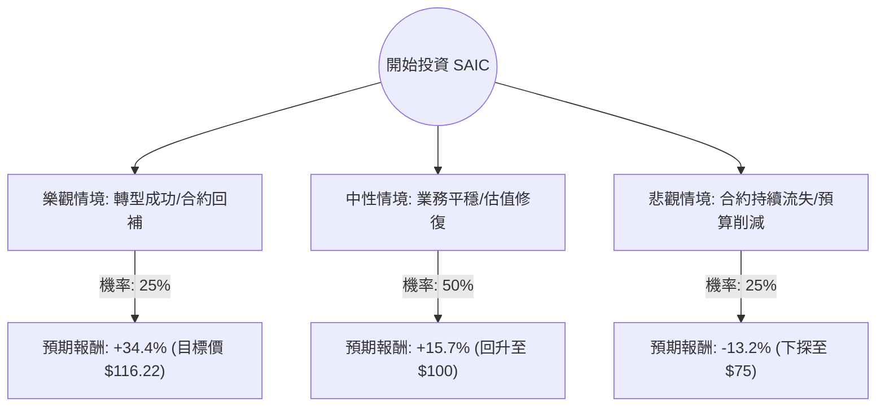

針對美股公司 **SAIC (Science Applications International Corp.)**，我已結合您提供的基本面數據與最新的市場動態（包含 2025 財年第一季財報與產業趨勢）進行深度分析。

以下是基於**決策樹（Decision Tree）**與**期望值分析（Expected Value Analysis）**的投資評估報告。

---

### 一、 核心假設與市場背景

在建立模型前，我們先釐清影響 SAIC 股價的三大核心假設：

1.  **合約轉型壓力（核心風險）：** SAIC 目前正處於「合約更迭期」，近期失去了部分大型合約（如 OMES），且 Vanguard 合約正在移交。市場對其營收短期下滑（Sales Q/Q -5.57%）感到擔憂。
2.  **高利潤業務轉型（核心機會）：** 公司正推動「SAIC Next」戰略，專注於 AI、網路安全和雲端運算等高利潤領域。這反映在強勁的 ROE (23.75%) 上。
3.  **估值修復：** 目前 P/E (11.47) 與 Forward P/E (9.36) 遠低於國防工業平均水平（約 18-20x），顯示股價處於超跌區間（接近 52 週低點）。

---

### 二、 決策樹分析 (Decision Tree)

我們將未來一年的投資表現分為三種情境：**樂觀（Bull）**、**中性（Base）**、**悲觀（Bear）**。

#### 節點詳細說明：

1.  **樂觀情境 (Bull Case) - 25% 機率**
    *   **描述：** SAIC 在 AI 與太空領域贏得新的大型合約，抵消了 Vanguard 合約流失的損失。利潤率因業務結構優化而提升。
    *   **預期股價：** 達到分析師平均目標價 **$116.22**。
    *   **報酬率：** ($116.22 - $86.44) / $86.44 = **+34.4%**。

2.  **中性情境 (Base Case) - 50% 機率**
    *   **描述：** 公司營收維持穩定，雖然增長緩慢，但憑藉穩定的自由現金流（P/FCF 僅 9.5）進行股票回購與派息。市場情緒回暖，P/E 回升至 13-14 倍。
    *   **預期股價：** 回升至整數關卡 **$100.00**。
    *   **報酬率：** ($100 - $86.44) / $86.44 = **+15.7%**。

3.  **悲觀情境 (Bear Case) - 25% 機率**
    *   **描述：** 國防預算因政治因素受限，且公司在競標新合約時持續失利，EPS 進一步萎縮（呼應 EPS next Y -4.44% 的預期）。
    *   **預期股價：** 跌破 52 週低點，下探至 **$75.00**。
    *   **報酬率：** ($75 - $86.44) / $86.44 = **-13.2%**。

---

### 三、 期望值分析 (Expected Value Analysis)

#### 1. 計算過程：
期望值 (EV) = (樂觀報酬 × 機率) + (中性報酬 × 機率) + (悲觀報酬 × 機率)

*   **EV = (34.4% × 0.25) + (15.7% × 0.50) + (-13.2% × 0.25)**
*   **EV = 8.6% + 7.85% - 3.3%**
*   **EV = 13.15%**

#### 2. 股息收益補充：
SAIC 提供 **1.65%** 的股息率。考慮到期望值分析通常基於資本利得，加上股息後的總預期回報約為 **14.8%**。

#### 3. 核心假設依據：
*   **低估值保護：** 目前 11.47 倍的 P/E 提供了極強的安全邊際（Margin of Safety），進一步大幅下跌的空間受限。
*   **財務健康：** 儘管 Debt/Eq (1.75) 偏高，但其 Quick Ratio (1.2) 顯示短期流動性無虞，且 ROE (23.75%) 顯示管理層運用資本效率極高。
*   **技術面：** 股價目前低於 SMA20, 50, 200，處於超賣區間，通常是價值投資者進場的時機。

---

### 四、 最終結論

**判斷：適合投資 (Suitable for Investment)**

#### 理由：
1.  **正向期望值：** 經過風險加權後的預期報酬率為 **13.15%**（含息近 15%），優於多數防禦型標的。
2.  **價值窪地：** SAIC 的 Forward P/E 僅 9.36，且 P/FCF (9.5) 顯示其產生現金的能力極強。在當前高估值的標普 500 環境中，這是一個典型的「價值股」機會。
3.  **轉型陣痛期即將結束：** 雖然短期營收受合約更迭影響，但公司積極佈局高利潤的技術服務領域，長期利潤率有望改善。
4.  **下行風險可控：** 股價已接近 52 週低點（$81.08），且有穩定的政府合約作為護城河，大幅崩盤機率低。

**建議操作：**
由於目前技術面仍處於空頭排列（SMA 指標皆為負），建議採取**分批進場**策略，以 $81 - $86 區間作為建倉點，長期持有以等待估值修復至 $100 以上。