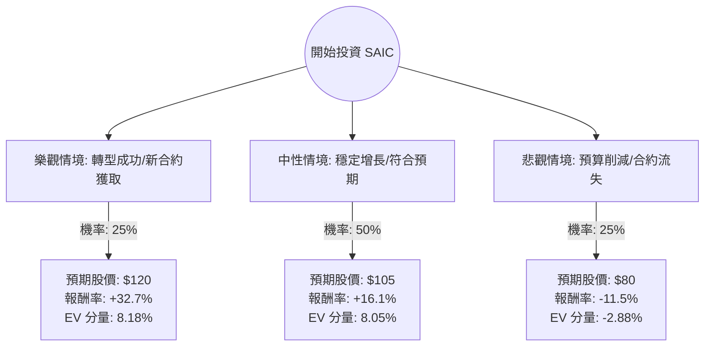

這份分析報告將結合您提供的財務數據與最新的市場動態（包含 2024 年 6 月發布的 Q1 FY2025 財報資訊），利用**決策樹（Decision Tree）**與**期望值分析（Expected Value Analysis）**評估 SAIC（Science Applications International Corp.）的投資價值。

---

### 一、 SAIC 最新市場動態與背景分析

在進入計算前，我們先整合最新的外部資訊：
1.  **最新財報表現**：SAIC 在 2024 年 6 月公布的 2025 財年第一季財報顯示，營收為 18.5 億美元，略低於去年同期（因合約轉移），但**調整後 EPS 為 $1.92，優於市場預期**。
2.  **戰略轉型（SAIC 4.0）**：公司正從傳統的 IT 運維轉向高利潤的「數位轉型、人工智慧（AI）與雲端」領域。
3.  **積壓訂單（Backlog）**：目前擁有約 236 億美元的強大積壓訂單，顯示未來收入穩定性高。
4.  **估值優勢**：目前 Forward P/E 僅約 8.7 倍，遠低於國防承包商同業（如 Leidos 或 Booz Allen Hamilton），具備價值投資吸引力。
5.  **風險因素**：2024 年為美國大選年，政府預算的不確定性以及高負債比（Debt/Eq: 1.8）是主要壓力來源。

---

### 二、 決策樹分析 (Decision Tree)

我們將未來一年的投資情境分為三種：**樂觀（Bull）**、**中性（Base）**、**悲觀（Bear）**。

---

### 三、 核心假設與計算過程

#### 1. 核心假設
*   **當前股價**：$90.41
*   **樂觀情境 (25%)**：SAIC 成功贏得大型國防 AI 合約，利潤率提升至 9% 以上，市場給予估值修復（P/E 回升至 12x）。目標價 $120。
*   **中性情境 (50%)**：公司維持現有增長速度，EPS 增長符合預期的 12%，股價向分析師平均目標價 $109.78 靠攏。保守取 $105。
*   **悲觀情境 (25%)**：受大選影響政府支出停滯，或高負債導致利息支出侵蝕利潤，股價回測 52 週低點。目標價 $80。

#### 2. 期望值 (Expected Value) 計算
期望值計算公式：$EV = \sum (機率 \times 報酬率)$

| 情境 | 機率 (P) | 預期股價 | 預期報酬率 (R) | P × R |
| :--- | :--- | :--- | :--- | :--- |
| **樂觀** | 0.25 | $120.00 | +32.73% | +8.18% |
| **中性** | 0.50 | $105.00 | +16.14% | +8.07% |
| **悲觀** | 0.25 | $80.00 | -11.51% | -2.88% |
| **總計** | **1.00** | - | - | **+13.37%** |

**計算過程詳解：**
*   樂觀分量：$0.25 \times [(120 - 90.41) / 90.41] = 8.18\%$
*   中性分量：$0.50 \times [(105 - 90.41) / 90.41] = 8.07\%$
*   悲觀分量：$0.25 \times [(80 - 90.41) / 90.41] = -2.88\%$
*   **總期望報酬率 = 8.18% + 8.07% - 2.88% = 13.37%**

---

### 四、 綜合評估與最終結論

#### 1. 財務數據亮點與隱憂
*   **優勢**：
    *   **估值極低**：Forward P/E 8.7 與 P/FCF 7.02 顯示股價被低估。
    *   **獲利能力**：ROE 高達 23.27%，顯示公司運用股東資本效率極高。
    *   **現金流**：P/FCF 僅 7 倍，代表公司產生現金的能力強，足以支撐股息與債務償還。
*   **劣勢**：
    *   **債務壓力**：Debt/Eq 1.8 偏高，在當前高利率環境下需注意利息負擔。
    *   **增長緩慢**：近期營收 Q/Q 下降 4.79%，顯示正處於合約汰換的陣痛期。

#### 2. 最終結論：適合投資 (Suitable for Investment)

**判斷理由：**
1.  **正向期望值**：計算出的年度期望報酬率為 **13.37%**，優於標普 500 的長期平均回報。
2.  **安全邊際**：目前股價 ($90.41) 距離分析師目標價 ($109.78) 有約 21% 的上漲空間，且 P/E 處於歷史低位，下行風險相對受限。
3.  **防禦屬性**：作為政府承包商，SAIC 擁有穩定的積壓訂單，在經濟波動中具有較強的抗跌性。
4.  **股東回報**：1.57% 的股息率加上積極的股票回購計畫，為投資者提供了額外的現金回報。

**建議操作：**
*   **進場點**：目前股價低於 SMA20、SMA50、SMA200，技術面呈現超賣，是分批布局的良機。
*   **風險監控**：需密切關注美國國防預算審核進度，以及公司在 AI 相關新合約的得標率。

---
*免責聲明：本分析僅供參考，不構成投資建議。投資股票具有風險，入市前請獨立思考並審慎評估。*