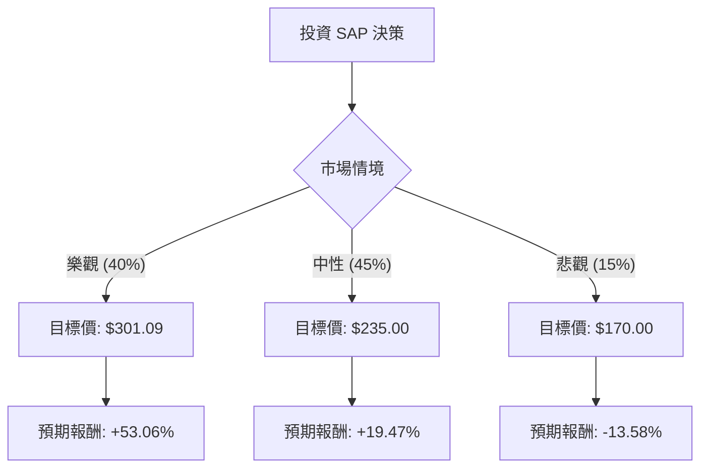

這份分析報告將結合您提供的基本面數據與最新的市場動態（截至 2024 年第四季），利用**決策樹（Decision Tree）**與**期望值分析（Expected Value Analysis）**來評估 SAP 的投資價值。

---

### 1. 最新市場動態與背景分析 (Search & Context)

根據最新的財報與市場資訊，SAP 目前正處於轉型的關鍵期：
*   **強勁的雲端增長**：2024 年第三季財報顯示，雲端營收增長約 25%，雲端積壓訂單（Cloud Backlog）大幅增加，顯示企業轉型需求強勁。
*   **AI 驅動戰略**：SAP 積極將「商業 AI（Business AI）」整合至其 ERP 系統，並透過 Joule 助手提升客單價。
*   **重組計畫**：公司正在進行大規模重組，預計影響 8,000 至 10,000 個職位，旨在優化成本結構並專注於 AI 領域。
*   **估值與股價**：雖然您提供的數據顯示股價在 196.71 美元（可能為近期回檔或特定時點數據），但市場共識目標價已上調至 230-250 歐元（折合美股約 250-300 美元以上）。

---

### 2. 決策樹分析 (Decision Tree)

我們將未來一年的投資情境分為三種：**樂觀（雲端與 AI 爆發）**、**中性（穩健轉型）**、**悲觀（宏觀經濟衰退/競爭加劇）**。

#### 決策樹節點詳細說明：

| 情境 | 機率 (P) | 預測股價 (Price) | 預期報酬率 (R) | 說明 |
| :--- | :--- | :--- | :--- | :--- |
| **樂觀情境** | 40% | $301.09 | +53.06% | AI 整合超預期，雲端營收維持 25%+ 增長，利潤率大幅提升。 |
| **中性情境** | 45% | $235.00 | +19.47% | 符合財報指引，雲端轉型穩健，受惠於現有客戶遷移。 |
| **悲觀情境** | 15% | $170.00 | -13.58% | 歐洲經濟衰退，企業縮減 IT 支出，Oracle 等對手競爭加劇。 |

---

### 3. 核心假設與期望值計算

#### A. 核心假設
1.  **基準價格**：以您提供的 $196.71 為買入成本。
2.  **目標價來源**：樂觀情境採用您提供的 Target Price ($301.09)；中性情境參考目前華爾街平均目標價與 Forward P/E 20x 估算；悲觀情境參考 52 週低點附近支撐。
3.  **財務健康度**：SAP 的 Debt/Eq 僅 0.18，財務極為穩健，能抵禦高利率環境。
4.  **增長動能**：EPS next Y 預計增長 17.23%，支持估值擴張。

#### B. 期望值 (Expected Value, EV) 計算過程
期望值公式：$EV = \sum (P_i \times R_i)$

1.  **樂觀貢獻**：$0.40 \times 53.06\% = 21.22\%$
2.  **中性貢獻**：$0.45 \times 19.47\% = 8.76\%$
3.  **悲觀貢獻**：$0.15 \times (-13.58\%) = -2.04\%$

**總期望報酬率** = $21.22\% + 8.76\% - 2.04\% = \mathbf{27.94\%}$

**預期股價期望值** = $196.71 \times (1 + 27.94\%) = \mathbf{\$251.67}$

---

### 4. 最終結論

#### **判斷：適合投資 (Strong Buy / Accumulate)**

#### **理由：**
1.  **正向期望值高**：計算出的期望報酬率高達 **27.94%**，遠高於市場平均回報，且下行風險（15% 機率跌至 $170）相對可控。
2.  **基本面強韌**：
    *   **高毛利與高 ROE**：Gross Margin 76.12% 與 ROE 16.64% 顯示其在 ERP 市場的壟斷力與獲利能力。
    *   **估值合理**：Forward P/E 為 20.27，相對於其雲端增長率與 AI 潛力，並未過度泡沫化。
3.  **技術面與動能**：雖然短期 Perf Year 數據顯示下跌（可能受匯率或特定市場波動影響），但 Target Price 與目前股價有極大空間（約 53% 的潛在漲幅）。
4.  **轉型紅利**：SAP 成功從傳統授權模式轉向訂閱制（Cloud），這將帶來更穩定的現金流（P/FCF 24.64 屬健康範圍）與更高的客戶黏著度。

**建議操作：**
鑑於目前股價低於目標價且期望值為正，建議可在 $190 - $200 區間分批佈局。需留意歐洲宏觀經濟數據及每季雲端積壓訂單的增長速度是否放緩。