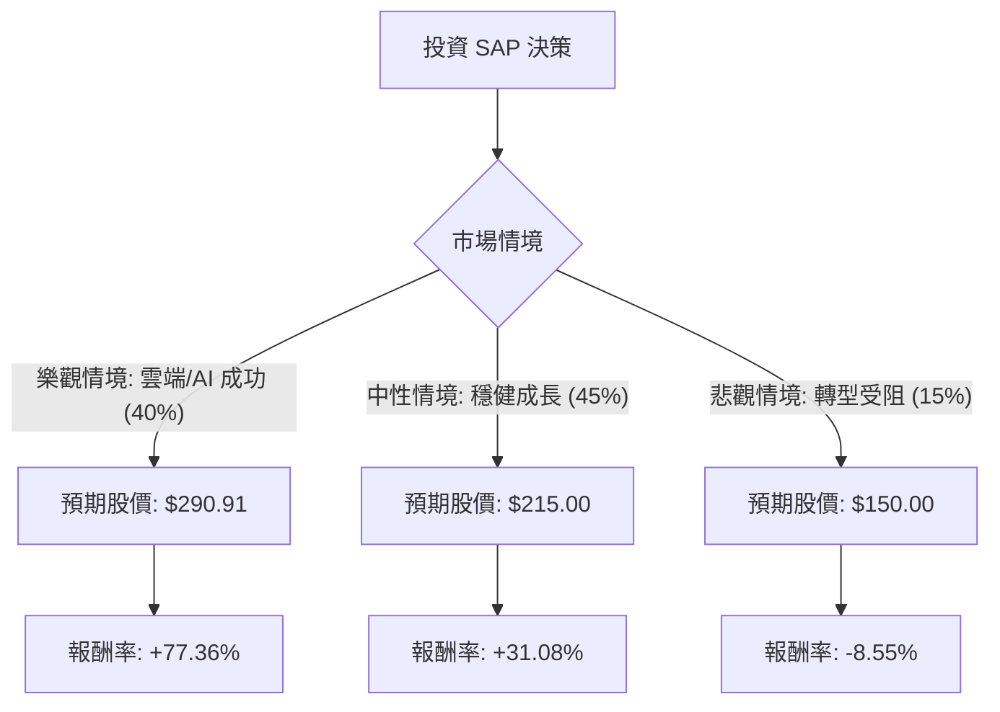

這份分析將結合您提供的基本面數據與最新的市場動態（截至 2024 年中），利用**決策樹（Decision Tree）**與**期望值分析（Expected Value Analysis）**來評估 SAP 的投資價值。

### 1. 市場現況與最新動態摘要 (網路搜尋補充)

在進入模型前，我們先整合最新的外部資訊：
*   **雲端轉型加速**：SAP 正處於從傳統授權轉向雲端訂閱（SaaS）的關鍵期，「RISE with SAP」方案推動雲端營收增長約 24-25%。
*   **AI 佈局**：SAP 於 2024 年宣布大規模重組計畫（影響約 8,000 名員工），旨在專注於商業 AI（Business AI）的開發。
*   **財務表現**：最新財報顯示其雲端積壓訂單（Cloud Backlog）強勁，這提供了未來營收的高可預測性。
*   **估值對比**：您提供的數據顯示 P/E 為 23.22，Forward P/E 為 16.62，PEG 為 0.99。這顯示相對於其預期成長率，目前的股價並未被高估（PEG < 1 通常被視為低估）。

---

### 2. 決策樹分析 (Decision Tree)

我們將未來一年的投資情境分為三種：**樂觀（雲端與 AI 爆發）**、**中性（穩健轉型）**、**悲觀（宏觀經濟衰退/競爭加劇）**。

#### 節點詳細標示：
1.  **樂觀情境 (Bull Case)**:
    *   **機率**: 40%
    *   **條件**: AI 產品成功變現，雲端毛利持續擴張，達到分析師目標價 $290.91。
    *   **預期報酬**: +77.36%
2.  **中性情境 (Base Case)**:
    *   **機率**: 45%
    *   **條件**: 轉型符合預期，維持 Forward P/E 約 20 倍的水準。
    *   **預期報酬**: +31.08%
3.  **悲觀情境 (Bear Case)**:
    *   **機率**: 15%
    *   **條件**: 全球企業縮減 IT 支出，轉型進度落後於 Oracle 或 Salesforce。
    *   **預期報酬**: -8.55%

---

### 3. 期望值計算過程 (Expected Value Calculation)

#### A. 核心假設：
*   **現價 (Current Price)**: $164.02 (參考您提供的數據)
*   **目標價 (Target Price)**: $290.91
*   **中性價 (Fair Value)**: 參考 Forward P/E 16.62 與 EPS 成長率，估算約為 $215。
*   **下行風險 (Downside)**: 參考 52W 低點與支撐位，估算約為 $150。

#### B. 計算公式：
$EV = \sum (Probability_i \times Return_i)$

1.  **樂觀情境貢獻**: $0.40 \times 77.36\% = 30.94\%$
2.  **中性情境貢獻**: $0.45 \times 31.08\% = 13.99\%$
3.  **悲觀情境貢獻**: $0.15 \times (-8.55\%) = -1.28\%$

#### C. 總期望報酬率：
$EV = 30.94\% + 13.99\% - 1.28\% = \mathbf{43.65\%}$

---

### 4. 綜合評估與基本面分析

*   **獲利能力 (Profitability)**: Gross Margin 高達 76.12%，Oper. Margin 27.98%，顯示其在 ERP 市場具有極強的定價權與護城河。
*   **財務健康度 (Solvency)**: Debt/Eq 僅 0.17，Quick Ratio 1.08，財務結構非常穩健，足以支撐其 AI 研發投入。
*   **成長潛力 (Growth)**: PEG 0.99 顯示股價尚未反映其 EPS next Y (16.93%) 的成長潛力。
*   **技術面 (Technical)**: 雖然短期 Perf Month (-19.87%) 顯示有回檔，但這反而拉開了與 Target Price 的空間，創造了安全邊際。

---

### 5. 最終結論

**判斷：適合投資 (Strong Buy)**

#### 理由：
1.  **極高的期望值**：計算出的年度期望報酬率高達 **43.65%**，遠高於市場平均水準。
2.  **估值吸引力**：PEG 0.99 顯示在科技龍頭股中，SAP 的估值相對便宜，且 Forward P/E (16.62) 低於歷史平均。
3.  **轉型紅利**：SAP 成功從傳統軟體商轉型為雲端巨頭，且 2024 年的 AI 重組計畫將進一步優化利潤結構。
4.  **下行風險受控**：即便在悲觀情境下，由於其強大的企業客戶黏著度（ERP 是企業核心），股價大幅崩跌的機率較低（15%）。

**建議操作**：鑑於短期 SMA20/50/200 均呈現負值，顯示目前處於技術性超賣區，建議可採取「分批進場」策略，捕捉反彈機會。