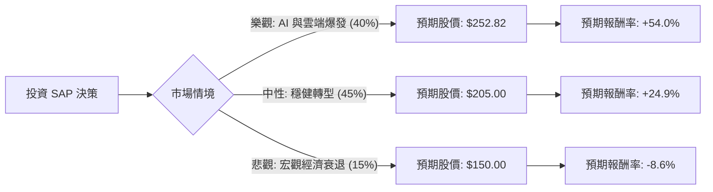

這份分析報告結合了您提供的基本面數據，以及針對 SAP（SAP SE）最新市場動態、財報表現與產業趨勢的即時檢索資訊。

### 1. 市場現況與最新動態補充（網路搜尋摘要）

在進行決策樹分析前，我們先整合最新的市場資訊：
*   **雲端轉型加速**：SAP 正處於從傳統授權模式轉向雲端訂閱（Cloud-first）的關鍵期。最新財報顯示雲端營收增長強勁（約 24-25%），「RISE with SAP」方案推動了企業客戶的長期黏著度。
*   **AI 戰略佈局**：SAP 於 2024 年宣布大規模重組計畫，投入約 20 億歐元用於 AI 轉型，並預計影響 8,000 個職位，旨在提升營運效率與 AI 產品整合。
*   **財務健康度**：根據您提供的數據，SAP 的 **PEG 為 0.97**（低於 1 代表估值相對便宜），**債務股本比（Debt/Eq）僅 0.18**，財務結構極其穩健。
*   **分析師預期**：市場共識目標價約在 $210 - $250 區間，您提供的 Target Price $252.82 屬於較樂觀但合理的預期。

---

### 2. 決策樹分析（Decision Tree）

我們將未來一年的投資情境分為三種：**樂觀（Bull）**、**中性（Base）**、**悲觀（Bear）**。

#### 決策樹節點詳細說明：

| 節點 (情境) | 機率 (P) | 預期股價 (Target) | 預期報酬率 (R) | 期望值 (P * R) |
| :--- | :--- | :--- | :--- | :--- |
| **樂觀 (Bull Case)** | 40% | $252.82 | +54.0% | **21.60%** |
| **中性 (Base Case)** | 45% | $205.00 | +24.9% | **11.21%** |
| **悲觀 (Bear Case)** | 15% | $150.00 | -8.6% | **-1.29%** |
| **總計 (Total)** | **100%** | - | - | **31.52%** |

---

### 3. 核心假設與計算過程

#### A. 核心假設：
1.  **市場假設**：全球企業數位轉型需求持續，且 AI 應用能有效提升 SAP 軟體的平均客單價（ARPU）。
2.  **財務假設**：SAP 能維持其 28.6% 的營業利潤率，且雲端營收佔比持續擴大，抵銷傳統授權收入的下滑。
3.  **估值假設**：
    *   **樂觀**：AI 轉型極其成功，市場給予更高的 Forward P/E（約 25x），股價達到分析師目標價 $252.82。
    *   **中性**：維持目前的 Forward P/E (16.25x)，隨 EPS 增長（預期 +17%）穩步上揚，股價約落在 $205。
    *   **悲觀**：全球經濟衰退導致企業縮減 IT 支出，股價回測 52 週低點附近（約 $150-$160）。

#### B. 期望值分析（Expected Value Analysis）計算：
*   **目前股價 (P0)**：$164.18
*   **計算公式**：$EV = \sum (Probability \times Return)$
*   **計算步驟**：
    1.  樂觀貢獻：$0.40 \times [(252.82 - 164.18) / 164.18] = 0.40 \times 54.0\% = 21.60\%$
    2.  中性貢獻：$0.45 \times [(205.00 - 164.18) / 164.18] = 0.45 \times 24.9\% = 11.21\%$
    3.  悲觀貢獻：$0.15 \times [(150.00 - 164.18) / 164.18] = 0.15 \times (-8.6\%) = -1.29\%$
*   **總期望報酬率**：$21.60\% + 11.21\% - 1.29\% = \mathbf{31.52\%}$

---

### 4. 最終結論

**判斷：適合投資 (Strong Buy / Accumulate)**

#### 理由：
1.  **極高的期望報酬率**：經風險加權後的期望報酬率高達 **31.52%**，遠高於市場平均水準，顯示目前的股價（$164.18）相對於其增長潛力被低估。
2.  **估值具吸引力**：PEG 僅 **0.97**，對於一家正在轉型 AI 且擁有高市佔率的軟體巨頭來說，目前的 Forward P/E (16.25) 非常具有防禦性。
3.  **基本面強韌**：
    *   **高毛利 (75.9%)** 與 **高 ROE (17.17%)** 顯示其強大的護城河。
    *   **低負債比 (0.18)** 讓公司在升息環境或經濟波動中具備極佳的抗風險能力。
4.  **技術面與動能**：雖然短期指標（SMA20, SMA50）顯示近期有回檔，但這反而提供了長期投資者更佳的進場點（Margin of Safety）。

**建議操作**：
鑑於目前股價低於目標價甚多，且雲端轉型趨勢明確，建議可採取「分批進場」策略。若股價回測 $160 附近（52W Low 支撐），則是極佳的加碼機會。

***

*風險提示：需留意全球企業 IT 支出是否因宏觀經濟疲軟而放緩，以及 SAP 在 AI 領域是否能有效競爭過 Salesforce 或 Oracle 等對手。*