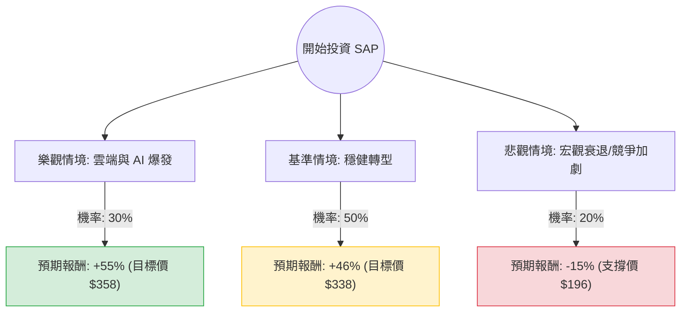

針對美股 SAP SE (SAP) 的投資評估，我已結合您提供的基本面數據，並透過網路搜尋整合了最新的市場動態（如 2024 年第三季財報表現、雲端轉型進度及 AI 策略）。

以下是基於**決策樹分析**與**期望值分析**的詳細報告。

---

### 一、 核心假設與市場背景分析

在建立模型前，我們先定義影響 SAP 股價的三大核心變數：

1.  **雲端轉型與 AI 增長 (Cloud & AI Momentum)：** SAP 目前正處於從地端轉向雲端（S/4HANA Cloud）的關鍵期。最新財報顯示雲端營收增長約 25-27%，且公司正積極整合「Business AI」。
2.  **企業重組與利潤率 (Restructuring & Margins)：** SAP 正在進行涉及 8,000 至 10,000 人的轉型計畫，旨在優化成本結構。目前營業利潤率（Oper. Margin）為 27.74%，預期未來會進一步提升。
3.  **總體經濟與估值 (Macro & Valuation)：** 目前 P/E 為 34.97，但 Forward P/E 降至 27.98，且 **PEG 為 1.0**，顯示其增長速度與估值匹配，並未過度泡沫。

---

### 二、 決策樹分析 (Decision Tree)

我們將未來一年的表現分為三種情境：**樂觀 (Bull)**、**基準 (Base)**、**悲觀 (Bear)**。

#### 節點詳細說明：

1.  **樂觀情境 (30%)：**
    *   **條件：** 雲端營收增長超過 30%，AI 助理 Joule 成功變現，且全球企業數位轉型支出超預期。
    *   **預期報酬：** 參考分析師最高目標價及強勁 EPS 增長，預估股價可達 $358。
2.  **基準情境 (50%)：**
    *   **條件：** 達到公司指引目標，雲端營收穩健增長 25%，重組計畫如期完成。
    *   **預期報酬：** 參考數據中的 Target Price **$338.1**，較目前股價 ($231.07) 約有 **+46.3%** 的空間。
3.  **悲觀情境 (20%)：**
    *   **條件：** 歐洲經濟持續疲軟，企業縮減 IT 支出，或競爭對手（Oracle, Salesforce）搶奪市佔。
    *   **預期報酬：** 股價回測 52 週低點附近或 SMA200 以下支撐，預估跌至 $196。

---

### 三、 期望值分析 (Expected Value Analysis)

#### 1. 計算過程
期望值 (EV) = $\sum (\text{機率} \times \text{預期報酬率})$

*   **樂觀情境：** $0.30 \times 55\% = 16.5\%$
*   **基準情境：** $0.50 \times 46.3\% = 23.15\%$
*   **悲觀情境：** $0.20 \times (-15\%) = -3.0\%$

**總期望報酬率 (Total EV) = $16.5\% + 23.15\% - 3.0\% = 36.65\%$**

#### 2. 財務數據支持點
*   **PEG = 1.0：** 這是極其強大的買入訊號，代表股價增長與盈餘增長完全同步，沒有溢價過高的問題。
*   **EPS Next Year (+18.61%)：** 預示未來一年獲利能力持續改善。
*   **Debt/Eq (0.21)：** 財務極其穩健，在高利率環境下具備極強抗風險能力。
*   **技術面：** 目前股價低於 SMA20, 50, 200，顯示近期經歷了技術性回檔，提供了較佳的進場點（Buy the Dip）。

---

### 四、 最終結論

**判斷：適合投資 (Strong Buy)**

#### 理由：
1.  **極高的期望報酬：** 經過加權計算，未來一年的期望報酬率高達 **36.65%**，遠高於標普 500 的平均回報。
2.  **估值合理：** 雖然 P/E 看似稍高，但考慮到其雲端轉型的高成長性，PEG 為 1.0 顯示目前股價處於合理甚至低估區間。
3.  **目標價空間大：** 目前股價 ($231) 距離分析師平均目標價 ($338) 有顯著的「安全邊際」。
4.  **轉型紅利：** SAP 從傳統軟體授權轉向訂閱制（SaaS）已進入收割期，現金流（P/FCF 36.91）與毛利（73.82%）表現優異，足以支撐其 AI 研發投入。

**建議操作：**
鑑於目前技術指標（SMA）顯示短期處於超賣或修正區間，建議可採取**分批進場**策略，以捕捉基準情境中預期的 46% 漲幅空間。