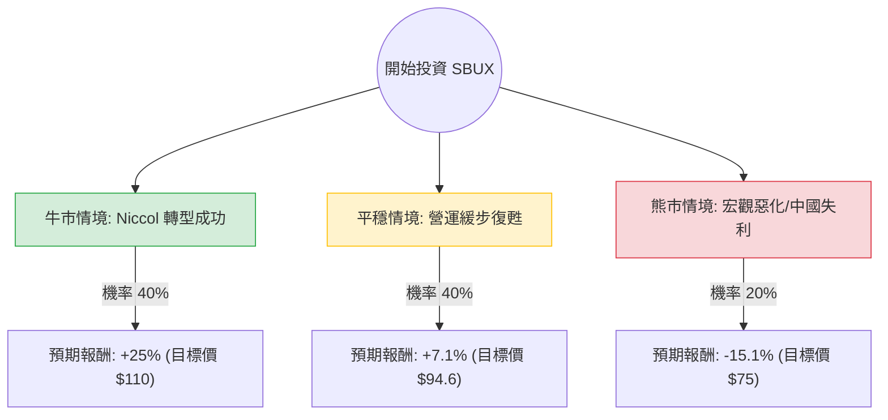

這份分析報告將結合您提供的數據與市場最新動態（特別是 **2024年8-9月發生的重大領導層變動**），利用**決策樹（Decision Tree）**與**期望值（Expected Value）**評估 Starbucks (SBUX) 的投資價值。

---

### 0. 前言：最新市場背景補充
在分析數據前，必須考慮到 SBUX 最近發生的「結構性利多」：
*   **新任 CEO 就職：** 星巴克於 2024 年 8 月宣布聘請前 Chipotle 執行長 **Brian Niccol** 擔任董事長兼 CEO。市場對此反應極其熱烈，認為他能複製 Chipotle 的成功模式（改善營運流程、強化品牌價值）。
*   **財報困境：** 數據顯示 EPS Q/Q 大幅衰退 (-85.4%)，中國市場同店銷售下降 14%，美國市場亦面臨客流量下滑。這反映了基本面目前處於「底部區域」。

---

### 1. 決策樹分析 (Decision Tree)

以下決策樹基於未來 12 個月的預期表現，分為三個主要路徑：

#### 決策樹節點詳細標示：
1.  **牛市情境 (Bull Case)**
    *   **機率：** 40%
    *   **核心假設：** Brian Niccol 成功縮短店內排隊時間、優化行動點餐（Mobile Order），且中國市場因經濟刺激政策止跌回升。
    *   **預期報酬：** +25% (回升至 52 週高點附近)。
2.  **平穩情境 (Base Case)**
    *   **機率：** 40%
    *   **核心假設：** 營運維持現狀，增長緩慢。股價回歸分析師平均目標價 ($94.62)。
    *   **預期報酬：** +7.1% (含股息約 2.77% 總回報約 10%)。
3.  **熊市情境 (Bear Case)**
    *   **機率：** 20%
    *   **核心假設：** 美國消費疲軟，中國競爭對手（瑞幸等）進一步蠶食份額，轉型計畫延遲。
    *   **預期報酬：** -15.1% (測試 52 週低點 $75.5)。

---

### 2. 期望值分析 (Expected Value Analysis)

#### A. 核心假設與計算過程
根據上述情境與目前的現價 **$88.33** 計算 12 個月的期望總報酬率：

*   **牛市報酬 (R1)：** $110 / $88.33 - 1 = **+24.53%**
*   **平穩報酬 (R2)：** $94.62 / $88.33 - 1 = **+7.12%**
*   **熊市報酬 (R3)：** $75.00 / $88.33 - 1 = **-15.09%**

**期望報酬率 (EV) 計算公式：**
$$EV = (P_{Bull} \times R_1) + (P_{Base} \times R_2) + (P_{Bear} \times R_3)$$

$$EV = (0.40 \times 0.2453) + (0.40 \times 0.0712) + (0.20 \times -0.1509)$$
$$EV = 0.0981 + 0.0285 - 0.0302 = 0.0964$$
**期望報酬率 ≈ 9.64%**

加上 **2.77% 的年度股息**，總預期報酬率約為 **12.41%**。

#### B. 財務數據關鍵解讀
*   **Forward P/E (29.32)：** 遠低於目前的 Trailing P/E (54.21)，顯示市場預期明年盈餘將顯著修復（EPS next Y 預計增長 26.43%）。
*   **PEG (1.65)：** 處於合理偏高區間，顯示目前的價格已部分反映了新 CEO 的預期利多。
*   **Current Ratio (0.72)：** 流動比率偏低，這在餐飲零售業常見，但需留意其債務結構（數據中 Debt/Eq 為 "-" 可能是因為高負債導致淨值為負，這是 SBUX 典型的資產負債表結構）。

---

### 3. 最終結論：適合投資 (Suitable for Investment)

**判斷：建議「分批買入」或「長期持有」。**

#### 理由如下：
1.  **期望值為正：** 計算出的總期望回報率（~12.4%）優於標普 500 的長期平均水準，且風險回報比（Risk/Reward Ratio）合理。
2.  **Niccol 溢價：** 新任 CEO 的加入是強大的催化劑。歷史證明 Brian Niccol 在轉型期公司具有極強的執行力，這能有效對沖營運上的短期利空。
3.  **技術面支撐：** 目前股價位於 52 週區間的中部，且 SMA20、SMA50、SMA200 均呈現正向（+3.38% 至 +4.57%），顯示短期與中期趨勢已轉強。
4.  **防禦性與股息：** 2.77% 的股息率提供了下行保護，在市場波動時具有防禦屬性。

**風險提示：**
*   **中國市場的不確定性：** 這是 SBUX 最大的黑天鵝。
*   **高估值：** 若 Niccol 的首季財報（預計 10 月底）未能展現營運改善跡象，股價可能回測 $80 支撐。

**建議操作：**
考慮到 Forward P/E 仍不算便宜，建議不要一次性投入，而是在 $85-$88 區間建立基本倉位，並在轉型成效顯現後加倉。