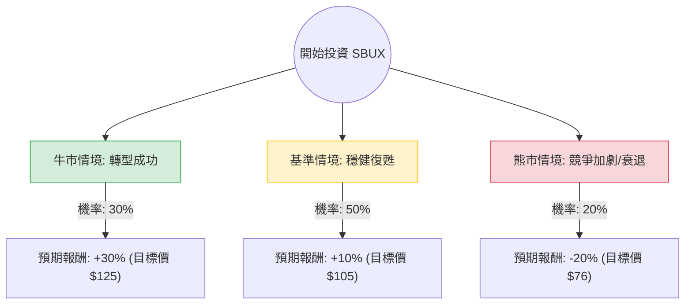

這份分析報告將結合您提供的基本面數據，以及最新的市場動態（特別是新任 CEO Brian Niccol 的上任與中國市場挑戰），利用**決策樹（Decision Tree）**與**期望值分析（Expected Value Analysis）**來評估 Starbucks (SBUX) 的投資價值。

---

### 一、 核心假設與市場背景分析

在建立模型前，我們必須考慮以下關鍵變數：

1.  **新任 CEO 效應 (The Niccol Factor)：** 前 Chipotle CEO Brian Niccol 於 2024 年 9 月正式接掌。市場對其「重塑星巴克體驗」寄予厚望，預期他能解決美國門市營運效率低、行動點餐混亂等問題。
2.  **中國市場壓力：** 中國市場面臨瑞幸咖啡（Luckin）等本土品牌的價格戰，以及消費疲軟，同店銷售額（Comp Sales）持續承壓。
3.  **估值修復：** 目前 Forward P/E 約 32.44x，相較於歷史高點已有所回落，但 PEG 1.67 顯示市場已預先反應了部分成長預期。
4.  **宏觀環境：** 美國聯準會降息循環有利於非必需消費品，但通膨對勞動力成本的壓力依然存在。

---

### 二、 決策樹分析 (Decision Tree)

以下決策樹模擬了未來 12 個月內 SBUX 可能面臨的三種主要情境：

#### 節點詳細說明：

1.  **牛市情境 (Bull Case) - 權重 30%**
    *   **描述：** Brian Niccol 迅速優化美國門市流程，提升出餐速度，並成功減少折扣依賴。中國市場因政策刺激回暖。
    *   **預期報酬：** 股價回升至歷史高位區間（約 $125），漲幅約 30%。
2.  **基準情境 (Base Case) - 權重 50%**
    *   **描述：** 美國業務緩步改善，但中國市場競爭依然激烈，僅維持低個位數成長。股息（2.57%）提供下行支撐。
    *   **預期報酬：** 接近分析師平均目標價（$100.86 - $105），漲幅約 10%。
3.  **熊市情境 (Bear Case) - 權重 20%**
    *   **描述：** 中國市場陷入長期價格戰導致利潤萎縮；美國消費者因經濟放緩減少高價咖啡支出。
    *   **預期報酬：** 股價回測 52 週低點（約 $76），跌幅約 20%。

---

### 三、 期望值計算 (Expected Value Calculation)

我們根據上述情境與當前股價 **$95.80** 進行計算：

#### 1. 預期報酬率計算：
*   **牛市期望值：** $30\% \times 30\% = 9\%$
*   **基準期望值：** $50\% \times 10\% = 5\%$
*   **熊市期望值：** $20\% \times (-20\%) = -4\%$

#### 2. 總體期望報酬率 (Total Expected Return)：
$$9\% + 5\% - 4\% = \mathbf{10\%}$$

#### 3. 考慮股息後的總回報：
*   當前股息率：**2.57%**
*   總預期回報 = $10\% + 2.57\% = \mathbf{12.57\%}$

---

### 四、 綜合數據評估

*   **技術面：** SMA50 (5.8%) 與 SMA200 (8.6%) 均呈現正向排列，顯示短期與中期趨勢轉強，股價已走出底部。
*   **財務面：** 
    *   **Forward P/E (32.44)** 雖然不便宜，但 **EPS next Y (28.57%)** 的高成長預期支撐了此估值。
    *   **Profit Margin (3.63%)** 偏低，這是 Niccol 上任後最大的改善空間（毛利 15.73% 尚可，但營運利潤有待提升）。
    *   **Short Float (3.72%)** 偏低，顯示市場並未大規模放空，情緒偏向中性樂觀。

---

### 五、 最終結論

#### **判斷：適合投資 (Moderate Buy)**

#### **理由：**
1.  **期望值為正：** 經風險加權後的預期回報率約為 **12.57%**（含股息），優於無風險利率（美債）且具備跑贏大盤的潛力。
2.  **管理層紅利：** Brian Niccol 在餐飲業的轉型紀錄極佳，市場願意給予「CEO 溢價」。
3.  **下行風險受控：** 2.57% 的股息率與強大的品牌護城河，使股價在 $80 以下具有極強支撐。
4.  **技術面轉佳：** 股價已站上所有主要均線（SMA20/50/200），顯示資金正在回流。

**建議策略：**
*   **進場點：** 目前 $95 附近可建立基本倉位。
*   **加碼點：** 若股價回測 $90 (SMA50 附近) 且基本面無惡化時加碼。
*   **止損點：** 若中國市場同店銷售跌幅擴大至雙位數，或美國營運利潤率持續下滑，跌破 $80 應重新評估。

---
*免責聲明：以上分析僅供參考，不構成具體投資建議。投資股票具有風險，入市前請審慎評估個人財務狀況。*