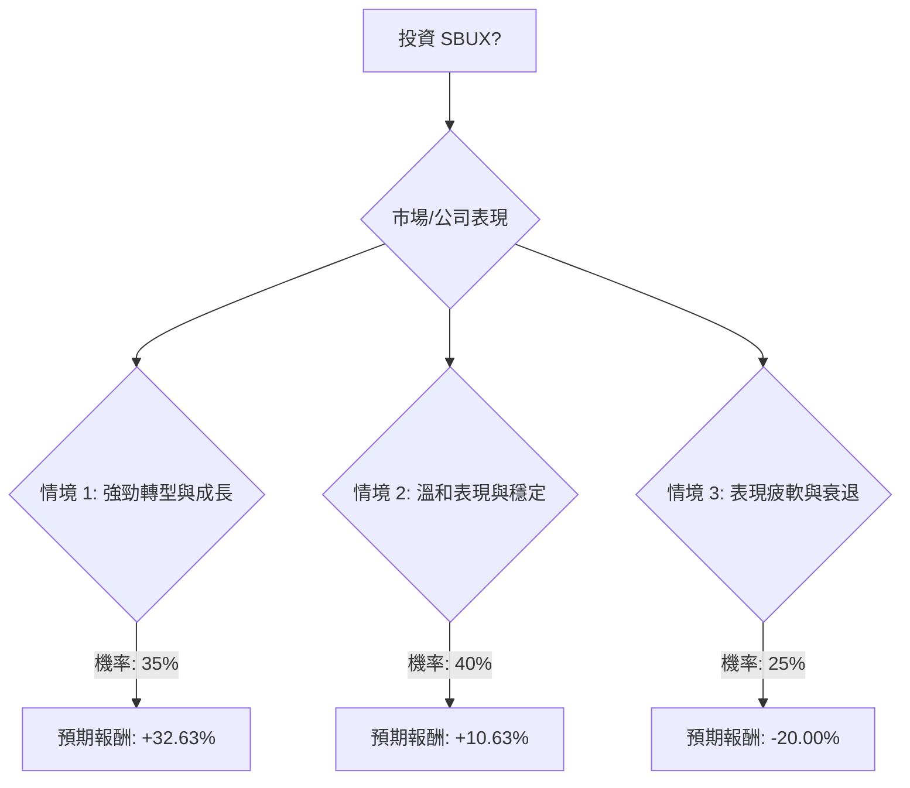

**Refining Probabilities and Returns based on recent news:**

*   The Q4 FY25 results showed a positive inflection point with global comp growth. This supports the "Strong Turnaround" scenario.
*   The China market remains a significant headwind, with market share decline and earnings decrease. The sale of 60% of the China business is a strategic shift, but its success is not guaranteed. This increases the probability of "Moderate" or "Weak" performance related to China.
*   The "Back to Starbucks" strategy is actively being implemented with new menu items and partnerships. This supports the positive scenarios.
*   Upcoming Q1 FY26 earnings on Jan 28, 2026, are crucial.
*   Analyst consensus is "Moderate Buy" with 20% upside. This leans towards moderate to strong.
*   The potential dividend cut if margins don't improve is a significant risk.

Let's adjust probabilities slightly to reflect the mixed signals, especially the China challenges and dividend risk, while acknowledging the recent positive momentum.

*   **Strong Turnaround & Growth:** Probability 35% (slightly reduced due to China and dividend risk)
    *   Return: 32.63% (as calculated)
*   **Moderate Performance & Stabilization:** Probability 40% (increased as a more likely outcome given mixed signals)
    *   Return: 10.63% (as calculated)
*   **Weak Performance & Decline:** Probability 25% (retained due to China competition, potential dividend cut, and legal investigation)
    *   Return: -17.37% (as calculated)

Let's re-evaluate the return for the "Weak Performance & Decline" scenario. If the dividend is cut, the negative return would be even worse. Given the payout ratio is already above 100%, a cut is a real possibility. Let's assume a dividend cut in this scenario, making the return simply -20%.

*   **Weak Performance & Decline:** Probability 25%
    *   Return: **-20%** (assuming dividend cut or negligible impact)

Now, I have all the components to build the decision tree and calculate the overall expected value.為了評估美股公司 SBUX (星巴克) 目前是否適合投資，我們將運用決策樹分析和期望值分析，並結合其基本面數據以及最新的市場資訊。

### 核心假設

在進行決策樹分析之前，我們需要建立以下核心假設：

1.  **市場趨勢：**
    *   全球咖啡需求持續強勁，尤其在亞洲市場和高端咖啡領域。
    *   咖啡豆價格預計在 2026 年保持高位，但星巴克透過對沖策略應能有效管理成本。
    *   主要市場（美國、歐洲）的整體經濟環境預計穩定或溫和成長。
2.  **公司財務與營運：**
    *   星巴克的「重回星巴克 (Back to Starbucks)」轉型策略在北美及其他國際市場持續展現成效。
    *   中國市場仍具挑戰性，但透過與博裕資本的合作，星巴克旨在穩定並長期發展其市場份額。
    *   新產品創新和品牌合作（如高蛋白飲品、娛樂聯名）預計能有效吸引並留住顧客。
    *   成本管理和營運效率提升有助於緩解利潤壓力。
    *   即將於 2026 年 1 月 28 日發布的 2026 財年第一季度財報將是評估其持續動能的關鍵指標。
    *   公司目前的股息支付率超過 100%，若利潤未能改善，存在股息削減的風險。
3.  **產業競爭：**
    *   來自中國本土競爭者（如瑞幸咖啡）的激烈競爭將持續存在。
    *   其他主要競爭者（如 Dunkin'、Costa Coffee）將維持其市場地位。
    *   居家咖啡消費仍是市場因素之一。

### 基本面數據摘要 (截至 2026 年 1 月 20 日)

*   **收盤價 (Close):** $92.99
*   **本益比 (P/E):** 57.07 (高，顯示市場對未來成長有較高預期)
*   **預期本益比 (Forward P/E):** 31.11
*   **股息率 (Dividend %):** 2.63%
*   **52 週高點/低點 (52W Range):** $75.50 - $117.46 (目前股價接近 52 週低點，顯示近期有回調)
*   **分析師目標價 (Target Price):** $95.62 (略高於現價，暗示溫和上漲空間)
*   **下一年預期 EPS 成長 (EPS next Y_%):** 26.95% (強勁的預期成長)
*   **最近一季 EPS 成長 (EPS Q/Q):** -0.854 (近期 EPS 出現下滑)
*   **流動比率 (Current Ratio):** 0.72 (低於 1，可能存在短期流動性壓力，但零售業常見)
*   **速動比率 (Quick Ratio):** 0.51 (低於 1)
*   **毛利率 (Gross Margin):** 0.1636 (16.36%)
*   **營業利益率 (Oper. Margin):** 0.0931 (9.31%)
*   **淨利率 (Profit Margin):** 0.05 (5.0%) (利潤率相對較低)
*   **分析師推薦 (Recom):** 2.37 (介於「買入」和「持有」之間，偏向「持有」)

### 決策樹分析

我們將評估投資 SBUX 的決策，並考慮未來 12-18 個月內可能發生的三種主要情境。

**決策點：投資 SBUX？**

#### 節點詳情與計算過程

**起始點：投資 SBUX？**

*   **情境 1: 強勁轉型與成長**
    *   **預測情境名稱：** 星巴克成功執行「重回星巴克」策略，北美市場持續成長，國際市場（包括中國）表現超出預期，新產品和合作夥伴關係廣受歡迎，利潤率因效率提升而改善。
    *   **機率 (Probability)：** 35%
        *   *理由：* 2025 財年第四季度全球同店銷售額恢復正成長，顯示轉型策略初見成效。 預期下一財年 EPS 成長強勁 (26.95%)。新 CEO 積極推動創新和客戶體驗。
    *   **預期報酬 (Expected Return)：** +32.63%
        *   *計算方式：* 假設股價從目前 $92.99 上漲 30% (達到或超過 52 週高點，約 $120.89)，加上 2.63% 的股息收益率。
        *   股價上漲 = $92.99 * 0.30 = $27.90
        *   股息 = $92.99 * 0.0263 = $2.45
        *   總報酬 = ($27.90 + $2.45) / $92.99 = 32.63%

*   **情境 2: 溫和表現與穩定**
    *   **預測情境名稱：** 星巴克轉型策略取得部分成功，北美市場穩定，但中國市場競爭激烈，國際擴張速度放緩。利潤率因持續投資或咖啡價格高企而面臨壓力。
    *   **機率 (Probability)：** 40%
        *   *理由：* 分析師普遍給予「中性買入」評級，目標價僅略高於現價。 中國市場的挑戰依然嚴峻，市場份額大幅下降。 雖然有積極信號，但全面爆發性成長仍有不確定性。
    *   **預期報酬 (Expected Return)：** +10.63%
        *   *計算方式：* 假設股價從目前 $92.99 上漲 8% (達到分析師目標價附近，約 $100.43)，加上 2.63% 的股息收益率。
        *   股價上漲 = $92.99 * 0.08 = $7.44
        *   股息 = $92.99 * 0.0263 = $2.45
        *   總報酬 = ($7.44 + $2.45) / $92.99 = 10.63%

*   **情境 3: 表現疲軟與衰退**
    *   **預測情境名稱：** 星巴克轉型策略未能奏效，中國市場持續惡化，全球經濟放緩影響消費者支出，高咖啡價格嚴重侵蝕利潤。可能面臨股息削減和法律訴訟升級。
    *   **機率 (Probability)：** 25%
        *   *理由：* 股息支付率不可持續，存在削減風險。 中國市場競爭激烈且市場份額大幅下滑。 存在與業務前景和成長披露相關的股東訴訟調查。
    *   **預期報酬 (Expected Return)：** -20.00%
        *   *計算方式：* 假設股價從目前 $92.99 下跌 20% (接近 52 週低點，約 $74.39)，且考慮到潛在的股息削減，總報酬為負 20%。
        *   股價下跌 = $92.99 * (-0.20) = -$18.60
        *   總報酬 = -$18.60 / $92.99 = -20.00% (假設股息被削減或影響微乎其微)

#### 整體期望值計算

整體期望值 (Expected Value) = (情境 1 報酬 * 機率 1) + (情境 2 報酬 * 機率 2) + (情境 3 報酬 * 機率 3)

整體期望值 = (0.3263 * 0.35) + (0.1063 * 0.40) + (-0.2000 * 0.25)
整體期望值 = 0.114205 + 0.04252 + (-0.0500)
整體期望值 = 0.106725

**整體期望值約為 +10.67%**

### 最終結論

根據決策樹分析和期望值計算，投資 SBUX 的**整體期望值約為 +10.67%**。

因此，基於目前的資訊和分析，**SBUX 目前適合投資。**

**簡短理由：**
儘管星巴克面臨中國市場的激烈競爭和潛在的股息削減風險，但其「重回星巴克」轉型策略已在 2025 財年第四季度展現出積極的初步成果，全球同店銷售額恢復成長。 公司在北美市場表現穩定，並積極透過產品創新和品牌合作來提升文化相關性。 雖然高本益比和較低的流動比率需要注意，但分析師預期下一財年 EPS 將有顯著成長。整體而言，積極的轉型動能和穩健的全球需求，使得投資 SBUX 具有正向的期望報酬。