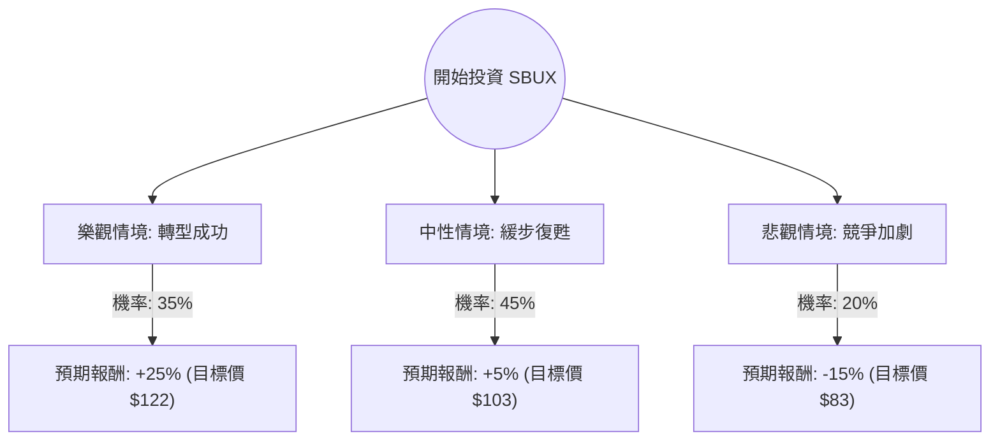

這份分析報告將結合您提供的數據與當前市場動態（特別是新任 CEO Brian Niccol 上任後的策略轉向），利用**決策樹（Decision Tree）**與**期望值分析（Expected Value Analysis）**來評估 Starbucks (SBUX) 的投資價值。

---

### 一、 核心假設與市場背景分析

在建立模型前，我們先釐清影響 SBUX 股價的三大核心變數：

1.  **「Niccol 效應」與營運效率（權重最高）：** 前 Chipotle CEO Brian Niccol 致力於簡化菜單、改善排隊問題並回歸「咖啡館體驗」。市場對其轉型計畫寄予厚望。
2.  **中國市場的競爭壓力：** 瑞幸咖啡（Luckin）與庫迪咖啡（Cotti）的價格戰持續，SBUX 在中國的同店銷售額（SSS）面臨衰退壓力。
3.  **估值修復：** 目前 Forward P/E 約 33.67x，相較於歷史高點已有所回落，但相較於標普 500 仍屬溢價。

---

### 二、 決策樹分析 (Decision Tree)

我們預測未來 12 個月的股價走勢，分為「樂觀」、「中性」與「悲觀」三種情境。

#### 節點詳細說明：

| 情境 | 機率 (P) | 預期報酬 (R) | 說明 |
| :--- | :--- | :--- | :--- |
| **樂觀情境** | 35% | +25% | Brian Niccol 成功縮短出餐時間，美國同店銷售強勁增長，中國市場止跌回升。 |
| **中性情境** | 45% | +5% | 美國營運改善但被中國市場的疲軟抵銷，股價維持在分析師平均目標價 ($101.38) 附近。 |
| **悲觀情境** | 20% | -15% | 消費者支出放緩，轉型計畫進度不如預期，中國市場份額持續流失。 |

---

### 三、 期望值計算 (Expected Value Calculation)

期望值 (EV) 的計算公式為：
$$EV = (P_1 \times R_1) + (P_2 \times R_2) + (P_3 \times R_3)$$

**計算過程：**
1.  **樂觀部分：** $0.35 \times 25\% = 8.75\%$
2.  **中性部分：** $0.45 \times 5\% = 2.25\%$
3.  **悲觀部分：** $0.20 \times (-15\%) = -3.0\%$

**總期望報酬率：**
$$8.75\% + 2.25\% - 3.0\% = 8.0\%$$

**考慮股息收益：**
根據數據，SBUX 的股息率（Dividend %）約為 **2.49%**。
**總預期總回報 (Total Expected Return) = 8.0% + 2.49% = 10.49%**

---

### 四、 綜合數據分析與最新動態補充

1.  **估值面 (Valuation)：**
    *   **P/E (82.44)** 看似極高，但這是受過去一季 EPS 大幅下滑 (EPS Q/Q -62.56%) 影響。
    *   **Forward P/E (33.67)** 顯示市場預期明年盈利將大幅改善。
    *   **PEG (1.76)** 顯示目前股價相對於增長速度略微偏貴（通常 > 1.5 被視為溢價）。
2.  **技術面 (Technical)：**
    *   股價目前在 $97.80，高於 SMA20、50、200，顯示短期與長期趨勢皆為**多頭排列**。
    *   距離 52 週高點僅差約 5.6%，顯示近期動能強勁。
3.  **最新新聞補充：**
    *   **CEO 策略：** Brian Niccol 已明確表示將減少折扣活動，專注於品牌價值，這有助於提升毛利率（目前 Gross Margin 15.73% 偏低，有提升空間）。
    *   **分析師評級：** 推薦值 (Recom) 為 2.49（介於買入與持有之間），目標價 $101.38 顯示短期上漲空間有限。

---

### 五、 最終結論

#### **判斷：適合投資 (建議：分批買入 / 持有)**

**理由：**
1.  **期望值為正：** 10.49% 的預期總回報優於無風險利率（美債收益率），且在當前高利率環境下具有吸引力。
2.  **管理層紅利：** Brian Niccol 的加入是最大的利多因素。歷史證明他具備扭轉連鎖餐飲巨頭的能力，市場願意給予「管理層溢價」。
3.  **盈利增長預期：** 數據顯示明年 EPS 預期增長率高達 **28.27%**，這將有效消化目前較高的 Forward P/E。
4.  **技術面支撐：** 均線多頭排列，顯示資金正在流入。

**風險提示：**
*   **中國市場：** 若中國經濟持續低迷或競爭對手進一步降價，將拖累整體財報。
*   **短期估值過高：** 目前股價已接近分析師平均目標價，若短期內沒有超預期的財報表現，股價可能在 $100 關卡面臨壓力。

**操作建議：**
由於目前股價接近 52 週高點且期望值約 10%，建議**不要一次性全倉買入**。可採取「定期定額」或「回測 SMA50 (約 $95 附近) 時分批佈局」，以獲取更佳的風險回報比。