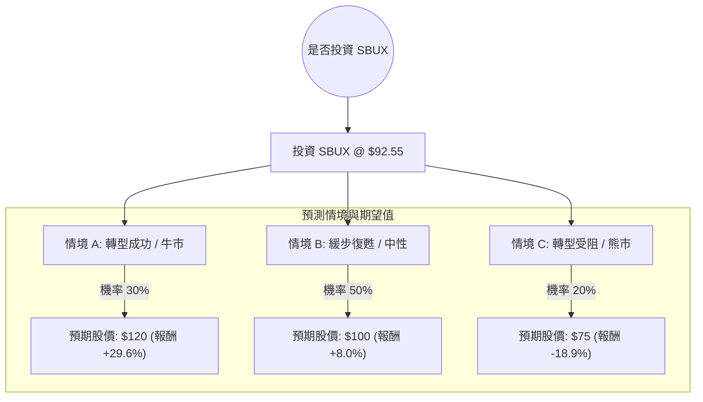

為了評估星巴克（SBUX）目前的投資價值，我結合了您提供的基本面數據以及最新的市場動態（特別是新任 CEO Brian Niccol 的上任與近期疲軟的財報表現）。

以下是基於**決策樹分析**與**期望值分析**的詳細評估。

---

### 一、 核心假設與市場背景分析

在構建決策樹之前，我們必須考慮以下關鍵變數：
1.  **領導層變革（Brian Niccol 效應）：** 前 Chipotle 執行長接手，市場對其「回歸核心」的策略抱有高度期待，但轉型需要時間。
2.  **中國市場挑戰：** 面對瑞幸咖啡等本土品牌價格戰，星巴克在中國的同店銷售額大幅下滑（最新季報顯示下滑 14%）。
3.  **美國市場疲軟：** 交易量下降，消費者因通膨對高價咖啡產生抵制。
4.  **估值：** 目前 Forward P/E 約 31.4 倍，高於歷史平均，顯示市場已提前反應部分轉型預期。

---

### 二、 決策樹分析 (Decision Tree)

我們以 **1 年為投資期限**，設定三種可能的情境：

#### 節點詳細說明：

1.  **情境 A：轉型成功 (Bull Case) - 30% 機率**
    *   **描述：** Brian Niccol 成功簡化菜單並優化店鋪營運，美國同店銷售轉正；中國市場透過合作夥伴關係止跌。
    *   **預期報酬：** 股價回升至歷史高點區域約 $120。
    *   **計算：** $120 / $92.55 - 1 = +29.6%

2.  **情境 B：緩步復甦 (Base Case) - 50% 機率**
    *   **描述：** 營運效率提升，但宏觀經濟壓抑消費力，增長緩慢。股價回歸分析師平均目標價。
    *   **預期報酬：** 股價達到 Target Price $100.6（取整數 $100）。
    *   **計算：** $100 / $92.55 - 1 = +8.0%

3.  **情境 C：轉型受阻 (Bear Case) - 20% 機率**
    *   **描述：** 中國市場持續萎縮，美國市場因競爭與高物價導致客流量進一步流失，轉型陣痛期長於預期。
    *   **預期報酬：** 股價回測 52 週低點支撐位。
    *   **計算：** $75 / $92.55 - 1 = -18.9%

---

### 三、 期望值分析 (Expected Value Analysis)

#### 1. 預期報酬率計算
我們將各情境的報酬率乘以其發生機率，並加上股息收益（Dividend % = 2.66%）：

*   **情境 A 貢獻：** $29.6\% \times 0.30 = 8.88\%$
*   **情境 B 貢獻：** $8.0\% \times 0.50 = 4.00\%$
*   **情境 C 貢獻：** $-18.9\% \times 0.20 = -3.78\%$
*   **預期資本利得：** $8.88\% + 4.00\% - 3.78\% = 9.1\%$
*   **總期望報酬 (含股息)：** $9.1\% + 2.66\% = \mathbf{11.76\%}$

#### 2. 核心財務指標解讀
*   **P/E (77.11) vs Forward P/E (31.4)：** 目前本益比極高是因為近期盈餘（EPS Q/Q -62.56%）大幅下滑。Forward P/E 顯示市場預期明年盈利會大幅反彈（EPS next Y 預期增長 28.64%）。
*   **PEG (1.62)：** 考慮到增長率，估值偏高（通常 > 1 被視為不便宜），反映了「CEO 溢價」。
*   **技術面：** SMA20 (-5.14%) 與 SMA50 (-3.41%) 均在股價之上，顯示短期趨勢偏弱，股價正在消化近期暫停財測的利空。

---

### 四、 最終結論

**判斷：適合投資 (謹慎看多 / 分批佈局)**

#### 理由：
1.  **期望值為正：** 11.76% 的預期總報酬率優於長期美股平均，且具備 2.66% 的股息作為下行保護。
2.  **管理層紅利：** Brian Niccol 在餐飲業的轉型紀錄極佳，星巴克目前面臨的是「營運問題」而非「品牌崩壞」，這類問題通常可透過管理手段解決。
3.  **最壞消息已出：** 公司已提前發布疲軟財報並暫停 2025 財年指引，這通常被視為「利空出盡」的信號，市場焦點已轉向 11 月份 Niccol 的詳細戰略發布。
4.  **估值支撐：** 雖然 P/E 偏高，但股價距離 52 週高點仍有約 11.7% 的空間，且 Forward P/E 顯示盈利修復潛力大。

**建議策略：**
由於短期技術指標（SMA20/50）顯示仍有下行壓力，建議**不要一次性投入**。可在 $88 - $92 區間分批建倉，以降低轉型陣痛期帶來的波動風險。

---
*免責聲明：以上分析僅供參考，不構成投資建議。投資股票具有風險，請根據自身風險承受能力做出決策。*