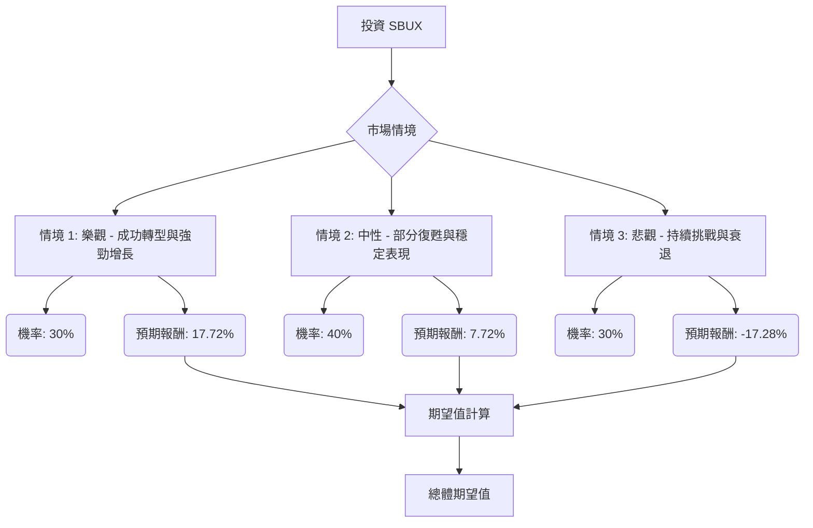

根據您提供的基本面數據以及透過網路搜尋獲得的最新資訊，我們將對美股公司 SBUX 進行決策樹分析與期望值分析，以評估其目前是否適合投資。

### SBUX 最新資訊與市場概況

**近期財務表現：**
*   **2024 財年第一季 (截至 2023 年 12 月 31 日) 業績：**
    *   全球同店銷售額增長 5%，其中交易量增長 3%，平均客單價增長 2%。
    *   北美同店銷售額增長 5%，主要受平均客單價增長 4% 和交易量增長 1% 帶動。
    *   國際市場淨收入增長 10%，同店銷售額增長 7%，其中交易量增長 11%，但平均客單價下降 3%。
    *   中國市場同店銷售額增長 10%，主要由交易量增長 21% 驅動，但平均客單價下降 9%。
    *   GAAP 營業利潤率擴大 140 個基點至 15.8%。
    *   每股盈餘 (EPS) 為 0.90 美元，增長 20%。
    *   然而，星巴克未達市場預期，並下調了全年營收和同店銷售額指引，理由是「第一季度營收面臨的綜合逆風」以及實施行動計劃所需的時間。
*   **2024 財年第四季 (截至 2024 年 9 月 29 日) 及 2025 財年第一季 (截至 2024 年 12 月 31 日) 展望/報告 (根據 2024 年底發布的資訊)：**
    *   有報告指出，星巴克在 2024 財年第四季全球同店銷售額下降 7%，淨收入下降 3% 至 91 億美元。
    *   北美和美國同店銷售額下降 6%，交易量下降 10%。
    *   國際同店銷售額下降 9%，中國同店銷售額下降 14%。
    *   2024 財年全年營收增長僅 0.58%，遠低於前幾年。
    *   公司已暫停 2025 財年財務指引。
    *   這些數據表明星巴克在 2024 年下半年至 2025 年初面臨顯著的挑戰和增長放緩。

**市場動態與產業趨勢：**
*   **挑戰：** 美國市場門店飽和導致內部競爭加劇，勞動力和運營成本上升，以及消費者需求疲軟。
*   **應對策略：** 星巴克正在實施「重塑計劃 (Reinvention Plan)」和「回歸星巴克 (Back to Starbucks)」策略，旨在簡化菜單、調整定價、提升門店體驗、加強數位參與度，並重新贏回顧客。
*   **增長動力：** 星巴克獎勵計劃 (Starbucks Rewards) 和數位渠道仍是重要的增長驅動力，美國活躍會員超過 3400 萬，數位交易佔美國營收的 75%。
*   **產業趨勢：** 咖啡產業持續關注永續性、特色咖啡、冰咖啡和冷萃咖啡的流行、功能性咖啡的興起，以及數位化點餐和 AI 技術的應用。

**分析師評級與目標價：**
*   分析師普遍給予「買入」或「適度買入」評級。
*   平均 12 個月目標價介於 95.87 美元至 98.61 美元之間，相較於當前股價 (約 89.96 美元) 有 8% 至 9.62% 的上漲空間。
*   最高目標價為 115 美元至 120.75 美元。
*   最低目標價為 59 美元至 76 美元。

### 核心假設

1.  **市場環境：** 假設全球經濟在未來 12-24 個月內保持相對穩定，但消費者支出可能因通脹壓力而受到影響。咖啡市場競爭激烈，特別是在中國市場。
2.  **公司財務：** 假設星巴克能夠有效執行其「重塑計劃」和「回歸星巴克」策略，改善運營效率並重新吸引顧客。儘管近期面臨挑戰，但其強大的品牌力、忠誠度計劃和全球擴張潛力仍是長期優勢。
3.  **產業趨勢：** 假設咖啡產業的永續性、特色咖啡、冷萃咖啡和數位化趨勢將持續，星巴克能抓住這些機會進行產品創新和市場拓展。

### 決策樹分析

**當前股價 (Close):** 89.96 美元
**股息率 (Dividend %):** 2.72%
**分析師目標價 (Target Price):** 95.24 美元

我們將設定三個未來情境，並評估其預期報酬：

**節點說明與計算過程：**

*   **起始節點：投資 SBUX**
    *   當前股價：$89.96

*   **決策節點：市場情境**
    *   我們將評估 SBUX 在不同市場情境下的表現。

*   **情境 1: 樂觀 - 成功轉型與強勁增長**
    *   **預測情境名稱：** 樂觀情境
    *   **情境描述：** 星巴克「回歸星巴克」策略成功扭轉近期頹勢，有效解決運營效率問題，並成功吸引新舊顧客。國際市場（尤其是中國）強勁復甦，產品創新（如特色咖啡、冷萃、功能性咖啡）和數位化策略帶來顯著增長。公司股價達到分析師高位目標區間。
    *   **機率 (Probability)：** 30%
    *   **預期股價：** 假設股價上漲 15% (達到約 $103.45，接近分析師高位目標區間 $115-$120.75)。
    *   **股價報酬：** ($103.45 - $89.96) / $89.96 = 15.00%
    *   **總預期報酬 (Expected Return)：** 股價報酬 + 股息率 = 15.00% + 2.72% = 17.72%
    *   **期望值 (Expected Value)：** 17.72% * 30% = 5.316%

*   **情境 2: 中性 - 部分復甦與穩定表現**
    *   **預測情境名稱：** 中性情境
    *   **情境描述：** 星巴克的轉型策略取得部分成效，但宏觀經濟逆風、激烈競爭和消費者需求疲軟等因素持續存在，導致增長速度溫和。公司表現符合分析師平均預期。
    *   **機率 (Probability)：** 40%
    *   **預期股價：** 假設股價上漲 5% (達到約 $94.46，接近分析師平均目標價 $95.24)。
    *   **股價報酬：** ($94.46 - $89.96) / $89.96 = 5.00%
    *   **總預期報酬 (Expected Return)：** 股價報酬 + 股息率 = 5.00% + 2.72% = 7.72%
    *   **期望值 (Expected Value)：** 7.72% * 40% = 3.088%

*   **情境 3: 悲觀 - 持續挑戰與衰退**
    *   **預測情境名稱：** 悲觀情境
    *   **情境描述：** 星巴克的轉型努力未能有效應對市場挑戰，消費者需求持續疲軟，尤其是在美國和中國等關鍵市場。勞動力成本上升和競爭加劇進一步壓縮利潤率，導致市場份額流失，股價跌至分析師低位目標區間。
    *   **機率 (Probability)：** 30%
    *   **預期股價：** 假設股價下跌 20% (達到約 $71.97，接近分析師低位目標區間 $59-$76)。
    *   **股價報酬：** ($71.97 - $89.96) / $89.96 = -20.00%
    *   **總預期報酬 (Expected Return)：** 股價報酬 + 股息率 = -20.00% + 2.72% = -17.28% (假設股息在下跌情境下仍能維持)
    *   **期望值 (Expected Value)：** -17.28% * 30% = -5.184%

### 總體期望值計算

總體期望值 = (樂觀情境期望值) + (中性情境期望值) + (悲觀情境期望值)
總體期望值 = 5.316% + 3.088% + (-5.184%)
總體期望值 = 3.22%

### 最終結論

根據決策樹分析和期望值計算，SBUX 的總體期望值為 **3.22%**。

**判斷：不適合投資**

**理由：**
儘管 SBUX 擁有強大的品牌和忠誠度計劃，且分析師平均目標價顯示有上漲空間，但其總體期望值僅為 3.22%，相對較低。這反映了公司近期面臨的顯著挑戰，包括 2024 財年下半年至 2025 財年第一季度的同店銷售額下降、營收增長放緩以及宏觀經濟逆風和激烈競爭。雖然公司正在積極實施轉型策略，但其成效仍有待觀察，且悲觀情境的機率和潛在損失不容忽視。

考慮到當前市場存在其他可能提供更高風險調整後報酬的投資機會，SBUX 目前的預期報酬並不足以吸引投資者，尤其是在其高 P/E 比 (55.21) 的情況下，這意味著市場對其未來增長有較高預期。因此，在星巴克的「重塑計劃」展現出更明確的成功跡象之前，目前不建議投資 SBUX。