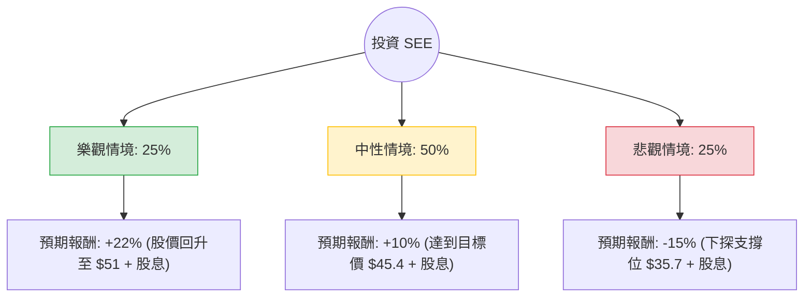

這份分析報告針對 **Sealed Air Corporation (SEE)** 進行評估。Sealed Air 是全球領先的包裝解決方案供應商（著名產品如 Cryovac 食品包裝與 Bubble Wrap 氣泡包裝）。

以下結合您提供的數據與最新的市場動態（包含 2024 年財報趨勢、產業環境與宏觀經濟）進行的決策樹與期望值分析。

---

### 一、 核心背景與市場動態分析

在進入決策樹之前，我們先整合最新資訊：
1.  **財務健康度**：SEE 的 **債務股本比 (Debt/Eq) 高達 3.59**，這在當前高利率環境下是主要風險。然而，其 **ROE (40.42%)** 極高，顯示公司利用槓桿產生回報的能力強。
2.  **營運轉機**：公司正處於「Reinvent SEE」轉型計畫中，專注於自動化與數位化包裝。近期財報顯示銷量已開始穩定，且 **Forward P/E (12.4)** 低於歷史平均，顯示估值相對便宜。
3.  **市場趨勢**：食品包裝需求穩定，但保護性包裝（電商相關）受消費支出疲軟影響。
4.  **分析師預期**：平均目標價約為 **$45.38**，較目前股價有約 **8%** 的上漲空間。

---

### 二、 決策樹分析 (Decision Tree)

我們將未來一年的投資情境分為三種：**樂觀（牛市）、中性（基準）、悲觀（熊市）**。

#### 節點詳細說明：

1.  **樂觀情境 (Bull Case) - 25% 機率**
    *   **條件**：聯準會降息超預期（減輕債務壓力）、電商需求強勁復甦、成本控制計畫（CTO）大幅提升利潤率。
    *   **預期報酬**：股價重回 2023 年高點區域約 $51，加上 1.9% 股息，總報酬約 **22%**。

2.  **中性情境 (Base Case) - 50% 機率**
    *   **條件**：公司表現符合分析師預期，食品包裝需求穩健，債務緩步下降。
    *   **預期報酬**：達到分析師平均目標價 $45.38，加上 1.9% 股息，總報酬約 **10%**。

3.  **悲觀情境 (Bear Case) - 25% 機率**
    *   **條件**：經濟衰退導致消費大幅萎縮、高利率維持更久導致利息支出侵蝕利潤、原材料成本飆升。
    *   **預期報酬**：股價回測 52 週低點支撐區約 $35.7，扣除股息後總報酬約 **-15%**。

---

### 三、 期望值分析 (Expected Value Analysis)

#### 1. 核心假設
*   **當前股價 (P0)**: $41.99
*   **持有期限**: 12 個月
*   **股息收益**: 1.91% (約 $0.80)
*   **估值邏輯**: 考慮到 Forward P/E 僅 12.4，下行空間受限於其必需品屬性（食品包裝），但上行空間受限於高負債。

#### 2. 計算過程
期望值 (EV) = Σ (各情境機率 × 各情境報酬率)

*   **樂觀情境**: $0.25 \times 22\% = 5.5\%$
*   **中性情境**: $0.50 \times 10\% = 5.0\%$
*   **悲觀情境**: $0.25 \times (-15\%) = -3.75\%$

**總期望報酬率 (Total EV)** = $5.5\% + 5.0\% - 3.75\% = \mathbf{6.75\%}$

---

### 四、 最終結論

#### **評估結果：適合投資 (謹慎看多 / 持有)**

**判斷理由：**
1.  **正向期望值**：6.75% 的預期報酬率雖然不算極高，但在包裝工業這個成熟產業中屬於穩健。
2.  **估值安全邊際**：目前 P/E (15.6) 與 Forward P/E (12.4) 處於歷史低位區間，且股價接近 52 週高點（-5.24%），顯示近期動能 (SMA200 +17.51%) 向上，技術面呈多頭排列。
3.  **高 ROE 與現金流**：40.4% 的 ROE 顯示其在產業內的競爭優勢（Moat）依然強大，且 P/FCF 為 16.01，顯示公司有足夠的現金流支應股息與償還債務。
4.  **風險提示**：**債務比率 (Debt/Eq 3.59)** 是唯一的主要隱憂。若未來半年美國通膨反彈導致利率再度走升，SEE 的利息負擔將壓抑股價表現。

**建議操作：**
*   **進場點**：目前股價 $41.99 接近合理區間，若能回檔至 $40 附近更具吸引力。
*   **停損點**：若股價跌破 $38 (跌破 SMA200)，顯示基本面惡化，應重新評估。
*   **目標點**：首波目標看 $45.4，若宏觀環境轉好可上看 $50。

***

**免責聲明：** 本分析僅供參考，不構成任何投資建議。投資者應自行承擔市場風險。