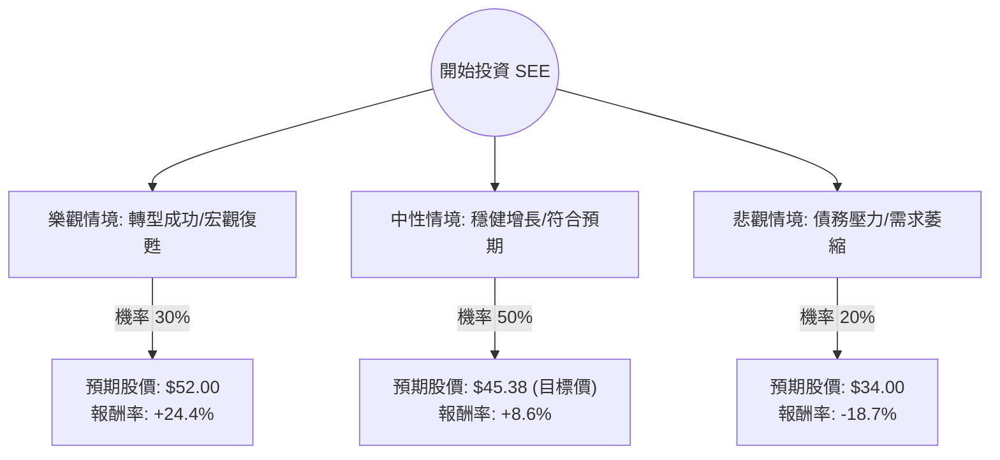

這份報告將針對 **Sealed Air Corporation (SEE)** 進行深入分析。Sealed Air 是全球包裝解決方案的領導者（知名產品如 Cryovac 食品包裝與 Bubble Wrap 氣泡包裝）。

透過結合您提供的基本面數據與最新的市場動態（包括 2024 年新任 CEO 上任、轉型計畫「Reinvent SEE」以及債務壓力），我將使用**決策樹分析**與**期望值分析**來評估其投資價值。

---

### 一、 核心假設與市場動態分析

在建立決策樹之前，我們必須確立以下核心假設：

1.  **管理層變動（關鍵變數）：** SEE 於 2024 年 7 月任命了新任 CEO Patrick Kivits。市場對其能否加速自動化轉型並優化成本結構抱有期待。
2.  **財務結構：** 該公司 **Debt/Eq (負債權益比) 高達 3.59**，這在當前高利率環境下是主要風險。然而，其 **ROE (40.42%)** 極高，顯示其利用槓桿產生獲利的能力強。
3.  **產業趨勢：** 食品包裝需求穩定（防禦性），但電商包裝受消費力影響波動較大。
4.  **估值：** 目前 **Forward P/E 為 12.34**，低於歷史均值，顯示股價可能被低估。

---

### 二、 決策樹分析 (Decision Tree)

我們將未來一年的投資情境分為三種：**樂觀（轉型成功）**、**中性（維持現狀）**、**悲觀（債務與需求危機）**。

#### 節點詳細說明：

1.  **樂觀情境 (Bull Case) - 30% 機率：**
    *   **條件：** 新 CEO 成功執行 Reinvent SEE 2.0，自動化包裝比例提升，且聯準會降息減輕債務利息負擔。
    *   **預期報酬：** 股價回升至 2023 年初高點約 $52。
2.  **中性情境 (Base Case) - 50% 機率：**
    *   **條件：** 業績符合分析師預期，EPS 緩步增長（EPS next Y 2.04%），維持派息。
    *   **預期報酬：** 達到分析師平均目標價 $45.38。
3.  **悲觀情境 (Bear Case) - 20% 機率：**
    *   **條件：** 高利率持續更久導致利息支出侵蝕利潤，或全球消費疲軟導致工業包裝需求大跌。
    *   **預期報酬：** 股價回測支撐位約 $34。

---

### 三、 期望值分析 (Expected Value Analysis)

#### 1. 計算過程
我們以目前股價 **$41.80** 為基準計算預期報酬率（$R$）：

*   **樂觀報酬 ($R_{bull}$):** $(52.00 - 41.80) / 41.80 = +24.4\%$
*   **中性報酬 ($R_{base}$):** $(45.38 - 41.80) / 41.80 = +8.56\%$
*   **悲觀報酬 ($R_{bear}$):** $(34.00 - 41.80) / 41.80 = -18.66\%$

#### 2. 期望值 (EV) 計算
$$EV = (P_{bull} \times R_{bull}) + (P_{base} \times R_{base}) + (P_{bear} \times R_{bear})$$
$$EV = (0.30 \times 24.4\%) + (0.50 \times 8.56\%) + (0.20 \times -18.66\%)$$
$$EV = 7.32\% + 4.28\% - 3.73\%$$
$$EV = 7.87\%$$

此外，考慮到 **1.92% 的股息收益率**，總預期回報率約為：
**$7.87\% + 1.92\% = 9.79\%$**

---

### 四、 綜合評估與最終結論

#### 數據亮點與隱憂：
*   **優勢：**
    *   **估值吸引力：** Forward P/E 12.34 處於低位，PEG 2.45 雖稍高但反映了穩健而非爆發性增長。
    *   **獲利能力：** ROE 40.42% 極其強悍，顯示其在包裝產業具備護城河。
    *   **技術面：** SMA200 為 +22.19%，顯示長期趨勢已從底部反轉向上。
*   **劣勢：**
    *   **財務風險：** Debt/Eq 3.59 是最大軟肋，流動比率 (Current Ratio) 1.29 尚可，但速動比率 (Quick Ratio) 0.75 偏低，短期資金壓力存在。

#### 最終判斷：適合投資 (謹慎看多)

**理由：**
1.  **期望值為正：** 總預期回報率約 **9.79%**，優於目前的無風險利率（美債收益率），且具備上行空間。
2.  **轉型契機：** 新 CEO 的上任通常是傳統工業股轉型的催化劑，目前的股價尚未完全反映轉型成功的預期。
3.  **防禦屬性：** SEE 的食品包裝業務具有抗週期性，能抵禦部分宏觀經濟下行風險。

**建議操作：**
*   **進場點：** 目前股價 $41.80 接近 SMA20/SMA50，建議分批進場。
*   **止損點：** 若股價跌破 $37.50（近期支撐位）或債務違約風險上升，應重新評估。
*   **適合對象：** 追求穩健股息增長及價值修復的長期投資者。

---
*免責聲明：本分析僅供參考，不構成投資建議。投資股票具有風險，請務必自行評估風險承受能力。*