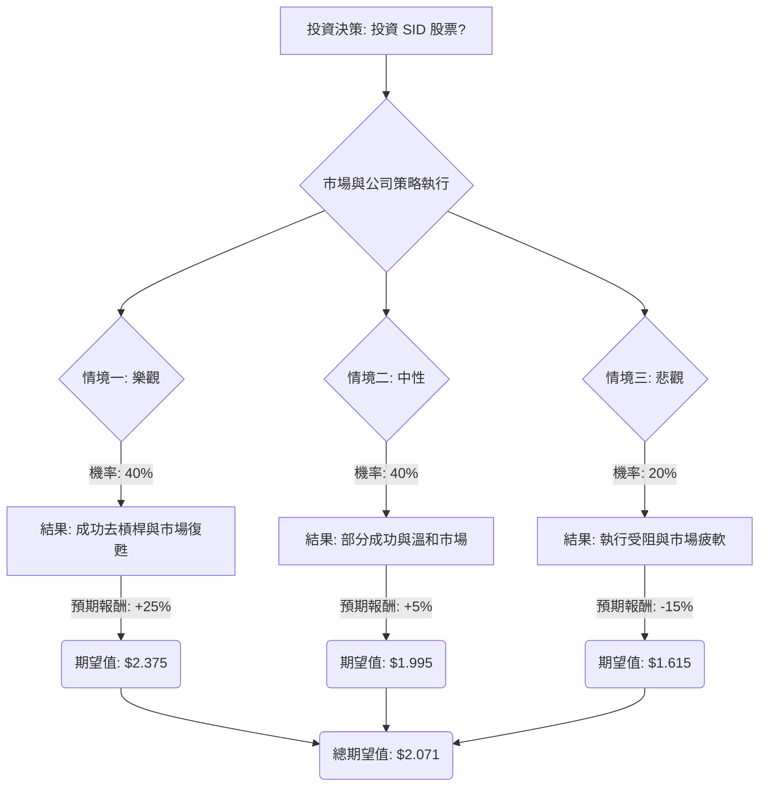

根據對美股公司 **SID (Companhia Siderúrgica Nacional)** 的基本面數據、最新新聞、財報、市場動態及產業趨勢的綜合分析，以下是基於決策樹分析和期望值分析的投資評估。

**公司概況與近期動態：**
Companhia Siderúrgica Nacional (SID) 是一家巴西綜合鋼鐵生產商，業務涵蓋鋼鐵、礦業、物流、能源和水泥五大板塊。公司目前正處於一項重大的去槓桿化和資產組合重塑計劃中，旨在透過出售非核心資產（預計在2026年出售150-180億巴西雷亞爾的資產，包括CSN Infra的重大股權和CSN Cement的控制權）來降低債務和槓桿率，並將重點轉向利潤率更高的礦業、基礎設施和能源業務。管理層預計這些措施有望在未來八年內使EBITDA翻倍，並將槓桿率降至1倍左右。

**財務表現與展望：**
*   2025年第三季度財報（2025年11月10日發布）顯示，每股盈餘 (EPS) 為0.01美元，低於市場預期的0.10美元，但營收達到22.2億美元，超出預期的20.8億美元。
*   公司過去12個月的EPS為-0.17美元，但預計明年EPS將從-0.02美元增長至0.29美元。
*   公司目前股價為1.90美元，52週股價區間為1.24美元至1.96美元。
*   近期股價表現強勁，過去一週上漲15.53%，過去一個月上漲7.47%，過去一季上漲14.72%，過去一年上漲43.85%。
*   儘管目前股東權益報酬率 (ROE) 和淨利率為負，但公司預計2026年盈利能力將因成本管理和國內市場價格改善而提升。
*   高負債權益比 (Debt/Eq: 3.76) 是一個挑戰，但去槓桿計劃旨在顯著改善這一狀況。

**市場動態與產業趨勢：**
鋼鐵市場目前仍具挑戰性，但公司透過資產出售和業務轉型，正積極應對。管理層對2026年國內市場價格趨勢持更樂觀態度。整體市場預計在2024-2026年增長放緩，並在2027年恢復增長，但供應商和製造商普遍保持樂觀。

---

### 1. 決策樹分析 (Decision Tree Analysis)

**核心假設：**
*   **市場環境：** 鋼鐵市場短期內仍具挑戰，但中長期有望復甦。全球經濟增長溫和，2025-2026年可能放緩，2027年恢復增長。
*   **財務狀況：** 資產出售和債務削減的成功是改善公司財務健康和盈利能力的關鍵。
*   **產業趨勢：** 公司轉向利潤率更高的礦業、基礎設施和能源業務，是應對傳統鋼鐵市場挑戰的戰略舉措。

**決策樹結構：**

**節點說明與計算：**

*   **起始節點 (A): 投資決策**
    *   當前股價 (Close): $1.90

*   **決策節點 (B): 市場與公司策略執行**
    *   代表投資者面臨的未來不確定性，主要受公司去槓桿計劃執行情況和整體市場環境影響。

*   **情境節點 (C1, C2, C3):**

    1.  **情境一: 樂觀 (Optimistic Scenario)**
        *   **預測情境名稱:** 成功去槓桿與市場復甦
        *   **對應機率 (Probability):** 40%
        *   **核心假設:** 公司成功執行150-180億巴西雷亞爾的資產剝離計劃，顯著降低債務和槓桿率（淨債務/EBITDA降至2倍以下，甚至1倍）。轉向高利潤率的礦業、基礎設施和能源業務效果顯著，EBITDA大幅增長。鋼鐵市場復甦超預期，國內價格顯著改善。EPS轉為強勁正值，超出分析師預期。
        *   **預期報酬 (Expected Return):** +25%
        *   **期望值 (Expected Value):** $1.90 * (1 + 0.25) = $2.375

    2.  **情境二: 中性 (Neutral Scenario)**
        *   **預測情境名稱:** 部分成功與溫和市場
        *   **對應機率 (Probability):** 40%
        *   **核心假設:** 公司部分成功執行資產剝離計劃，債務有所減少但未達預期，或存在延遲。高利潤率業務轉型產生一定積極影響，但EBITDA增長溫和。鋼鐵市場保持穩定但具挑戰性，國內價格逐步改善。EPS轉為正值，但處於分析師預期區間的低端（例如明年EPS為0.29美元）。
        *   **預期報酬 (Expected Return):** +5%
        *   **期望值 (Expected Value):** $1.90 * (1 + 0.05) = $1.995

    3.  **情境三: 悲觀 (Pessimistic Scenario)**
        *   **預測情境名稱:** 執行受阻與市場疲軟
        *   **對應機率 (Probability):** 20%
        *   **核心假設:** 公司在執行資產剝離計劃時遇到重大挑戰或延遲，未能有效降低債務。鋼鐵市場進一步惡化，或高利潤率業務轉型未達預期效果。負收益持續，或EPS增長微乎其微，遠低於分析師預期。高債務水平持續構成負擔，影響投資者信心。
        *   **預期報酬 (Expected Return):** -15%
        *   **期望值 (Expected Value):** $1.90 * (1 - 0.15) = $1.615

### 2. 期望值分析 (Expected Value Analysis)

**總期望值計算：**
總期望值 = (情境一機率 × 情境一期望值) + (情境二機率 × 情境二期望值) + (情境三機率 × 情境三期望值)
總期望值 = (0.40 × $2.375) + (0.40 × $1.995) + (0.20 × $1.615)
總期望值 = $0.95 + $0.798 + $0.323
**總期望值 = $2.071**

### 3. 最終結論

根據決策樹分析和期望值分析，SID 股票的整體期望值為 **$2.071**。

**判斷：適合投資**

**理由：**
SID 股票的整體期望值 ($2.071) 高於其當前股價 ($1.90)。這表明在考慮了不同情境及其發生機率後，預期該股票未來有上漲的潛力。儘管公司目前面臨鋼鐵市場挑戰、負收益和高債務等問題，但其積極的去槓桿化和業務轉型計劃（包括出售非核心資產並專注於高利潤率的礦業、基礎設施和能源業務）為未來的財務改善和EBITDA增長提供了明確的路徑。近期股價的強勁表現和分析師對明年EPS轉正的預期也支持了這一判斷。然而，投資者應密切關注公司資產出售計劃的執行進度以及全球鋼鐵市場的變化。